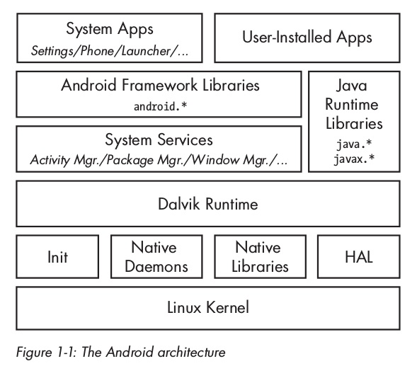
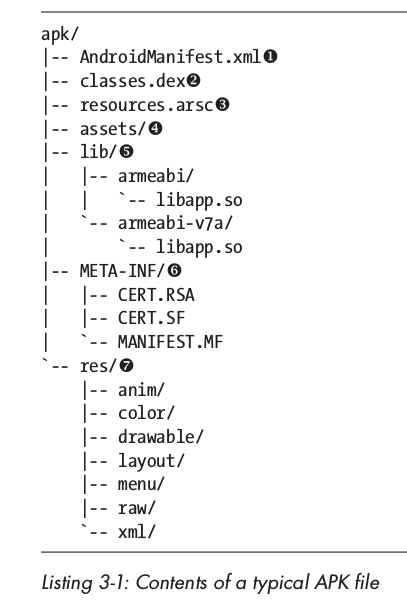
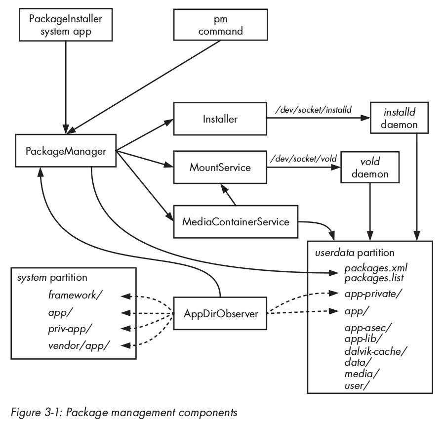
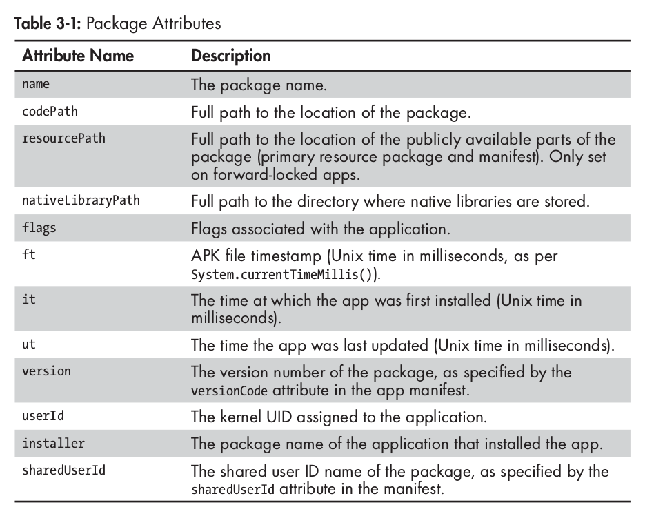
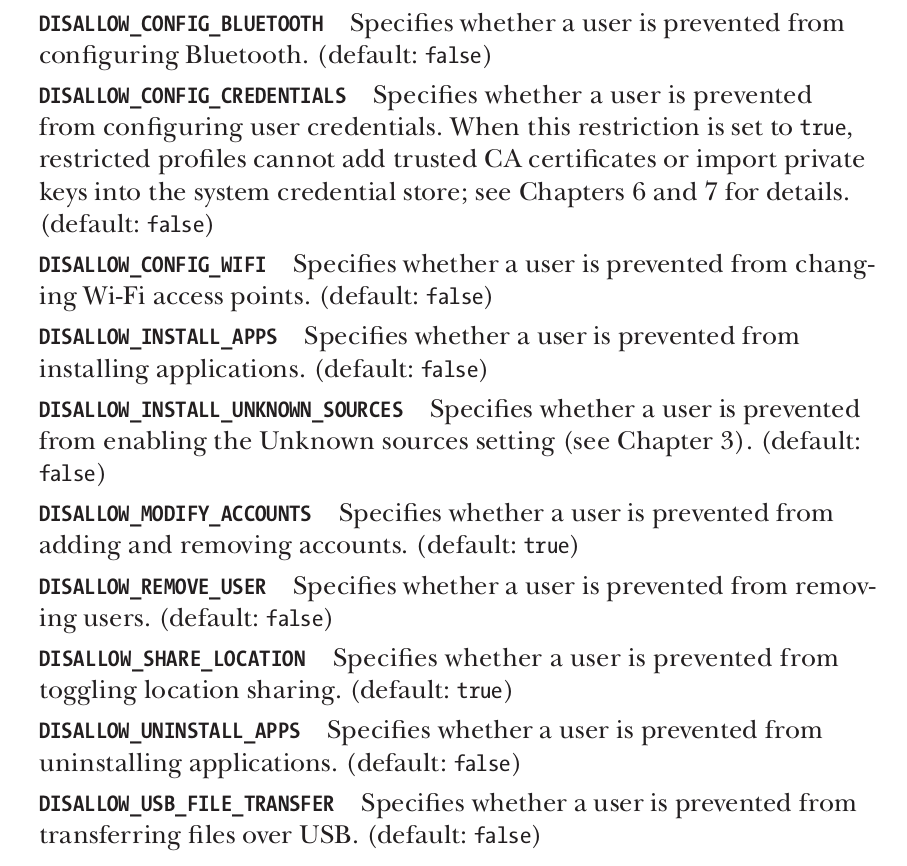
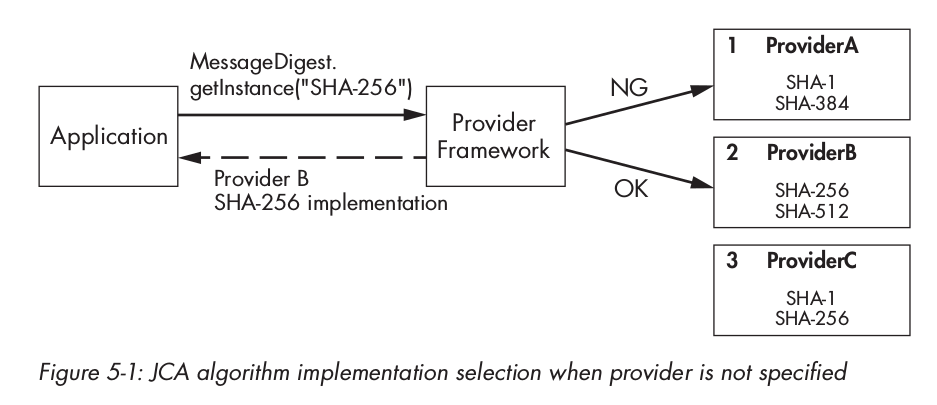
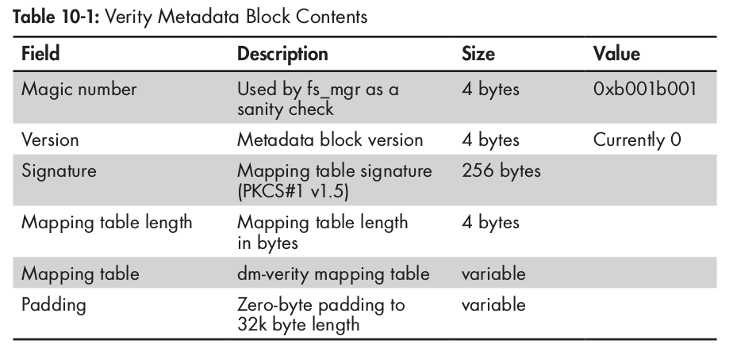

# Android 安全架构深究

## 第一章 Android安全模型

### Android体系结构



#### Binder

1. Binder实现

Binder 实现了一个基于抽象接口的分布式组件架构。Binder 驱动是这一架构的核心对象，所有 IPC 调用都通过它来实现。其中一个接口是 `/dev/binder` 设备。进程间通信是通过一个 `ioctl()` 调用实现的，它使用 `binder_write_read` 结构收发数据，该数据由一个包含驱动所要执行的命令的 `write_buffer` 和一个包含用户层需要执行的命令的 `read_buffer` 组成。

Binder 驱动管理每个进程的一部分地址空间，这些内存块对于进程是只读的，其写操作由内核模块来实施。当一个进程向另一个进程发送消息时，内核在目录进程的内存空间里申请一部分空间，接着直接将消息从发送进程复制进去。然后它将接收消息的具体地址，通过一个短消息发送给接收进程。因为消息在接受者的内存空间，接受者就可以直接访问。当进程不再需要这个消息时，它通知 Binder 驱动程序来释放这一块内存。


Android 中更高层次的 IPC 抽象，比如 Intent、Messenger、ContentProvider等，都是基于 Binder 实现的。

2. Binder安全

在更高的一个层次上，每个通过 Binder 框架实现 `IBinder` 接口，允许被访问调用的对象都可以被叫做 Binder 对象。对 Binder 对象的调用在一个 Binder 事物处理（transaction）内部实现，其中包括一个对目标对象的引用、需执行方法的 ID 和一个数据缓冲区。Binder 驱动会调用进程的ID（PID）和有效用户ID（EUID）自动添加到事物处理数据。被调用进程（callee）可以检查 PID 和 EUID，然后基于它内部的实现逻辑或调用进程的系统级元数据，来决定是否执行所请求的方法。

因为PID和EUID均是由内核填写，所以调用者进程不能通过伪造身份标识来获取超出系统允许的权限。这是Android安全模型核心之一。调用者的EUID和PID通过类 `android.os.Binder` 的 `getCallingPid()` 和 `getCallingUid()` 来访问。

3. Binder标识

Binder 对象的一个重要属性是它们具有跨进程独一无二的身份标识。内核负责维护活动的 Binder 对象与它们在其他进程中的句柄直接的映射关系。这使 Binder 对象可以作为安全令牌使用，也使得 Android 可以使用基于权能的安全模型（capability-based-security）。

基于权能的安全模型：通过赋给程序一个不可伪造的权能授权程序对特定资源的访问权限。

4. Binder令牌

一个 Binder 令牌可以是一种权能，也可以是一个目标资源。一个进程拥有一个 Binder 令牌，授权该进程对 Binder 对象的完全访问控制权限，从而使其能够在目标对象上执行 Binder 事物处理操作。

一个通常的模式是：对于在 `system`（UID 1000）或 `root` （UID 0）权限下运行的调用进程允许执行所有操作，而对于其他进程来执行额外的权限检查例程。

5. 访问Binder对象

我们知道与 Binder 通信的唯一方法是使用该对象的引用，但是很多 Binder 对象（尤其是系统服务）需要全局可被访问，然而分发所有系统服务的引用到每个进程是不现实的。未来使用服务发现机制，Binder 框架中拥有一个专门的上下文管理器（context manager），即 `servicemanager` 原生守护进程，用于维护到 Binder 对象的引用。服务通常传递服务名和一个 Binder 引用到服务管理器进行注册，从而使任何客户端都可以通过服务名获得它的 Binder 引用。

### Android安全模型

#### 应用程序沙箱

每个应用程序在安装时被赋予一个独一无二的 UID，程序就在特定进程内以该 UID 运行。应用程序是隔离的，包括进程级（分别运行在各自的进程中）和文件级（具有私有的数据目录）。

Android 没有传统的 `/etc/password` 文件，并且它的系统 UID 是静态定义在 `android_filesystem_config.h` 头文件内的。系统服务的 UID 从 1000 开始，1000 是 `system` 用户（AID_SYSTEM），具有特殊的权限（仍然受限）。而应用程序自动从 10000（AID_APP）开始产生 UID，对应用户名是 `app_XXX` 或 `uY_aXXX` 格式。

应用程序 UID 和包的其他元数据一起由 `/data/system/packages.xml` 文件管理，同时被写入 `/data/system/packages.list` 文件。

应用程序可以使用同一个 UID 安装，叫做共享用户ID，它们共享文件，甚至在同一个进程中运行。为了共享同一个UID，应用需要使用同一个密钥进行代码签名。

#### 权限

应用程序通过在 `AndroidManifest.xml` 文件中进行定义，来请求访问权限。

#### IPC

Android 使用内核驱动和用户空间库的组合来实现 IPC 机制。

#### 代码签名和平台密钥

Android 使用 APK 签名来确保应用更新包是来自同一作者，从而建立应用程序之间的信任关系。

系统应用是用一些平台密钥（platform key）签名的，不同的系统组件之间可以共享资源，并且当它们被相同平台密钥签名时，可以在同一个进程中运行。

#### 多用户支持

从Android 4.2版本开始，默认在平板电脑上开启。

每个用户都有唯一的 `user ID`，该 ID 从0开始，并且有自己的数据目录 `/data/system/users/<user ID>/`，也叫做用户的系统目录。未来区分每个物理用户安装的应用程序，Android 给应用程序赋予一个新的有效 UID。该 UID 基于物理用户的 user ID 和应用在单用户系统下的 UID（app ID）。这种复合结构的 UID 确保了，即使有不同用户安装了同一应用，该应用在各自用户下都有属于自己的沙箱环境。

#### SELinux

SELinux 是一个面向 Linux 内核的强制访问控制（MAC）机制的实现，在 Android 中增加了一些特有功能，用于将核心系统守护进程和用户应用隔离到不同的安全域（domain），并且为每个域定义不同的访问策略。

### 总结

Android 是一个基于 Linux 内核进行权限隔离的操作系统。高层的系统功能实现成一组相互协作的系统服务，它们之间使用一个叫 Binder 的 IPC 机制进行通信。Android 使用不同的系统身份标识（Linux UID）来隔离应用程序。默认情况下，应用程序只会有非常有限的权限，如要与系统服务、硬件设备或其他应用交互，必须申请更细粒度的权限。权限在每个应用的 manifest 文件中事先定义，在安装时赋予应用。系统使用每个应用的 UID 来找到它们的权限，并执行权限检查。在最新的版本中，系统进程隔离利用 SELinux 机制，为每个进程做了更进一步的权限限制。

## 第二章 权限

### 权限的本质

Android 中，一个权限，简单说只是一个字符串，表示执行特定操作的能力。由内置权限和自定义权限两种，可以使用 `pm list permission` 查看当前系统已知的权限列表。权限名称通常以定义它的包名做前缀，再接上 `.permission` 字符串。

### 权限的申请

应用程序通过在 `AndroidManifest.xml` 文件中添加 `<uses-permission>` 标签来申请权限，并且使用 `<permission>` 标签来定义新的权限。

### 权限管理

在每个应用程序安装时，系统使用包管理器服务，将权限赋予它们。包管理器维护一个已安装程序包的核心数据库，包括预安装和用户安装的程序包的安装路径、版本、签名证书、每个包的权限和一个所有已定义权限的列表。这个包数据库以 XML 文件的形式存放在 `/data/system/packages.xml`。

### 权限的保护级别

一个权限的保护级别（Permission Protection Levels）是：暗示权限中隐含的潜在风险，并且指出当决定是否赋予权限时系统应遵循的校验程序的流程。

Android 中定义了4个保护级别：

1. normal级别
默认值，定义了访问系统或其他应用程序的低风险权限。normal 级别的权限无须用户确认，自动授予。
2. dangerous级别
dangerous 级别的权限，可以访问到用户数据或者在某种形式上控制设备。在赋予权限时会弹出一个显示权限信息的确认对话框。
3. signature级别
signature 级别是最严格的权限级别，只会赋予那些与声明权限使用相同证书的应用程序。通常用于执行设备管理任务的系统应用。
4. signatureOrSystem级别

折中方案，可被赋予系统镜像的部分应用，或者与声明权限具有相同签名密钥的应用程序。

### 权限的赋予

1. 权限和进程属性

```xml
<!-- This file is used to define the mappings between lower-level system
     user and group IDs and the higher-level permission names managed
     by the platform. -->
<permissions>
    <!-- The following tags are associating low-level group IDs with
         permission names.  By specifying such a mapping, you are saying
         that any application process granted the given permission will
         also be running with the given group ID attached to its process,
         so it can perform any filesystem (read, write, execute) operations
         allowed for that group. -->

    <permission name="android.permission.INTERNET" >
        <group gid="inet" />
    </permission>
    <permission name="android.permission.WRITE_EXTERNAL_STORAGE" >
        <group gid="sdcard_r" />
        <group gid="sdcard_rw" />
    </permission>

    <!-- The following tags are assigning high-level permissions to specific
         user IDs.  These are used to allow specific core system users to
         perform the given operations with the higher-level framework. -->

    <assign-permission name="android.permission.MODIFY_AUDIO_SETTINGS" uid="media" />

</permissions>
```

`/etc/permission/platform.xml` 文件定义了低层的系统用户、用户组和高层的权限名之间的映射。

由 `<permission>` 标签里的关联可知，被赋予 `WRITE_EXTERNAL_STORAGE` 权限的进程，其补充 GID 中包括 `sdcard_r` 和 `sdcard_rw` 对应的 GID。

`<assign-permission>` 标签则相反，用于给那些运行在特定 UID 下的、没有对应包文件的系统进程赋予更高层次的权限。节选中，权限 `MODIFY_AUDIO_SETTINGS` 分配给了以 `media` UID运行的进程。

Android 系统中没有 `/etc/group` 文件，所以组名称到 GID 的映射是静态的，在 `android_filesystem_config.h` 头文件中定义。该头文件同样定义了 Android 系统核心目录和文件的所有者、访问模式和权能。

包管理器在启动时读取 `platform.xml`，并维护一个权限到 GID 的列表。当它给一个安装中的包授权时，包管理器检查每个权限是否有对应的 GID。如果有，则此 GID 加入到应用的补充 GID 列表中。补充 GID 列表写在 `packages.list` 文件中的最后一个字段。

2. 赋予进程属性

我们知道每个应用实际上就是一个执行应用字节码的 Dalvik 虚拟机进程，但 Android 不会为每个应用开启新的虚拟机进程，它使用一个叫作 `zygote` 的已部分初始化的进程，这个进程由 `init.rc` 初始化脚本启动，当需要启动新的应用时，就使用 `fork()` 函数来复制 zygote 进程，这个过程叫做特殊化（dalvik_system_Zygote.cpp 文件中的 forkAndSpecializeCommon() 方法）。

```c
pid = fork()

if (pid == 0) {
    int err;
    /* The child process */
    err = setgroupsIntarray(gids);
    err = setrlimitsFromArray(rlimits);
    err = setresgid(gid, gid, gid);
    err = setresuid(uid, uid, uid);
    err = setCapabilities(permittedCapabilities, effectiveCapabilities);
    err = set_sched_policy(0, SP_DEFAULT);
    err = setSELinuxContext(uid, isSystemServer, seInfo, niceName);
    enableDebugFeatures(debugFlags);
}
```

子进程首先使用 `setgroups()` 设置补充 GID，然后使用 `setrlimit()` 设置资源限制，再调用 `setresgid()` 和 `setresuid()` 设置实际用户/组 ID、有效用户/组 ID 和保护用户/组 ID。之后使用 `capset()` 设置进程的权能，然后通过将自己加入一个预定义的控制组，来设置调度策略。再设置自身的 `nice name` 和 `seinfo` 标签。最后根据需要开启调试功能。

使用 `ps` 命令查看进程列表，`PID` 列表示显示进程 ID，`PPID` 列表示父进程 ID。

```text
USER     PID   PPID  VSIZE  RSS     WCHAN    PC        NAME
root      1     0     2936   548   c02caffc 0806c480 S /init

root      1145  1     1217224 50032 ffffffff b7709f05 S zygote

system    1492  1145  1341112 82336 ffffffff b77096b5 S system_server
u0_a12    1570  1145  1276984 66640 ffffffff b77096b5 S com.android.systemui
radio     1663  1145  1251160 43660 ffffffff b77096b5 S com.android.phone
```

### 权限执行

#### 内核层的权限执行

相对于 Linux，Android 增加的特有控制是，那些创建网络套接字的进程需要属于 `inet` 组，也叫做安卓的 `paranoid` 网络访问安全控制机制（paranoid network security），由 Android 内核的一个额外检查实现。

```c
#ifdef CONFIG_ANDROID_PARANOID_NETWORK
#include <linux/android_aid.h>

static inline int current_has_network(void)
{       return in_egroup_p(AID_INET) || capable(CAP_NET_RAW);   # 1
}
#else
static inline int current_has_network(void)
{       return 1;                                               # 2
}
#endif
--snip--
static int inet_create(struct net *net, struct socket *sock, int protocol, int kern)
{
        --snip--
        if (!current_has_network())
                return -EACCES;                                 # 3
        --snip--
}
```

那些不属于 `AID_INET` 组的进程，不会拥有 `CAP_NET_RAW` 的权能，因此会收到一个拒绝服务的错误（#1、#3）。非 Android 内核不会定义 `CONFIG_ANDROID_PARANOID_NETWORK`，因此不需要特定的组对应创建套接字的操作（#2）。为使 `inet` 组可以被分配到应用进程，那么就需要赋予进程 `INTERNET` 权限。 paranoid 网络安全控制也被用于 Bluetooth 套接字和内核隧道驱动（VPN）。由内核特殊对待的 Android GID 列表在 `include/linux/android_aid.h`中。

#### 原生守护进程级别的权限执行

虽然 Binder 是 Android 中的首选 IPC 机制，但底层的原生守护进程常常使用 UNIX 域套接字进行进程间通信。UNIX 域套接字使用文件系统上的节点（node）来表示，可以使用标准的文件系统权限机制进行权限控制。

系统守护进程的本地套接字由 `init.rc` 定义，该文件由 `init` 进程创建。以设备卷管理守护进程（vold）为例：

```text
service vold /system/bin/vold
    class core
    socket vold stream 0660 root mount
    ioprio be 2
```

vold 声明了一个同样名为 `vold`，访问权限为 `0660` 的套接字，该套接字属于 `root`，所属组为 `mount`。Android 守护进程的本地套接字创建在 `/dev/socket/` 目录中：

```text
root@generic_x86:/ # ls -al /dev/socket/                                       
srw-rw---- root     mount             2016-11-30 13:40 vold
srw-rw---- root     system            2016-11-30 13:40 zygote
--snip--
```

UNIX 域套接字允许使用 `SCM_CREDENTIALS` 控制消息和 `SO_PEERCERD` 套接字选项，来传递和查询用户凭证，由内核进行检查，从而无法被用户进程伪造。

#### 框架层的权限执行

系统会根据 manifest 文件记录与每个组件相关联的权限，并在允许访问组件之前，检查调用者是否具有所需权限。由于组件不能在运行时改变权限，所以系统的权限检查执行过程是静态的。属于声明安全机制（declarative security）。

Android 组件也可以动态检查调用进程是否被赋予某个权限，而调用进程并不需要 manifest 中预先声明权限。属于命令式安全机制（Imperative Security）。

1. 动态权限执行

Android 在 `android.content.Context` 类中提供了很多用于检查调用者是否具备某个权限的方法。以 `int Context.checkPermission(String permission, int pid, int uid)` 为例：

```java
public int checkUidPermission(String permName, int uid) {
    synchronized (mPackages) {
        Object obj = mSettings.getUserIdLPr(UserHandle.getAppId(uid));
        if (obj != null) {
            GrantedPermissions gp = (grantedPermissions)obj;
            if (gp.grantedPermissions.contains(permName)) {
                return PackageManager.PERMISSION_GRANTED;
            }
        } else {
            HashSet<String> perms = mSystemPermissions.get(uid);
            if (perms != null && perms.contains(permName)) {
                return PackageManager.PERMISSION_GRANTED;
            }
        }
    }
    return PackageManager.PERMISSION_DENIED;
}
```

这里 `PackageManagerService` 首先基于传入参数 UID 获取应用的 app ID，然后获取所授权限。如果 `GrantedPermission` 类包含目标目标权限，则该方法返回 `PERMISSION_GRANTED`。如果不包含，则基于 UID 检查目标权限是否可以被自动分配（基于 platform.xml 文件中的 <assign-permission>标签）。如果这个检查也失败，最终返回 `PERMISSION_DENIED`。

2. 静态权限执行

当某个应用试图与另一个应用所声明的组件进行交互时，便会涉及静态权限执行。总体流程与动态权限执行类似：使用 `Binder.getCallingUid()` 和 `Binder.getCallingPid()` 获取调用者的 UID 和 PID，然后调用者 UID 映射到包名，接下来获取相关权限。如果调用者权限集合中包含目标组件需要的权限，则组件启动，否则抛出 `SecurityException` 异常。

权限检查由 `ActivityManagerService` 执行，它负责解析具体的 `intent`，并检查目标组件是否拥有相关的权限属性。如果有，则它将权限检查工作移交给包管理器执行。

### 系统权限

`framework-res.apk` 定义了 android 包和系统权限，里面的 `AndroidManifest.xml` 文件声明了权限组和权限。权限组用于在系统用户界面显示一组相关联的权限，但每个权限依旧需要单独申请。

保护级别可以结合保护标志（protection flags）做更进一步的授权约束。

### 共享用户ID

使用相同密钥签发的 Android 应用可以使用相同的 UID 运行，并且也可以运行在同一进程中，这个特性就是共享用户ID。注意，不能将一个已安装的应用从非共享用户ID状态切换为共享用户ID状态。

共享用户ID可以通过在 `AndroidManifest.xml` 文件的根元素中添加 `sharedUserId` 属性开启。如果指定的共享 UID 不存在，则马上被创建，如果另一个有相同共享 UID 的包已经被安装，签名证书会与已存在的包进行比较，如果不匹配，则返回 `INSTALL_FAILED_SHARED_USER_INCOMPATIBLE` 错误。

共享 UID 是系统包数据的一级对象，作为应用一样对待：有相应的签名证书和权限。Android 内置了5个共享UID，在系统引导时自动添加：

- android.uid.system（SYSTEM_UID, 1000）
- android.uid.phone（PHONE_UID, 1001）
- android.uid.bluetooth（BLUETOOH_UID, 1002）
- android.uid.log（LOG_UID, 1007）
- android.uid.nfc（NFC_UID, 1027）

作为共享用户一部分的包，并没有相关的授权信息权限列表。包继承了共享用户的权限，这些权限集合了所有以相同共享 UID 安装包的申请权限。`<shared-user>` 下定义的权限可随着包的安装或卸载，动态地添加或移除。

共享 UID 不仅仅是一个包管理组件，它在运行时也实际映射了一个共享的 Linux UID。

### 自定义权限

自定义权限是那些第三方应用简单地进行声明的权限。权限声明后，它们可以被加到应用的组件中，由系统进行静态权限执行，或者应用通过使用 `Context` 类的 `checkPermission()` 或 `enforcePermission()` 方法，动态检查调用者是否已被授权。

应用可以使用 `android.content.pm.PackageManager.addPermission()` 接口动态添加新的权限，使用 `removePermission()` 删除权限。动态添加的权限，必须属于应用定义的权限树。应用只能对自身或者共享同一 UID 的包，在权限树中添加、删除权限。

### 公开和私有组件

AndroidManifest.xml 中定义的组件可以是公开的，也可以是私有的。私有组件只能被所声明的特定应用调用，而公开组件可以被其他所有应用调用。组件可以通过设定 `exported` 属性为 `true`，来使得组件公开；或通过声明一个 `intent filter`，隐式地使得组件公开。而具有 `intent filter` 的组件，可以设置 `exported` 为 `false`，从而使得组件不公开。

### activity和service权限

activity 和 service 均可以通过设置目标组件的 `permission` 属性进行保护。当其他应用使得 `intent` 调用 `Context.startActivity()` 或 `text.startActivityForResult()` 启动某个 activity 时，这个 activity 的权限就会被检查。对于服务来说，当其他应用调用 `Context.startService()`、`stopService()` 或 `bindService()` 启动一个服务时，也会触发相应的权限检查。

### 广播权限

广播接收者的权限可以由接收者指定，也可以由发送者指定。当发送一个广播时，可以使用 `Context.sendBroadcast(Intent intent, String receiverPermission)` 方法， `receiverPermission` 参数指定了那些对该广播感兴趣的接收者的权限。或者，发送者可以使用 `Intent.setPackage(String packageName)` 来将接收者范围限定在指定包所定义的范围内。接收者可以通过设置 manifest 文件中的 `<receiver>` 标签的 `permission` 属性，来限制谁可以给它们发送广播，这种方法叫做静态广播接收者。或者向 `Context.registerReceiver(BroadcastReceiver receiver, IntentFilter filter), String broadcastPermission, Handler scheduler)` 方法传递权限参数，这种方法叫作动态注册广播接收者。

### content provider权限

#### 静态provider权限

大部分 provider 针对读、写使用不同的权限，还可以指定 `per-URI` 权限，对 URI 分别指定权限，从而保护它们数据的一个特定子集。per-URI 权限比组件级权限具有更高的优先级，因此如果一个应用想要访问一个有关联权限的 content provider URI 时，它只需要具有目标 URI 的权限，而不需要拥有组件级的权限。

#### 动态provider权限

应用可以使用 `Context.grantUriPermission(String toPackage, Uri uri, int modeFlags)` 方法，动态地赋予 per-URI 临时访问权限，并且可以使用 `revokeUriPermission(Uri uri, int modeFlags)` 方法撤销授权。可以通过设置全局的 `grantUriPermissions` 属性为 true，来临时开启 per-URI 访问，或者为指定 URI 添加 `<grantUriPermissions>` 属性进行开启。

### pending intent

pending intent 封装了一个 intent 和执行它的一个目标动作。与常规 intent 的区别是，它同样包含创建它的应用的身份标识。这允许 pending intent 可被移交给其他应用程序，这些应用可以利用原始应用的身份和权限，执行指定操作。由系统的 `ActivityManagerService` 服务赋予 pending intent 中的身份标识，和记录当前活动的 pending intnet。

### 总结

Android 上的每个应用均运行在一个受限的沙箱内，并且需要应用申请指定权限，以便与其他应用或系统进行交互。权限由一个字符串表示，代表具备执行特定操作的能力。它们在应用安装时被授权给应用，并且在应用的生命周期内保持不变（除了开发权限）。权限可以被映射成 Linux 补充 UID，用于内核在授权访问系统资源时进行检查。

高层系统服务通过使用 Binder，获取调用应用程序的 UID，并查找应用包管理器数据库中保存的权限，来执行权限检查。与组件关联的权限，由应用程序的 manifest 文件声明，并由系统自动执行，但是应用仍可以选择额外的动态权限检查。除了使用内置权限，应用还可以自定义权限，并将它们与组件相关联，从而用于组件的访问控制。

每个 Android 组件都可以定义自己的访问权限，并且 content provider 可以额外分别对每个 URI 指定读、写权限。pending intent 封装了创建它们的应用程序的身份标识，以及一个 intent 和一个将要执行的操作，使得系统或第三方应用可以使用原先应用程序的身份标识和权限来执行指定的操作。

## 第三章 包管理机制

### Android应用程序包文件的格式



### 代码签名

签名验证过程，既验证代码是否被篡改，同时验证签名确实由所预期的密钥生成。但存在两个问题，一个是代码签名不能直接解决代码签名者能否被信任的问题，另一个是不能解决被签名的代码是否确定安全的问题。

#### Java代码签名

Java代码签名在 JAR 文件层执行。它重用并扩展了 JAR manifest 文件，用以向 JAR 压缩包添加代码签名。其主要的 JAR manifest 文件（MANIFEST.MF）的每个条目由压缩包中每个文件的文件名和摘要组成。

```text
Manifest-Version: 1.0
Created-By: 1.7.0_60-ea (Oracle Corporation)

Name: R/o/lbs.xml
SHA1-Digest: dVGv8TM0cWVbDKwhxkgo/Ll3DW4=

Name: R/a/lsq.xml
SHA1-Digest: xcEF2Ph150M4VsMUwD42pnCskEg=
```

1. 实现

Java代码签名通过添加另一个叫作签名文件的 manifest 文件来实现（.SF后缀），该文件包含要被签名的数据和一个数字签名。数字签名也叫做签名块文件，以二进制形式存放，后缀通常为 `.RSA`、`.DSA`、`.EC`。

```text
Signature-Version: 1.0
SHA1-Digest-Manifest-Main-Attributes: GQIRuJcAmolTl8SuRVbT9a+jZmw=
Created-By: 1.7.0_60-ea (Oracle Corporation)
SHA1-Digest-Manifest: EEfFH4d0IWOZ/CgcjvhE479B7fM=

Name: R/k/nes.png
SHA1-Digest: D9BO1p4U5U2prsvj4RuJO4FRWjY=

Name: R/a/lsq.xml
SHA1-Digest: bsQJm/EY9cpzcL6pF4HApb/QamE=
```

签名文件包含整个 manifest 文件的摘要，也包含 MANIFEST.MF 文件中的每一条摘要。

2. JAR文件签名和验证

官方工具是 jarsigner 和 keytool 命令。

通过指定 keystore 为签名密钥的别名，以及一个签名算法，使用 jarsigner 命令进行签名。指定 `-verify` 选项可进行验证。

```sh
$ jarsigner -keystore debug.keystore -sigalg SHA1withRSA test.apk androiddebugkey
$ jarsigner -keystore debug.keystore -verify -verbose -certs test.apk
```

或者使用 keytool 命令：

```sh
$ keytool -list -printcert -jarfile test.apk
```

#### Android代码签名

与标准JAR签名不同，Android不关心签名证书的内容和签发者，所有Android里使用的代码签名，都是自签名的，也不需要以任何方式维护你的身份。另外所有 APK 条目均需要被相同的一套证书签名。

1. Android代码签名工具

AOSP的 `build/` 目录中包含一个叫 signapk 的Android专用工具。

2. OTA文件代码签名

为了支持 OTA 更新，在每个文件已经单独签名的情况下，还需要对整个压缩包进行签名。signapk 工具通过 `-w` 选项开启 "sign whole file" 模式来实现。

### APK的安装过程

- 通过应用商店客户端
- 在设备上直接打开已下载的app文件
- 将USB设备连接到PC，使用 Android SDK 提供的 adb install 命令安装，该命令会调用 pm 命令行工具，并带有 install 参数。
- 使用 Android shell，直接复制APK文件到一个应用的目录，由包管理器探测并安装。
实线箭头表示组件之间的依赖关系，和函数调用一样。虚线箭头指向的文件或目录，受某个组件监控，但不由那个组件直接修改。



#### 应用程序包和数据的位置

大部分系统中，system 分区是只读分区，可在 `/system/app/` 目录下找到系统应用，在 `/system/priv-app/` 下是有特权的应用，它们可被授权 signatureOrSystem 保护级别的权限。`/system/vendor/app` 目录下是厂商专有的应用。用户安装的应用存放在具有读写权限的 userdata 分区的 `/data/app/` 目录下，数据目录 `/data/data/`，应用优化过的DEX文件 `/data/dalvik-cache/`，系统包数据库 `/data/system/packages.xml` 等。

#### 活动组件

1. PackageInstaller系统应用

默认APK文件处理方式，只有在用户开启设备安全设置中的“未知来源”选项方可开启。PackageInstall 为包管理提供了一个基本的GUI，并且当它被传递 `VIEW` 或 `INSTALL_ACTION` 动作并附带上APK文件的 URI 的 intent 时，它就会处理安装包，并弹出一个显示应用所需权限的确认对话框，点击确认后，PackageInstall 会调用 PackaeManagerService 服务，执行安装过程。

2. pm命令

在 Android shell 中，使用 `pm install` 或 `pm uninstall` 命令，在 ADB 中，使用 `adb install/uninstall` 命令。

3. PackageManagerService

负责解析APK文件，启动应用安装、更新和卸载包、维护包数据库，并且负责管理权限。它提供了若干 `installPackage()` 方法，最常用的是 `installPackageWithVerificationAndEncryption()`，它运行加密APK文件的安装，以及通过验证代理进行包验证的操作。

4. Install类

PackageManagerService 运行在系统服务进程内（system UID），缺少 root 权限，然而创建、删除和更改应用目录的所有者，需要 root 权限，它就将这些操作委托给 `install` 守护进程。Install 类使用 `/dev/socket/intalld` 这个 UNIX 域套接字，向 installd 守护进程发起连接，并且封装成 installd 面向命令的协议。

5. installd 守护进程

installd 守护进程是一个有特权的本地守护进程，它向系统包管理器提供应用和用户目录管理功能。它还用于启动 `dexopt` 命令，为新安装的包生成优化过的DEX文件。

可以通过 `installd` 本地套接字来访问 installd 守护进程，该套接字只可被 system 下运行的进程访问。install 守护进程不以 root 执行，它利用 Linux 的 `CAP_DAC_OVERRIDE` 和 `CAP_SHOWN` 能力，以便设置应用程序所创建的文件及目录的UID和GID。

6. MountService

用于挂载可分离式的外存和OBB文件，OBB文件常用作应用程序的扩展文件。MountService 还用于启动设备加密和更改加密密码。

MountService 服务还管理安全容器（secure container），它用于存放应用的文件，以使得非系统应用不可访问。安全容器是加密的，并且用于实现一种叫做转发锁定（forward locking）的 DRM 机制。转发锁定主要用于付费应用的安装，以确保它们的APK文件不能轻易地被复制和再发布。

7. vold守护进程

vold 是Android存储管理守护进程。由于 MountService 以 system 用户运行，缺少挂载/卸载磁盘的权限，这些操作就由 vold 守护进程实现，它以 root 用户运行。

vold 通过 UNIX 域套接字 `/deev/socket/vold` 暴露一个本地套接字接口，该接口只能被 root 和 mount 组成员访问。

8. MediaContainerService

MediaContainerService 服务将APK文件复制到它们最终的安装位置，或者到一个加密容器，并且运行 PackageManagerService 在移动存储上访问文件。

9. AppDirObserver

AppDirObserver 是一个用于检测应用目录下 APK 文件改动的组件，然后根据实际类型调用相应的 PackageManagerService 方法。每个被见识的目录均有一个专门的实例。

#### 安装一个本地包

1. 解析和验证包

打开一个APK文件会触发 `application/vnd.android.package-archive` 处理程序， `PackageInstaller` 系统应用中的 `PackageInstallActivity` 组件会首先检测应用是否受信任。如果不信任，且 `Setting.Global.INSTALL_NON_MARKET_APPS` 被设置为 `false`，那么对弹出一个警告框，并终止进程。

如果允许安装，`PackageInstallerActivity` 解析APK文件，并且从 `AndroidManifest.xml` 文件提取信息和包签名。当使用 `java.util.jar.JarFile` 和相关类对每个条目提取签名证书时，APK文件的完整性会被自动验证。`AndroidManifest.xml` 文件的哈希值技术同样是APK解析过程的一部分，并且会传给后续的安装步骤，该值将用于验证在用户点击OK和APK复制进程启动之间，APK文件没有被替换。

2. 接收权限和启动安装进程

解析完成后出现一个显示该应用的相关信息和所需权限的对话框。如果确认安装，`PackageInstallerActivity` 将APK文件及其 manifest 摘要转发给 `InstallAppProgress`，然后由它将APK的URI和安装元数据传递给 `PackageManagerService` 的 `installPackageWithVerificationAndEncryption()` 方法，从而启动安装进程。

3. 复制到应用程序目录

`PackageManagerService` 首先在应用程序目录（/data/app）中创建一个临时文件，然后委派 `MediaContainerService` 进行复制。复制成功后，它包含的任何本地库都会被提取到一个指定的 app 目录，该目录在系统本地库目录下（/data/app-lib）。接下来，临时的APK文件和库目录均会被重命名为它们最终的基于包名称的名字。APK文件的权限被设置为 `0644`。其 SELinux 环境也被设置。

4. 包扫描

调用 `PackageManagerService` 的 `scanPackageLI()` 方法来触发包扫描。包管理器首先创建一个 `PackageSettings` 结构，其中包含包名、代码路径、单独的资源路径和一个本地库的路径。然后它给新包赋予一个UID，并且存在配置结构里。

5. 创建数据目录

`PackageManagerService` 通过向 `installd` 守护进程发送一个 `install` 命令来将目录创建的动作委托给 `installd` 守护进程。 `installd` 守护进程创建包的数据目录、共享原生库目录、本地库目录，然后设置包目录的权限为 `0751`，在本地库目录中创建app本地库的符号链接。最后设置包目录的 SELinux 环境，并切换其所有者到app被赋予的UID和GID。

6. 生成Optimized DEX

通过向 `installd` 守护进程发送 `dexopt` 命令来为程序代码生成 odex 文件。接下来，installd 守护进程 fork 一个 dexopt 进程，该进程会在 `/data/dalvik-cache/` 目录下创建 odex 文件。

7. 文件和目录结构


8. 将新安装的包添加到package.xml
9. 包属性

可以通过 `android.content.pm.PackageManager` SDK类的 `getPackageInfo(String packageName, int flags)` 方法获取，该方法返回一个 PackageInfo 的实例，其封装了 `packages.xml` 中每个条目的信息。



10. 更新组件和权限

创建 `packages.xml` 条目之后，PackageManagerService 扫描所有新应用程序 manifest 清单中定义的Android组件，并且将其添加到它内部加载在内存中的组件注册表。接下来，任何该app声明的权限组和权限均会被扫描，并添加到权限注册表中。最终，修改保存在磁盘上的包数据库，然后 PackageManagerService 发送 `ACTION_PACKAGE_ADDED` 通知其他组件，新添加了一个应用。

#### 更新包

1. 签名验证

检查更新包和目标是否由相同的签发者所签发。由 PackageManagerService 的 `compareSignatures()` 方法来执行。

2. 更新非系统应用

本质就是保留它的数据目录，重新安装应用。首先杀掉被更新包的相关进程，将包和该应用注册的所有组件从内部结构和包数据库中移除。然后，PackageManagerService 通过 `scanPackageLI()` 方法触发包扫描动作，并更新包的代码、资源路径、版本号和时间戳。包的清单也被扫描并将所有定义的组件注册到系统中。然后包的权限被重新授权，更新包数据库被写回磁盘，同时发送一个 `PACKAGE_REPLACED` 系统广播。

3. 更新系统应用

由于系统应用安装目录 `/system/app/` 是只读的，因此更新包安装在 `/data/app/` 目录下，但原有的应用还是完好的，处理一个 `<package>` 目录之外，更新应用还有一个 `<updated-package>` 条目。

#### 安装加密的APK

1. 创建和安装一个加密APK

一个APK文件可以使用 `enc` OpenSSL 命令进行加密，例如：

```sh
$openssl enc -aes-128-cbc -K 000102030405060708090A0B0C0D0E0F -iv 000102030405060708090A0B0C0D0E0F -in my-app.apk -out my-app-enc.apk
```

`adb install`　命令封装了 `adb push` 和 `pm install`　命令，将APK文件复制到设备上的一个临时文件，并启动安装进程。

```sh
adb install [-l] [-r] [-s] [--algo <algoritm name> -- key <hex-encoded key> --iv <hex-encoded iv>] <file>
```

`--algo`、`--key`、`--iv`分别指定加密算法、密钥和初始向量。

2. 实现和加密参数

当 `pm` 命令启动附带 `install` 参数时，会调用 `installPackageWithVerificationAndEncryption()` 方法。

```java
public void installPackageWithVerificationAndEncryption(Uri packageURI,
                        IPackageInstallObserver observer,
                        int flags,
                        String installerPackageNAme,
                        VerificationParams verificationParams,
                        ContainerEncryptionParams encryptionParams) {
--snip--
}
```

VerificationParams 类封装了一个用于包验证的参数。ContainerEncryptionParams 类保存加密参数，包括通过 `adb install` 命令传递的值。

3. 带有完整性检查的加密APK安装

```sh
$ pm install -r --algo 'AES/CBC/PKCS5Padding' \
--key 000102030405060708090A0B0C0D0E0F \
--iv 000102030405060708090A0B0C0D0E0F \
--macalgo HmacSHA1 --mackey 686d61635f6b65795f31 \
--tag 962ecdb4e99551f6c2cf72f641362d657164f55a /sdcard/my-app-enc.apk
        pkg: /sdcard/kr-enc.apk
Success
```

app 通过指定的 MAC `tag` 和基于真实文件内容计算的值相比较完成来完成完整性检测。最终文件以已解密的形式被复制到 `/data/app` 目录下，因此除了文件解密和完整性检测以外，安装过程和未加密的APK是一样的。

#### 转发锁定

转发锁定用于铃声、壁纸和其他为功能手机售卖的数字商品。它将 app 包分成两部分：全局可读的部分，包括资源和 manifest（在 /data/app 目录下），另一部分只能由系统用户读取，包括可执行代码（在 /data/app-private 目录下）。

#### Android 4.1 转发锁定实现

使用加密容器实现转发锁定机制。一个典型的转发锁定应用挂载点清单：

```sh
# ls -l /mnt/asec/com.example.app-1
drwxr-xr-x system   system          lib
drwx------ root     root            lost+found
-rw-r----- system   u0_a96  1319057 pkg.apk
-r2-r--r-- system   system   526091 res.zip
```

`res.zip` 保存了 app 的资源和 manifest 文件，是全局可读的；`pkg.apk` 文件保存了整个APK文件，只能被系统和 app 指定应用（u0_a96）读取。实际的 app 容器放在 `/data/app-asec/` 目录下，后缀为 `.asec`。

1. 加密应用容器

Android Secure External Caches（ASEC）容器管理器在系统卷守护进程（vold）中实现，并且 MountService 服务提供了一个将其功能提供到框架层服务的接口。还可以使用 `vdc`命令与 vold 进程交互：

```text
# vdc asec list        // 列举已挂载容器的命名空间ID
# vdc asec path com.example.app-1        // 显示指定容器的挂载点
# vdc asec unmount org.example.app-1        // 卸载
# vdc asec mount com.example.app-1 000102030405060708090A0B0C0D0E0F 1000        // 挂载
```

ASEC 容器的加密密钥存放在 `/data/misc/systemkeys/` 目录下。

2. 安装转发锁定的APK

安装过程设计两个额外步骤：创建和挂载安全容器，和从APK文件中提取公共资源。这些步骤由 MediaContainerService 封装，当APK复制到应用程序目录是调用恰当的 MountService 方法，激昂容器管理委托给 vold 守护进程来执行。

### 包验证

应用最广泛的包验证器是 Google Play Store 客户端中的实现，由 Google 的应用分析基础设施支持，在APK安装之前进行验证器扫描。

#### Android对包验证的支持

包验证由一到多个验证代理执行，而且有一个 `required verifier`，和零到多个 `sufficient verifier`。当 required verifier 和至少一个 sufficient verifier 返回肯定结果后，验证动作完成。

### 总结

Android应用包是 JAR 文件格式的扩展，其包含资源、代码和一个 manifest 文件。APK文件使用 JAR 文件的代码签名格式进行签名，但是需要所有文件使用同一组证书进行签名。Android使用签名证书，来确保应用与其更新包同源，并且建立应用间的信任关系。APK文件的安装，是通过复制它们到 `/data/app` 目录下，并为每个应用程序在 `/data/data/` 下创建特定的数据目录完成的。

Android支持加密APK和安全应用容器。加密应用在复制到应用程序目录之前自动解密。转发锁定应用将资源和 manifest 分成一部分，它们是可公开访问的，将代码和私有资产分成另一部分，存放在指定的容器内，只能由 OS 访问。

Android可选择在安装之前，通过一个或多个验证代理对应用程序进行验证。目前，使用最广泛的验证代理内置于 Google Play Store 客户端内部，并且使用 Google 的在线验证服务检查有害应用程序。

## 第四章 用户管理

### 多用户支持概述

用户使用互不相同的 user ID 来标识，并且只有系统可以在用户间切换。默认为单用户，可以将 `config_multiuserMaximumUsers` 系统资源设置成一个大于1的值开启多用户模式。

### 用户类型

#### 主用户（持有者）

主用户是设备上创建的第一个用户，user ID 是0，具有所有权限，可以创建、删除其他用户，也可以更改影响所有用户的系统设置。

#### 次要用户

每个次要用户有一个指定的用户目录，它们自己的已安装应用，以及每个应用的私有数据目录。

#### 受限用户

受限用户基于主用户，并且以特定限制条件共享它的应用程序、数据和账户。

1. 用户限制



2. 应用限制
应用程序在运行时，可以使用 `UserManager.getUserRestrictions()` 方法获取一个 Bundle（一个通用的容器类，使用字符串映射不同的类型值），其包括强加到用户上的限制条件。限制条件以键值对定义，键是限制条件名称，值用布尔变量表示是否生效。除 OS 定义的内置限制条件，应用程序可以通过创建一个 BroadcastReceiver，接收 `ACTION_GET_RESTRICTION_ENTRIES` intent，从而自定义限制条件。

3. 访问在线账户

首先用户还可以通过 AccountManager 接口，访问主用户的在线账户。

### 用户管理

UserManagerService 服务用于管理用户，负责读取和维护用户信息，并且维护一个活动用户的列表。

#### 命令行工具

```sh
$ pm list users         // 列出所有用户
$ pm create-user        // 创建新用户
$ pm remove-user        // 删除用户
$ pm get-max-users      // 操作系统支持的最大用户数
```

#### 用户状态和相关广播

```sh
USER_ADDED            // 新建用户
USER_REMOVE           // 删除用户
USER_INFO_CHANGED     // 用户或其配置信息改变时
USER_BACKGROUND、
USER_FOREGROUND、
USER_SWITCH           // 切换用户
```

### 用户元数据

用户数据存放在 `/data/system/users/` 下，每个用户都有一个叫做 user system directory 的特定目录，其名字与用户ID匹配，`userlist.xml` 文件存放了系统所有用户的相关信息。

### 每个用户的应用程序管理

#### 应用程序数据目录

当安装应用程序时，如果系统上存在其他用户，PackageManagerService 服务就会为每个用户创建应用程序数据目录。用户数据目录存储在 `/data/user/` 目录下，并以用户 ID 命名，其中设备拥有者目录（0/）是一个到 `/data/data/` 目录的符号链接，因为主用户的数据仍然放在 `/data/data/` 目录下。

```sh
uid = userId * 100000 + (appId % 100000)
```

#### 应用共享

虽然每个用户都有一个专用的数据目录，但 APK 文件是所有用户间共享的，也可以通过在每个用户的系统目录下创建一个 `package_restrictions.xml` 文件使得每个用户拥有不同的应用程序。

### 外存

外存是一个大小写不敏感的、具有不变的 POSIX 权限类和模式的文件系统。

#### 外存实现

应用程序可以在外存中管理它们自己的目录，而不需要请求 `WRITE_EXTERNAL_STORAGE` 权限，这个权限用于授权对所有外存数据的访问。这个特效叫做合成权限，它的 AOSP 实现基于一个 FUSE 守护进程，封装了原始存储设备，并且基于一个特定的权限模拟方式，来管理文件的访问和权限。应用程序可以访问多个外存设备，但只允许写任意文件到朱外出（拥有 WRITE_EXTERNAL_STORAGE 权限的前提下），并且它们访问其他外存的权限很受限，也叫做次要外存。

#### 多用户外存

Android设备上的每个用户必须有各自的、互相隔离的外存目录。但是外存历来使用 FAT 格式的文件系统，是全局可读的且不支持权限机制。Google 的多用户外存实现权衡了三个 Linux 内核特性：挂载命名空间、绑定挂载和共享子树。

1. Linux高级挂载特性

Linux 将所有存储设备的全部文件作为目录的一部分来管理，每个文件系统通过被挂载到指定的目录，从而链接到指定子树。目录树被所有进程共享，每个进程看到的目录结构是相同的。

挂载命名空间：运行每个进程拥有自己的挂载点，因此可以使用与其他进程不同的目录结构。这时父进程的命名空间叫做父级命名空间。

绑定挂载：允许一个目录或文件挂载到目录树的其他路径下，使得在多个不同位置可以看到相同的目录或文件。

共享子树特性：提供了一种方式，来控制文件系统的挂载点如如何在挂载命名空间中传播。从而使进程拥有自己的命名空间，但仍旧可以访问进程启动之后的挂载文件系统。Android使用了共享子树的共享挂载和从属挂载两种类型。在父级命名空间创建的共享挂载，会传播到所有的子级命名空间。一个从属挂载有一个共享挂载的主挂载点，同样传播新的挂载，但只能由主挂载点向其从属挂载点传播。

2. Android上的实现

在一个主存依赖于内部存储的设备上，sdcard FUSE 守护进程使用 `/data/media/` 目录作为源，并且在 `/mnt/shell/emulated` 创建了一个模拟的文件系统。与应用数据目录一样，每个用户有专门的外存数据目录，并以其用户ID命名。外存设置分两步：第一步所有共享的挂载点在 zygote 进程中设置，第二步对各自进程可见的专有挂载点，作为每个应用进程的一部分设置。之后，新创建的应用进程只能看到分配到其启动用户的外存。

#### 外存权限

sdcard FUSE 守护进程指派固定的用户、组和访问权限到外存上的每个文件或目录。此外，权限是不可更改的，并且均不支持符号链接和硬链接。指派的拥有者和权限由 sdcard 守护进程使用的权限派生模式决定。

### 总结

Android通过为每个用户提供各自的内存和外存，允许多用户共享一个设备。多用户支持遵循既定的安全模型，并且每个用户的应用程序均被指派为不同的 UID，并在指定的进程中运行，不可访问其他用户的数据。用户隔离通过结合 UID 分配方案和存储挂载规则实现。

## 第五章 加密服务

### JCA Provider 结构

JCA 提供了一个可扩展的加密服务提供程序框架和一组 API，它覆盖了当今在用的主要密码学原语。

#### 加密服务 Provider

JCA 将密码功能分成若干抽象的加密服务，也叫做引擎，并且以引擎类的形式对每个服务定义的API。

在 JCA 环境中，一个加密服务提供程序（CSP，或Provider）提供了某些加密服务具体实现的一个包。每个 Provider 通告其实现的服务及算法，允许 JCA 框架维护一个所支持算法及相关实现的 Provider 注册表。该注册表维护着 Provider 优先序列，所以如果某个算法被多个 Provider 所支持，则优先级较高的会被返回给所请求的应用程序。



1. Provider实现

JCA 架构通过遵照一个通用接口，来请求某个特定密码服务或算法的所有实现，从而确保了实现的独立性。对于每个表示特定密码服务的引擎lei，框架定义了相应的抽象服务 Provider 接口（SPI）类。各自密码服务的 Provider，实现并公告相应的 SPI 类。

每个 Provider 还有一个 `java.security.Provider` 抽象类的子类，它定义了 Provider 的名称和版本，还有定义了一个所支持的算法列表，并与 SPI 实现类相匹配。

2. 静态注册Provider

静态注册需要编辑系统安全属性文件，并为该 Provider 添加一个条目。

```java
security.provider.n=ProviderClassName
```

`n` 是优先级顺序号，从1开始。

3. 动态注册Provider

使用 `java.security.Security` 类的 `addProvider()` 和 `insertProviderAt()` 方法在运行时动态注册，调用 `removeProvider()` 方法动态删除。

```java
static {
    Security.insertProviderAt(new MyProvider(), 1);
}
```

### JCA引擎类

一个引擎类提供到指定类型密码服务的接口：

- 密码操作
- 生成或转换密码材料
- 管理和存储密码对象

#### 获得引擎类实例

引擎类除提供一个密码操作的未定义接口之外，还将客户端代码从后台实现解耦出来，这也是它们为什么不能直接被实例化的原因；而且提供了 `getInstance()` 的静态工厂方法，允许间接请求一个实现。

```java
static EngineClassName getInstance(String algorithm)
    throws NoSuchAlgorithmException
static EngineClassName getInstance(String algorithm, String provider)
    throws NoSuchAlgorithmException, NoSuchProviderException
static EngineClassName getInstance(String algorithm, Provider provider)
    throws NoSuchAlgorithmException
```

#### 算法名称

所有工厂方法的 algorithm 参数，映射到特定的密码算法，或者为管理证书/密钥集合的高级对象指定实现策略。

#### SecureRandom

SecureRandom 类表示一个密码学随机数生成器（RNG）。典型的软件实现是一个密码学安全的伪随机数生成器（CSPRNG），它基于一个称作种子（seed）的初始值，生成一组近似真实随机的序列数。SecureRandom 拥有公共构造函数，可以使用它创建一个实例。在Android上，推荐的获取合适种子实例的方法是使用默认的构造函数。

```java
SecureRandom sr = new SecureRandom();
byte() output = new byte[16];
sr.nextBytes(output);
```

#### MessageDigest

MessageDigest 类表示一个密码学消息摘要功能，也称作哈希函数。一个密码学消息摘要使用任意长度的字节序列作为输入，并生成固定长度的字节序列，称作摘要或哈希值。

```java
MessageDigest md = MessageDigest.getInstance("SHA-256");
byte[] data = getMessage();
byte[] digest = md.digest(data);
```

#### Signature

Signature 类提供一个基于非对称加密的数字签名算法的通用接口。一个数字签名算法以任意消息和一个私钥作为输入，生成固定字节长度的字符串，叫做签名。数字签名通常对输入消息使用哈希摘要算法，再对哈希值进行编码，然后使用一个私钥操作生成签名。签名可以使用相应的公钥执行相反的操作，来进行验证。计算签名消息的哈希值，然后与签名中编码的哈希值做比较。验证成功，会确保签名消息的完整性，并在保持私钥确实私有的前提下，确保其可信性。

```java
PrivateKey privKey = getPrivateKey();
PublicKey pubKey = getPublicKey();
byte[] data = "sign me".getBytes("ASCII");

Signature sig = Signature.getInstance("SHA256withRSA");
sig.initSign("privKey");
sig.update(data);
byte[] signature = sig.sign();

sig.initVerify(pubKey);
sig.update(data);
boolean valid = sig.verify(signature);
```

#### Cipher

Cipher 类提供了加密解密的通用接口。密码分为分组密码和流密码，加密方法分为对称加密和非对称加密。

```java
SecureRandom sr = new SecureRandom();
SecretKey key = getSecretKey();
Cipher cipher = Cipher.getInstance("AES/CBC/PKCS5Padding");

byte[] iv = new byte[cipher.getBlockSize()];
sr.nextBytes(iv);
IvParameterSpec ivParams = new IvParameterSpec(iv);
cipher.init(Cipher.ENCRYPT_MODE, key, ivParams);
byte[] plaintext = "encrypt me".getBytes("UTF-8");
ByteArrayOutputStream baos = new ByteArrayOutputStream();
byte[] output = cipher.update(plaintext);
if (output != null) {
    baos.write(output);
}
output = cipher.doFinal();
baos.write(output);
byte[] ciphertext = baos.toByteArray();
cipher.init(Cipher.DECRYPT_MODE, key, ivParams);
baos = new ByteArrayOutStream();
output = cipher.update(ciphertext);
if (output != null) {
    baos.write(output);
}
output = cipher.doFinal();
baos.write(output);
byte[] decryptedPlaintext = baos.toByteArray();
```

#### Mac

Mac 类提供了消息认证码（MAC）算法的通用接口。MAC 算法通常用于检查消息在不可靠信道上传输后的完整性。MAC 算法使用密钥计算 MAC 值，可用于验证消息，并检查其完整性。验证使用相同的密钥，所以需要在通信的参与者直接共享密钥。

```java
KeyGenerator keygen = KeyGenerator.getInstance("HmacSha256");
SecretKey key = keygen.generateKey();
Mac mac = Mac.getInstance("HmacSha256");
mac.init(key);
byte[] message = "MAC me".getBytes("UTF-8");
byte[] tag = mac.doFinal(message);
```

#### Key

Key 接口表示 JCA 框架中不能透明访问的密钥。不透明的密钥可被用于密码操作，但不能直接访问底层的密钥材料。

Key 接口的三种定义方法：`String getAlgorithm()`、`byte[] getEncoded()`、`String getFormat()`。

获取一个 Key 实例：使用 KeyGenerator 或 KeyPairGenerator 生成密钥；使用 KeyFactory 从某种编码格式转换过来；从 KeyStore 中获取存储的密钥。

#### SecretKey和PBEKey

SecretKey 接口表示用于对称加密的密钥，只有一个实现，可被直接初始化，叫做 SecretKeySpec。

PBEKey 子接口表示使用基于口令加密（PBE）派生的密钥。基于两个思想：一是使用加盐的方法，抵抗表辅助字典攻击；二是使用一个大的迭代技术，使得密钥的派生计算非常昂贵。

#### PublicKey、PrivateKey和KeyPair

公钥和私钥用于非对称加密算法，KeyPair接口简单来说是公钥和私钥的容器。

#### KeySpec

KeySpec 可以持有一个编码后的密钥。

#### KeyFactory

KeyFactory 封装了一个转换程序，可将透明的公钥或私钥表示转换成非透明的对象，反之亦可。

#### SecretKeyFactory

与 KeyFactory 类似，但只对对称密钥进行操作，可将一个指定的对称密钥转换成 Key 对象，反之亦可。

#### KeyPairGenerator

KeyPairGenerator 用于生成公私钥对。通过将非对称算法名称作为参数，传给 `getInstance()` 工厂方法，从而初始化 KeyPairGenerator。

#### KeyGenerator

与 KeyPairGenerator 类似，但用于生成对称密钥。

#### KeyAgreement

KeyAgreement 类表示密钥协商协议，允许两个或多个参与者在不交互秘密信息的前提下，共享密钥。

#### KeyStore

keystore 表示密钥和证书的数据库。KeyStore 类提供一个定义好的到 keystore 的接口，定义以下三种条目：PrivateKeyEntry，一个与证书链关联的私钥；SecretKeyEntry，一个密钥；TrustedCertificateEntry，另一个参与的公钥证书。

#### CertificateFactory和CertPath

CertificateFactory 作为一个证书和 CRL 解析器，可以从一系列证书中建立证书链。

#### CertPathValidator和CertPathBuilder

CertPathValidator 类封装了一个证书链的验证算法。

### 总结

Android 实现了 Java 密码服务架构（JCA），并打包了若干密码服务 Provider。JCA 以引擎类的形式定义了到通用密码学算法的接口。Cryptographic Provider 支持这些引擎类实现，并允许客户端通过算法名称来请求一个算法实现，而不需要知道实际的内部实现。Android中两个主要的 JCA Provider 分别是 Bouncy Castle Provider 和 AndroidOpenSSL Provider。Bouncy Castle 是纯 Java 实现的，而 AndroidOpenSSL 是由本地代码支持的，是首先的 JCA Provider。

## 第十章 设备安全

### 控制系统的启动和安装

#### 引导加载程序

引导加载程序（bootloader）是一个专用的、与硬件相关的程序，在设备第一次启动时，这一程序将会启动，其作用是初始化设备硬件，找到并启动操作系统。大部分 bootloader 都支持 fastboot 协议或 download 模式，并支持对设备的持久性存储分区进行写入或者不刷入设备zhijie启动临时系统。

#### 恢复系统

recovery 操作系统是一个小型的基于 Linux 的操作系统，包含有各种底层工具的 RAM 磁盘，和一个通过设备硬件按钮操作的小型UI。recovery 系统保存在一个特定的分区中，可以在 bootloader处于 download 模式的情况下刷入一个第三方的 recovery，之后即可替换对于公钥或者关闭签名验证。这样 recovery 就允许主系统被一个第三方操作系统镜像完全替换。

### 验证启动

Android验证启动（verified boot）实现基于 dm-verity 设备块（device-mapper）完整性检测靶（target）。device-mapper 是一个 Linux 内核框架，提供了一个通用方法实现虚拟块设备。它是 Linux 的逻辑卷管理器（LVM）的基础，也可被用来实现全盘解密、RAID 阵列和分布式冗余存储。

device-mapper 的功能本质上是将一个虚拟块设备映射到一个或多个物理块设备上，并可在传输时选择性修改传输数据。

#### dm-verity简介

因为 dm-verity 是一个块完整性检测靶，当每个块设备被读入时，都会透明地验证每个块设备的完整性。从细节上看，dm-verity 使用了一个预计算哈希树，里面包含所有设备块的哈希。


#### Android实现

Android 也使用了 dm-verity 靶，RSA 公钥保存在 boot 分区的 verity_key 文件中，用于验证 dm-verity 映射表。而该映射表中包含目标设备路径及其对应哈希表偏移、根哈希和盐。

映射表及其签名是 verity 元数据块的一部分，而验证元数据块在目标设备最后一个文件系统块被写入磁盘后写入。在设备的 fstab 文件中加入分区前 Android 特有的 fs_mgr_flags 域中的一个 verify 标签即可标记该分区是可验证的。当签名验证成功后，文件系统管理器将会处理 dm-verity 映射表，然后将其传给 device-mapper，之后 device-mapper 使用其中的信息创建一个虚拟的 dm-verity 块设备。这个虚拟的块设备会挂载到 fstab 表中对应物理块的挂载点上，即替换了原来的挂载点。这样所有对底层物理设备的读取都被透明地进行了哈希树验证。

#### 打开验证启动

启动验证需要很多步骤：生成哈希树，为哈希树制造 dm-verity 映射表，为该映射表签名，然后生成一个 verity 元数据块并将其写入到目标设备中。

通过使用 cryptsetup 卷密码管理工具包中的 veritysetup 程序可以生成一个 dm-verity

哈希树。Android 的 dm-verity 要求哈希树和目标文件系统在同样的设备上，因此在调用 veritysetup 命令时，必须显式指定元数据块之后的偏移量。


生成哈希树就会产生根哈希值，根哈希之后被用于为目标设备构建 dm-verity 映射表。


映射表会被 2048 比特的 RSA 密钥签名，然后与生成的 PKCS#1 v1.5 签名一起组成 32KB 的 verity 元数据块。



最后修改设备的 fstab 文件，打开系统分区的块完整性检查，添加 verify 标签即可。

### 磁盘加密

磁盘加密是指使用一种加密方法，将需要存储到磁盘上的文件的每个比特都转换成密文进行存储，这样保证如果没有解密密钥，完全无法从磁盘上读取数据。全磁盘加密（FDE）保证了磁盘上的所有数据都是加密的。Android 的全磁盘加密实现仅加密用户数据（userdata）分区，启动（boot）和系统（system）分区都不加密，但可以使用验证启动的 dm-verity device-mapper 靶来验证。

#### 密码模式

Android 的磁盘加密使用 dm-crypt，是现在 Linux 内核标准磁盘加密子系统。dm-crypt 也是一个 device-mapper 靶，将一个加密物理块设备映射到一个虚拟 device-mapper 设备，所有对这个虚拟设备访问的数据都会被透明地解密或加密。

Android 中部署的加密机制使用一个随机产生的128个比特密钥和 CBC 模式 AES 进行加密。

## 第十二章 SELinux

### SELinux 介绍

SELinux 是 Linux 内核的一个强制访问控制机制，作为一个 Linux 安全模块存在。Linux 安全模块（LSM）框架允许第三方访问控制机制被链接到内核，修改默认 DAC 的实现。LSM 包括一系列安全函数钩子和在 Linux 内核中复制访问控制的各种模块中植入的相关数据结构。被 LSM 插入钩子的主要内核服务包括：程序执行、文件和 inode 操作、netlink 消息和套接字操作。

#### SELinux架构

四个基本组件：对象管理器，访问向量缓存，一个安全服务器和一个安全策略。


#### 强制访问控制

SELinux 的 MAC 模型基于三个主要概念：主体、对象和操作。

#### SELinux模式

SELinux 有三种操作模式：关闭（disabled）、宽容（permissive）和强制（enforcing）。关闭模式仅仅执行默认的 DAC；宽容模式对访问的拒绝仅仅会被记录而不会实际执行；强制模式下安全策略会被加载执行并记录。

#### 安全上下文

安全上下文是由分号分隔的四个域组成的字符串：用户名、角色、类型和一个可选的 MLS 安全范围。
