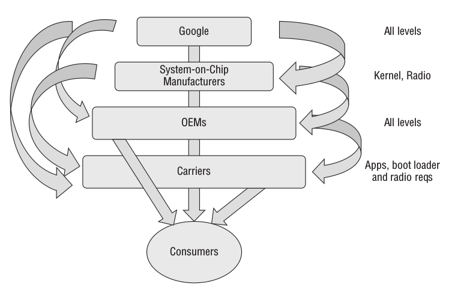
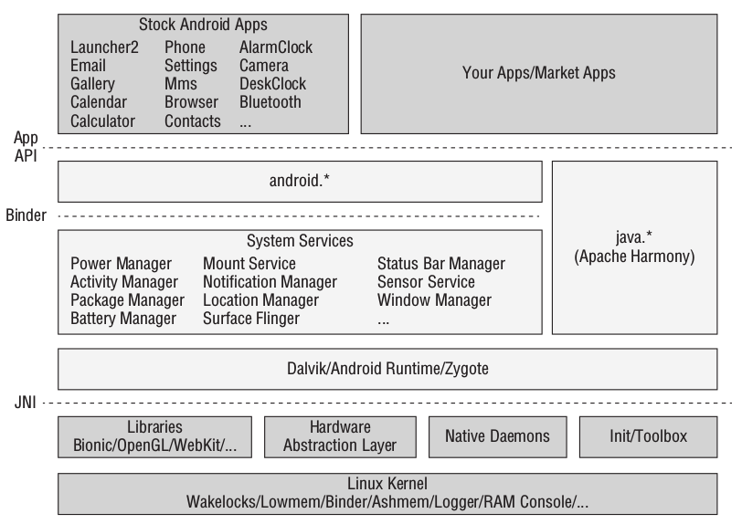
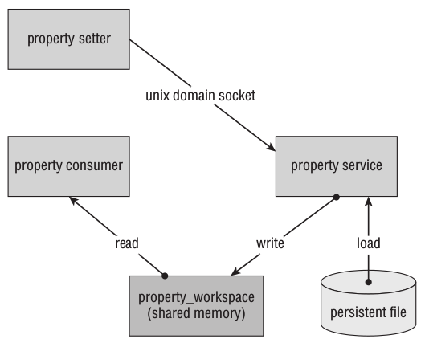
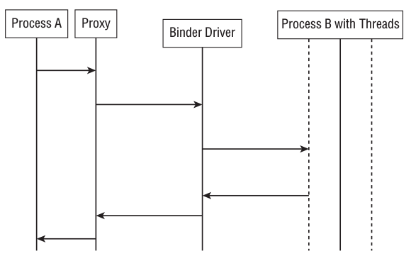
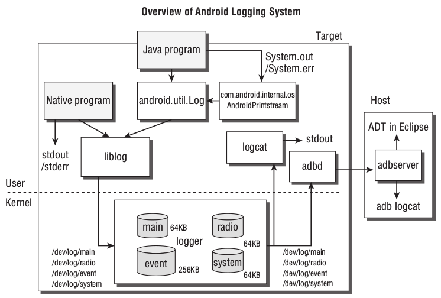

# The Authoritative Guide to Android Security Attack and Defense

## Chapter 1 Overview of the Android Ecosystem

## Chapter 2 Android Security Design and Architecture 

Android's overall architecture consists of five main levels of components: Android application layer, Android framework layer, Dalvik virtual machine layer, user space native code layer and Linux kernel layer. 

### Understanding security boundaries and security policy enforcement

 Security boundaries are special areas in the system that separate different trust levels. 

The Android operating system applies two sets of independent but coordinated permission models: the Android sandbox model that uses users and user groups to implement permission control in the Linux kernel, and the Android runtime model that exists in the form of DalvikVM and the Android framework. 

#### Android Sandbox

The Android system follows Linux's `UID/GID` permission model and defines a mapping table from name to unique identifier `Android ID (AID)`. In addition, Android uses a secondary user group mechanism to allow processes to access shared or protected resources and can be used to grant additional permissions to processes. 

When the application executes, their `UID`, `GID` and auxiliary user group will be assigned to the newly created process. Running in a unique `UID` and `GID` environment allows the operating system to implement low-level restrictions in the kernel and allows the running environment to control the interaction between applications. 

#### Android Permissions

To determine the permissions and secondary user groups of an app user, the Android system handles the high-level permissions specified in the `AndroidManifest.xml` file in the app package. An app's permissions are extracted by the `PackageManager` from the app's `Manifest` file at installation time and stored in the `/data/system/packages.xml` file. These entries are used during the instantiation phase of the application process to grant the appropriate permissions to the process. The mapping table of 

 permissions to user groups is stored in the `/etc/permissions/platform.xml` file. 

1. API permissions 
API permissions are used to control access to high-level functions. Some API permissions correspond to kernel-level security enforcement mechanisms. 
2. File system permissions
3. IPC permissions

 apply to some major Android application components built on the Android Binder IPC mechanism. 

### In-depth understanding of each layer

#### Android application layer

`AndroidManifest.xml`: Pay special attention to the `sharedUserId` attribute. If two applications are signed by the same key, They can specify the same user identifier in their respective Manifest files, and the two applications will run under the same UID environment and thus have access to the same file system data storage and potentially other resources. 

`Intent`: An `Intent` is a message object that contains information about an operation to be performed. If the caller or callee specifies permission requirements to send or receive messages, the Android runtime performs a permission check on the `Intent`. When declaring a specific component in the `Manifest` file, you can specify an `Intent Filter` to define the criteria for endpoint processing. (Implicit Intent)

`Activity`: `Activity` is a user-oriented application component or user interface. The low-level management of `Activity` is handled by a component called `Activity Manager`. The `launchMode` property affects how the Activity is launched. 

`Broadcast Receiver`: Occurs when an app wishes to receive an implicit Intent that matches certain criteria. 

`Service`: An application component that runs in the background without a user interface. 

`Content Provider`: Provides structured access interfaces for various common and shared data stores. 

#### Android Framework Layer

The Android Framework Layer provides developers with components that perform common tasks, including any non-application-specific code that still executes in `DalvikVM`. Common framework layer packages are located in the `android.*` namespace. The framework layer also includes services for managing the functionality provided by internal classes. These managers are started by `system_server` after system initialization. 

#### DalvikVM

DalvikVM is register based rather than stack based. These registers are designated as storage locations in virtual machine memory and are used to emulate the register functionality of a microprocessor. `DalvikVM` uses `Java Native Interface (JNI)` to interact with the underlying native code. 

When an Android device starts, the `Zygote` process is one of the first processes to run. It is responsible for starting other services and loading the libraries used by the Android framework. Then, the Zygote process acts as a The loader of a process creates a process by making a copy of its own process. `Zygote` can also start the `system_server` process, which houses all core system services and runs with privileged permissions in the system's `AID` user environment. 

#### User space native code layer

 This layer is mainly composed of two major types of components: program libraries and core system services. 

1. Program libraries: Many low-level functions that higher-level classes in the Android framework layer rely on are implemented through shared libraries and accessed through `JNI`. 
2. Core services: Services and Android native components that establish the basic operating system environment. 

`init`: The `init` program initializes the user-space environment by executing a series of commands that Android executes based on the instructions found in `/init.rc`. 

`Property service`: The `Property` service is located in Android's initialization service. It provides a persistent, memory-mapped, key-value pair-based configuration service. 

`Wireless interface layer`: Provides communication functions. 

`debuggerd`: The `debuggerd` daemon provides basic crash reporting for Android. 

`ADB`: Consists of the `adbd` daemon on the Android device, the `adb` server running on the host workstation, and the corresponding `adb` command line client. 

`Volume daemon`: or `vold`, is a service responsible for installing and uninstalling various file systems on the Android system. `vold` also handles the installation and uninstallation of `Android Secure Container (ASEC)` files. When the application package is stored on an unsafe file system such as `FAT`, `ASEC` will encrypt it when the application is loaded. Install via a loopback device, usually mounted to `/mnt/asec`. Opaque binary blocks (OOBs) are also installed and uninstalled by `vold`. These files are packaged with the application to store data encrypted by a shared key. Unlike `ASEC` containers, the installation of `OBB` And uninstallation is performed by the application itself rather than the system. 

#### Kernel

1. Binder

`Binder` kernel driver is the glue of the entire `Binder` architecture. `Binder` operates in a client/server model, allowing one process to call multiple methods in multiple "remote" processes simultaneously. The `Binder` architecture abstracts the underlying details so that these method calls are like local function calls. Binder's information flow diagram: 

`Binder` also uses process `ID (PID)` and `UID` information as a means of identifying the calling process , allowing the callee to make access control decisions. Usually, functions such as `Binder.getCallingUid` and `Binder.getCallingPid` are called, or high-level check functions such as `checkCallingPermission` are called. 

2. ashmem

 The anonymous shared memory service provides a file-based, reference-counted shared memory interface. ashmem can automatically shrink the memory cache and reclaim the memory area when the global available memory is low, which is very suitable for low memory environment. To use `ashmem` under the hood just call `ashmem_create_region` and use the `mmap` function on the returned file descriptor. At a high level, the Android framework layer provides the `MemoryFile` class as a wrapper around the `ashmem` driver. 

3. pmem
`pmem` is used to manage large physically contiguous memory blocks that can be shared between user space processes and other kernel drivers. Unlike `ashmem`, the `pmem` driver requires an allocation process that reserves a file descriptor for `pmem`'s memory heap until all other indexes are closed. 

4. The logger 

 is used as a support for the `logcat` command. This driver is used to view the log buffer. It provides 4 independent log buffers according to the type of information: `main` (main buffer), radio (radio buffer), event (event buffer) and system (system buffer). 

5. Paranoid Networking

The Android kernel restricts network operations based on an auxiliary user group of a calling process, and this calling process is called `Paranoid Kernel modification module for Networing`. At a high level, this module maps an AID to an application-level permission statement or request. 

## Chapter 3 Root Android Device

## Chapter 4 Application Security Assessment

## Chapter 5 Understanding Android’s Attack Surface

## Chapter 6 Using Obfuscation Test to discover vulnerabilities

## Chapter 7 Debugging and Analysis of Security Vulnerabilities

## Chapter 8 Vulnerability Exploitation of User Mode Software

## Chapter 9 ROP vulnerability exploitation technology

## Chapter 10 Attacking the kernel

## Chapter 11 Attacking the RIL wireless interface layer

## Chapter 12 Vulnerability Exploitation Mitigation Technology

## Chapter 13 Hardware Layer Attack
