# A thorough study of Android security architecture

## Chapter 1 Android security model

### Android architecture

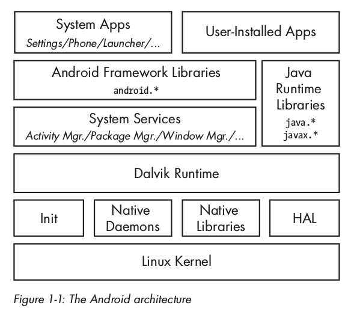

#### Binder

1. Binder implementation

Binder implements a distributed component architecture based on abstract interfaces. The Binder driver is the core object of this architecture, and all IPC calls are implemented through it. One of the interfaces is the `/dev/binder` device. Inter-process communication is implemented through an `ioctl()` call, which uses the `binder_write_read` structure to send and receive data. The data consists of a `write_buffer` containing the command to be executed by the driver and a `read_buffer` containing the command to be executed by the user layer. `Composition. The 

Binder driver manages a portion of the address space of each process. These memory blocks are read-only for the process, and their write operations are implemented by the kernel module. When one process sends a message to another process, the kernel allocates some space in the memory space of the directory process, and then copies the message directly from the sending process into it. Then it will send the specific address of the received message to the receiving process through a short message. Because the message is in the recipient's memory space, the recipient can access it directly. When the process no longer needs this message, it notifies the Binder driver to release this memory. 

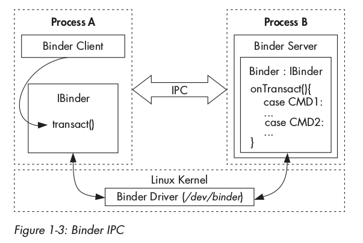

Higher-level IPC abstractions in Android, such as Intent, Messenger, ContentProvider, etc., are all implemented based on Binder. 

2. Binder security

 At a higher level, each object that implements the `IBinder` interface through the Binder framework and is allowed to be accessed and called can be called a Binder object. A call to a Binder object is implemented inside a Binder transaction, which includes a reference to the target object, the ID of the method to be executed, and a data buffer. The Binder driver will automatically add the process ID (PID) and effective user ID (EUID) to the transaction data. The called process (callee) can check the PID and EUID and decide whether to execute the requested method based on its internal implementation logic or the calling process's system-level metadata. 

Because the PID and EUID are both filled in by the kernel, the caller process cannot obtain permissions beyond the system's permission by forging identities. This is one of the core aspects of the Android security model. The caller's EUID and PID are accessed through `getCallingPid()` and `getCallingUid()` of class `android.os.Binder`. 

3. Binder Identity

Binder An important property of objects is that they have a unique identity across processes. The kernel is responsible for maintaining a direct mapping between active Binder objects and their handles in other processes. This enables Binder objects to be used as security tokens and enables Android to use capability-based security. 

Capability-based security model: Grant a program access to specific resources by giving it an unforgeable capability. 

4. Binder token

 A Binder token can be a capability or a target resource. A process has a Binder token that grants the process full access control over the Binder object, allowing it to perform Binder transaction operations on the target object. 

A common pattern is to allow all operations to the calling process running under `system` (UID 1000) or `root` (UID 0) permissions, while performing additional permission checking routines for other processes . 

5. Accessing the Binder object

 We know that the only way to communicate with Binder is to use a reference to the object, but many Binder objects (especially system services) need to be globally accessible, however, distribute references to all system services It is unrealistic to reach every process. To use the service discovery mechanism in the future, the Binder framework has a dedicated context manager, the `servicemanager` native daemon, which is used to maintain references to Binder objects. Services usually pass the service name and a Binder reference to the service manager for registration, so that any client can obtain its Binder reference through the service name. 

### Android security model

#### Application sandbox

 Each application is given a unique UID when installed, and the program runs with this UID within a specific process. . Applications are isolated, both at the process level (running in their own processes) and at the file level (with private data directories). 

Android does not have a traditional `/etc/password` file, and its system UID is statically defined in the `android_filesystem_config.h` header file. UIDs for system services start at 1000, which is the `system` user (AID_SYSTEM) with special (still restricted) permissions. And the application automatically starts from 10000 (AID_APP) starts to generate UID, and the corresponding user name is in `app_XXX` or `uY_aXXX` format. 

The application UID is managed in the `/data/system/packages.xml` file along with other package metadata and written to the `/data/system/packages.list` file. 

Applications can be installed using the same UID, called a shared user ID, they share files, and they even run in the same process. In order to share the same UID, apps need to use the same key for code signing. 

#### Permissions

 applications request access permissions by defining them in the `AndroidManifest.xml` file. 

#### IPC

Android uses a combination of kernel drivers and user space libraries to implement the IPC mechanism. 

#### Code Signing and Platform Key

Android uses APK signing to ensure that app update packages come from the same author, thereby establishing trust between apps. 

 System applications are signed with some platform key (platform key). Different system components can share resources and run in the same process when they are signed by the same platform key. 

#### Multi-user support

Starting from Android version 4.2, it is enabled by default on tablets. 

Each user has a unique `user ID`, which starts from 0, and has its own data directory `/data/system/users/<user ID>/`, also called the user's system directory. To differentiate between applications installed by each physical user in the future, Android assigns the application a new effective UID. The UID is based on the user ID of the physical user and the UID (app ID) of the application under the single-user system. This composite structure of UID ensures that even if different users install the same application, the application has its own sandbox environment under each user. 

#### SELinux

SELinux is an implementation of the mandatory access control (MAC) mechanism for the Linux kernel. It adds some unique functions to Android to isolate the core system daemon process and user applications. Different security domains (domains), and different access policies defined for each domain. 

### Summary

Android is a permission isolation operating system based on the Linux kernel. High-level system functions are implemented as a set of cooperating system services, and they communicate using an IPC mechanism called Binder. Android uses different system identities (Linux UIDs) to isolate applications. By default, applications will only have very limited permissions. If you want to interact with system services, hardware devices, or other applications, you must apply for more fine-grained permissions. Permissions are defined in advance in each application's manifest file and are assigned to the application during installation. The system uses each app's UID to find their permissions and perform permission checks. In the latest version, system process isolation uses the SELinux mechanism to further restrict permissions for each process. 

## Chapter 2 Permissions

### The essence of permissions

In Android, a permission is simply a string that represents the ability to perform a specific operation. There are two types of permissions: built-in permissions and custom permissions. You can use `pm list permission` to view the list of permissions known to the current system. Permission names are usually prefixed by the name of the package that defines it, followed by the `.permission` string. 

### Application for permission

 The application applies for permission by adding the `<uses-permission>` tag in the `AndroidManifest.xml` file, and uses the `<permission>` tag to define new permissions. 

### Permission management

When each application is installed, the system uses the package manager service to grant permissions to them. The package manager maintains a core database of installed packages, including the installation paths, versions, signing certificates, permissions for each package and a list of all defined permissions for pre-installed and user-installed packages. This package database is stored as an XML file in `/data/system/packages.xml`. 

### Protection levels of permissions 

 The protection levels of a permission (Permission Protection Levels) are: implying the potential risks hidden in the permissions, and indicating the checks that the system should follow when deciding whether to grant permissions The flow of the program. 

 There are 4 protection levels defined in Android: 

1. The normal level is the default value and defines low-risk permissions for accessing the system or other applications. Normal level permissions do not require user confirmation and are automatically granted. 
2. Dangerous level 
dangerous level permissions can access user data or control the device in some form. When granting permissions, a confirmation dialog box will pop up showing permission information. 
3. signature level
signature level is the most restrictive permission level and will only be granted to applications that use the same certificate as the declared permission. System applications typically used to perform device management tasks. 
4. signatureOrSystem level

 compromise solution that can be given to some applications of the system image, or applications with the same signature key as the claimed permission. 

### 权限的赋予

1. 权限和进程属性

```xml
<!-- This file is used to define the mappings between lower-level system
     user and group IDs and the higher-level permission names managed
     by the platform. -->
<permissions>
    <!-- The following tags are associating low-level group IDs with
         permission names.  By specifying such a mapping, you are saying
         that any application process granted the given permission will
         also be running with the given group ID attached to its process,
         so it can perform any filesystem (read, write, execute) operations
         allowed for that group. -->

    <permission name="android.permission.INTERNET" >
        <group gid="inet" />
    </permission>
    <permission name="android.permission.WRITE_EXTERNAL_STORAGE" >
        <group gid="sdcard_r" />
        <group gid="sdcard_rw" />
    </permission>

    <!-- The following tags are assigning high-level permissions to specific
         user IDs.  These are used to allow specific core system users to
         perform the given operations with the higher-level framework. -->

    <assign-permission name="android.permission.MODIFY_AUDIO_SETTINGS" uid="media" />

</permissions>
```

`/etc/permission/platform.xml` 文件定义了低层的系统用户、用户组和高层的权限名之间的映射。

由 `<permission>` 标签里的关联可知，被赋予 `WRITE_EXTERNAL_STORAGE` 权限的进程，其补充 GID 中包括 `sdcard_r` 和 `sdcard_rw` 对应的 GID。

`<assign-permission>` 标签则相反，用于给那些运行在特定 UID 下的、没有对应包文件的系统进程赋予更高层次的权限。节选中，权限 `MODIFY_AUDIO_SETTINGS` 分配给了以 `media` UID运行的进程。

Android 系统中没有 `/etc/group` 文件，所以组名称到 GID 的映射是静态的，在 `android_filesystem_config.h` 头文件中定义。该头文件同样定义了 Android 系统核心目录和文件的所有者、访问模式和权能。

包管理器在启动时读取 `platform.xml`，并维护一个权限到 GID 的列表。当它给一个安装中的包授权时，包管理器检查每个权限是否有对应的 GID。如果有，则此 GID 加入到应用的补充 GID 列表中。补充 GID 列表写在 `packages.list` 文件中的最后一个字段。

2. 赋予进程属性

我们知道每个应用实际上就是一个执行应用字节码的 Dalvik 虚拟机进程，但 Android 不会为每个应用开启新的虚拟机进程，它使用一个叫作 `zygote` 的已部分初始化的进程，这个进程由 `init.rc` 初始化脚本启动，当需要启动新的应用时，就使用 `fork()` 函数来复制 zygote 进程，这个过程叫做特殊化（dalvik_system_Zygote.cpp 文件中的 forkAndSpecializeCommon() method). 

```c
pid = fork()

if (pid == 0) {
 int err;
 /* The child process */
 err = setgroupsIntarray(gids);
 err = setrlimitsFromArray(rlimits);
 err = setresgid(gid, gid, gid);
 err = setresuid(uid, uid, uid);
 err = setCapabilities(permittedCapabilities, effectiveCapabilities);
 err = set_sched_policy(0, SP_DEFAULT);
 err = setSELinuxContext(uid, isSystemServer, seInfo, niceName);
 enableDebugFeatures(debugFlags);
}
```

 The child process first uses `setgroups()` to set the supplementary GID, then uses `setrlimit()` to set resource limits, and then calls `setresgid()` and ` setresuid()` sets the real user/group ID, effective user/group ID, and protected user/group ID. Then use `capset()` to set the capabilities of the process, and then set the scheduling policy by adding yourself to a predefined control group. Then set its own `nice name` and `seinfo` tags. Finally, enable debugging as needed. 

Use the `ps` command to view the process list. The `PID` column indicates the displayed process ID, and the `PPID` column indicates the parent process ID. 

```text
USER PID PPID VSIZE RSS WCHAN PC NAME
root 1 0 2936 548 c02caffc 0806c480 S /init

root 1145 1 1217224 50032 ffffffff b7709f05 S zygote

system 1492 1145 1341112 82336 ffffffff b77096b5 S system_server
u0_a12 1570 1145 1276984 66640 ffffffff b77096b5 S com.android.systemui
radio 1663 1145 1251160 43660 ffffffff b77096b5 S com.android.phone
```

### Permission execution

#### Kernel layer permission execution

 Compared with Linux, Android has added unique features The control is that the processes that create network sockets need to belong to the `inet` group, also known as Android `paranoid` network access security control mechanism (paranoid network security), implemented by an additional check in the Android kernel. 

```c
#ifdef CONFIG_ANDROID_PARANOID_NETWORK
#include <linux/android_aid.h>

static inline int current_has_network(void)
{ return in_egroup_p(AID_INET) || capable(CAP_NET_RAW); # 1
}
#else
static inline int current_has_network(void)
{ return 1; # 2
}
#endif
--snip--
static int inet_create(struct net *net, struct socket *sock, int protocol, int kern)
 {
 --snip--
 if (!current_has_network())
 return -EACCES; # 3
 --snip--
}
```

Processes that do not belong to the `AID_INET` group will not have the `CAP_NET_RAW` capability and will therefore receive a denial of service error (#1, # 3). Non-Android kernels do not define `CONFIG_ANDROID_PARANOID_NETWORK`, so there is no need for a specific group corresponding to the operation that creates the socket (#2). In order for the `inet` group to be assigned to an application process, the process needs to be granted `INTERNET` permission. Paranoid network security controls are also used for Bluetooth sockets and the kernel tunnel driver (VPN). The list of Android GIDs treated specially by the kernel is in `include/linux/android_aid.h`. 

#### Native daemon-level permission enforcement

Although Binder is the preferred IPC mechanism in Android, the underlying native daemons often use UNIX domain sockets for inter-process communication. UNIX domain sockets are represented by nodes on the file system, and the standard file system permission mechanism can be used for permission control. 

The local socket of the system daemon is defined by `init.rc`, which is created by the `init` process. Take the device volume management daemon (vold) as an example: 

```text
service vold /system/bin/vold
 class core
 socket vold stream 0660 root mount
 ioprio be 2
`` `

vold declares a socket also named `vold` with access permission `0660`, which belongs to `root`, the group it belongs to is `mount`. The local socket of the Android daemon is created in the `/dev/socket/` directory: 

```text
root@generic_x86:/ # ls -al /dev/socket/ 
srw-rw--- - root mount 2016-11-30 13:40 vold
srw-rw---- root system 2016-11-30 13:40 zygote
--snip--
```

UNIX domain sockets allow passing and querying user credentials using the `SCM_CREDENTIALS` control message and the `SO_PEERCERD` socket option, by the kernel Check so that it cannot be forged by user processes. 

#### Permission execution at the framework layer

The system records the permissions associated with each component based on the manifest file, and checks whether the caller has the required permissions before allowing access to the component. Since components cannot change permissions at runtime, the system's permission check execution process is static. Belongs to declarative security. 

Android components can also dynamically check whether the calling process is granted a certain permission, and the calling process does not require pre-declared permissions in the manifest. It belongs to the imperative security mechanism (Imperative Security). 

1. Dynamic permission execution

Android provides many methods in the `android.content.Context` class for checking whether the caller has a certain permission. Take `int Context.checkPermission(String permission, int pid, int uid)` as an example: 

```java
public int checkUidPermission(String permName, int uid) {
 synchronized (mPackages) {
 Object obj = mSettings.getUserIdLPr(UserHandle.getAppId(uid));
 if (obj != null) {
 GrantedPermissions gp = (grantedPermissions)obj;
 if (gp.grantedPermissions.contains(permName)) {
 return PackageManager.PERMISSION_GRANTED;
 }
 } else {
 HashSet< String> perms = mSystemPermissions.get(uid);
 if (perms != null && perms.contains(permName)) {
 return PackageManager.PERMISSION_GRANTED;
 }
 }
 }
 return PackageManager.PERMISSION_DENIED;
}
```

here `PackageManagerService` first obtains the app ID of the application based on the incoming parameter UID, and then obtains the authorized permissions. If the `GrantedPermission` class contains the target target permission, this method returns `PERMISSION_GRANTED`. If not included, checks whether the target permission can be automatically assigned based on the UID (based on the <assign-permission> tag in the platform.xml file). If this check also fails, `PERMISSION_DENIED` is eventually returned. 

2. Static permission enforcement

 Static permission enforcement occurs when an application attempts to interact with a component declared by another application. The overall process is similar to dynamic permission execution: use `Binder.getCallingUid()` and `Binder.getCallingPid()` to obtain the UID and PID of the caller, then map the caller UID to the package name, and then obtain the relevant permissions. If the caller's permission set contains the permissions required by the target component, the component starts, otherwise a `SecurityException` exception is thrown. 

 Permission checking is performed by `ActivityManagerService`, which is responsible for parsing the specific `intent` and checking whether the target component has the relevant permission attributes. If so, it hands off the permission checking to the package manager. 

### System permissions

`framework-res.apk` defines the android package and system permissions, and the `AndroidManifest.xml` file inside declares permission groups and permissions. Permission groups are used to display a set of related permissions in the system user interface, but each permission still needs to be applied for separately. 

 protection level can be combined with protection flags for further authorization constraints. 

### Shared user ID

Android applications signed with the same key can run with the same UID and can also run in the same process. This feature is the shared user ID. Note that you cannot switch an installed app from non-shared user ID status to shared user ID status. 

Shared user IDs can be enabled by adding the `sharedUserId` attribute to the root element of the `AndroidManifest.xml` file. If the specified shared UID does not exist, it will be created immediately. If another package with the same shared UID has already been installed, the signing certificate will be compared with the existing package. If there is a mismatch, an `INSTALL_FAILED_SHARED_USER_INCOMPATIBLE` error will be returned. 

 Shared UID is a first-level object of system package data and is treated like an application: it has corresponding signing certificates and permissions. Android has 5 built-in shared UIDs, which are automatically added when the system boots: 

- android.uid.system (SYSTEM_UID, 1000) 
- android.uid.phone (PHONE_UID, 1001) 
- android.uid. bluetooth(BLUETOOH_UID, 1002)
- android.uid.log(LOG_UID, 1007)
- android.uid.nfc (NFC_UID, 1027)

 is a package that is part of a shared user and does not have a related authorization information permission list. Packages inherit the permissions of the shared user, which aggregate the permissions requested by all users installing the package with the same shared UID. Permissions defined under `<shared-user>` can be dynamically added or removed as packages are installed or uninstalled. 

Shared UID is not just a package management component, it actually maps a shared Linux UID at runtime. 

### Custom permissions 

 Custom permissions are permissions that are simply declared by third-party applications. After permissions are declared, they can be added to the application's components for static permission enforcement by the system, or the application can dynamically check whether the caller has been authorized by using the `checkPermission()` or `enforcePermission()` methods of the `Context` class. Authorization. 

 Applications can use the `android.content.pm.PackageManager.addPermission()` interface to dynamically add new permissions and use `removePermission()` to remove permissions. Dynamically added permissions must belong to the application-defined permission tree. An application can only add or delete permissions in the permission tree for itself or for packages that share the same UID. 

### Public and private components 

 Components defined in AndroidManifest.xml can be public or private. Private components can only be called by the specific application in which they are declared, while public components can be called by all other applications. A component can make the component exposed by setting the `exported` attribute to `true`, or by declaring an `intent filter` to make the component exposed implicitly. For components with `intent filter`, you can set `exported` to `false` to make the component not public. 

### activity and service permissions 

activity and Services can be protected by setting the `permission` attribute of the target component. When another application causes an `intent` to call `Context.startActivity()` or `text.startActivityForResult()` to start an activity, the activity's permissions are checked. For services, when other applications call `Context.startService()`, `stopService()` or `bindService()` to start a service, the corresponding permission check will also be triggered. 

### Broadcast permissions 

 The permissions of a broadcast receiver can be specified by the receiver or the sender. When sending a broadcast, you can use the `Context.sendBroadcast(Intent intent, String receiverPermission)` method. The `receiverPermission` parameter specifies the permissions of those receivers who are interested in the broadcast. Alternatively, the sender can use `Intent.setPackage(String packageName)` to scope the recipients to those defined by the specified package. Receivers can restrict who can send broadcasts to them by setting the `permission` attribute of the `<receiver>` tag in the manifest file. This method is called a static broadcast receiver. Or pass permission parameters to the `Context.registerReceiver(BroadcastReceiver receiver, IntentFilter filter), String broadcastPermission, Handler scheduler)` method. This method is called dynamically registering broadcast receivers. 

### Content provider permissions 

#### Static provider permissions 

 Most providers use different permissions for reading and writing. You can also specify `per-URI` permissions for URIs respectively. Specify permissions to protect a specific subset of their data. Per-URI permissions have higher priority than component-level permissions, so if an app wants to access a content provider URI that has associated permissions, it only needs to have permissions on the target URI, not component-level permissions. 

#### Dynamic provider permission

 applications can use the `Context.grantUriPermission(String toPackage, Uri uri, int modeFlags)` method to dynamically grant per-URI temporary access permissions, and can use `revokeUriPermission (Uri uri, int modeFlags)` method revokes authorization. Per-URI access can be temporarily enabled by setting the global `grantUriPermissions` attribute to true, or by adding the `<grantUriPermissions>` attribute to a specified URI. 

### pending intent

pending intent encapsulates an intent and a target action to perform it. The difference from a regular intent is that it also contains the identity of the application that created it. This allows pending intents to be handed off to other applications, which can perform specified actions using the identity and permissions of the original application. The identity in the pending intent is given by the system's `ActivityManagerService` service, and the pending intnet that records the current activity. 

### Summary

Every application on Android runs in a restricted sandbox and requires the application to apply for specified permissions in order to interact with other applications or the system. A permission is represented by a string representing the ability to perform a specific operation. They are granted to the app when the app is installed and remain unchanged for the life of the app (except for development permissions). Permissions can be mapped to Linux supplementary UIDs for the kernel to check when granting access to system resources. 

High-level system services perform permission checks by using Binder to obtain the UID of the calling application and looking up the permissions saved in the application package manager database. Permissions associated with a component are declared in the application's manifest file and are automatically enforced by the system, but the application can still choose to perform additional dynamic permission checks. In addition to using built-in permissions, applications can also customize permissions and associate them with components for access control of components. 

Each Android component can define its own access permissions, and the content provider can additionally specify read and write permissions for each URI. Pending intents encapsulate the identity of the application that created them, as well as an intent and an operation to be performed, allowing the system or third-party applications to use the identity and permissions of the original application to perform the specified operation. 

## Chapter 3 Package Management Mechanism

### The format of Android application package file

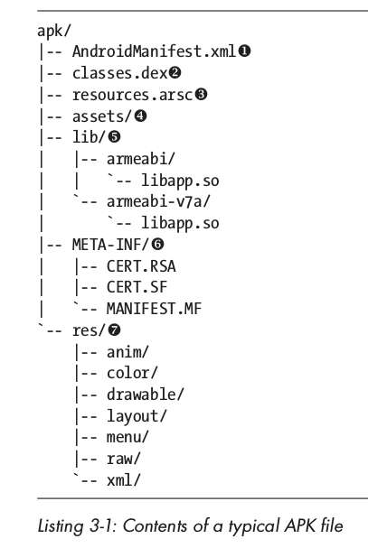

### Code signature

 Signature verification process not only verifies whether the code has been tampered with, but also verifies that the signature is authentic Generated from the expected key. But there are two problems. One is that code signing cannot directly solve the problem of whether the code signer can be trusted. The other is that it cannot solve the problem of whether the signed code is safe. 

#### Java Code Signing

Java code signing is performed at the JAR file level. It reuses and extends the JAR manifest file to add code signing to the JAR archive. Each entry in its main JAR manifest file (MANIFEST.MF) consists of the filename and summary of each file in the archive. 

```text
Manifest-Version: 1.0
Created-By: 1.7.0_60-ea (Oracle Corporation)

Name: R/o/lbs.xml
SHA1-Digest: dVGv8TM0cWVbDKwhxkgo/Ll3DW4=% 0A
Name: R/a/lsq.xml
SHA1-Digest: xcEF2Ph150M4VsMUwD42pnCskEg=
```

1. Implement 

Java code signing by adding another manifest file called the signature file (.SF suffix), This file contains the data to be signed and a digital signature. Digital signatures are also called signature block files, which are stored in binary form, and the suffixes are usually `.RSA`, `.DSA`, and `.EC`. 

```text
Signature-Version: 1.0
SHA1-Digest-Manifest-Main-Attributes: GQIRuJcAmolTl8SuRVbT9a+jZmw=
Created-By: 1.7.0_60-ea (Oracle Corporation)
SHA1-Digest-Manifest: EEfFH4d0IWOZ/CgcjvhE479B7fM=

Name: R/k/nes.png
SHA1-Digest: D9BO1p4U5U2prsvj4RuJO4FRWjY=

Name: R/a/lsq.xml
SHA1-Digest: The bsQJm/EY9cpzcL6pF4HApb/QamE=
```

 signature file contains a summary of the entire manifest file, as well as each summary in the MANIFEST.MF file. 

2. The official tools for signing and verifying JAR files are the jarsigner and keytool commands. 

 Use the jarsigner command to sign by specifying keystore as the alias of the signing key and a signature algorithm. Specify the `-verify` option for verification. 

```sh
$ jarsigner -keystore debug.keystore -sigalg SHA1withRSA test.apk androiddebugkey
$ jarsigner -keystore debug.keystore -verify -verbose -certs test.apk
```
% 0A Or use the keytool command: 

```sh
$ keytool -list -printcert -jarfile test.apk
```

#### Android code signature

 is different from standard JAR signature. Android does not care about the content and issuer of the signing certificate. All code signatures used in Android are Self-signed, there is no need to maintain your identity in any way. Additionally, all APK entries need to be signed by the same set of certificates. 

1. The `build/` directory of the Android code signing tool

AOSP contains an Android-specific tool called signapk. 

2. OTA file code signing

In order to support OTA updates, when each file has been signed separately, the entire compressed package needs to be signed. The signapk tool does this by turning on the "sign whole file" mode with the `-w` option. 

### APK installation process

- Open the downloaded app file directly on the device through the app store client
- Connect the USB device to the PC and use adb provided by the Android SDK Install with the install command, which calls the pm command line tool with the install parameter. 
- Use the Android shell to copy the APK file directly to an application directory, and the package manager will detect and install it. 
 solid arrows indicate dependencies between components, the same as function calls. The files or directories pointed by the dotted arrows are monitored by a component but are not directly modified by that component. 

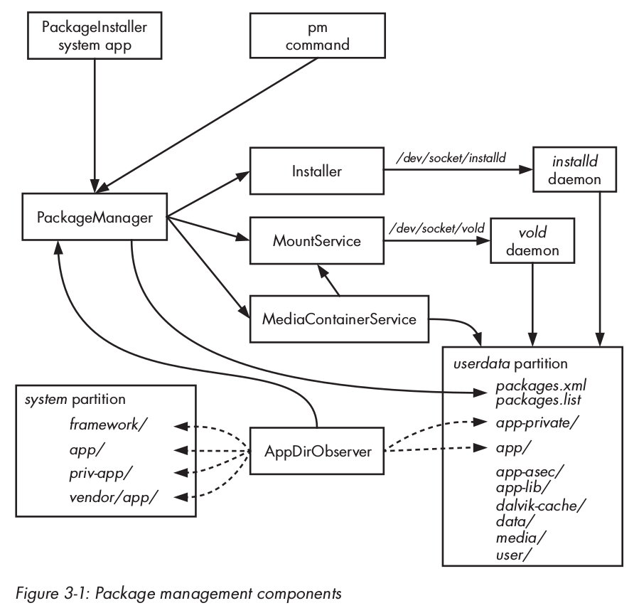

#### The location of application packages and data

In most systems, the system partition is a read-only partition and can be found in `/ System applications are found in the system/app/` directory. Under `/system/priv-app/` are privileged applications that can be authorized. signatureOrSystem protection level permissions. The `/system/vendor/app` directory contains vendor-specific applications. Applications installed by users are stored in the `/data/app/` directory of the userdata partition with read and write permissions, the data directory `/data/data/`, and the application-optimized DEX file `/data/dalvik-cache/`, System package database `/data/system/packages.xml` etc. 

#### Active component 

1. PackageInstaller system applies 

 default APK file processing method, which can only be turned on when the user turns on the "Unknown Sources" option in the device security settings. PackageInstall provides a basic GUI for package management, and when it is passed a `VIEW` or `INSTALL_ACTION` action with an intent attached to the URI of the APK file, it will process the installation package and pop up a window showing the permissions required by the application. Confirmation dialog box, after clicking Confirm, PackageInstall will call the PackaeManagerService service to execute the installation process. 

2. pm command

In Android shell, use `pm install` or `pm uninstall` command, in ADB, use `adb install/uninstall` command. 

3. PackageManagerService

 is responsible for parsing APK files, starting application installation, updating and uninstalling packages, maintaining package databases, and managing permissions. It provides several `installPackage()` methods, the most commonly used is `installPackageWithVerificationAndEncryption()`, which runs the installation of encrypted APK files and package verification through a verification agent. 

4. The Install class

PackageManagerService runs in the system service process (system UID) and lacks root permissions. However, creating, deleting and changing the owner of the application directory requires root permissions, and it delegates these operations to` install` daemon. The Install class uses the UNIX domain socket `/dev/socket/intalld` to initiate a connection to the installd daemon and encapsulates it into the installd command-oriented protocol. 

5. installd daemon 

installd daemon is a privileged local daemon that provides application and user directory management functions to the system package manager. It is also used to launch the `dexopt` command, which generates optimized DEX files for newly installed packages. 

The installd daemon can be accessed through the `installd` local socket, which can only be accessed by processes running under system. The install daemon does not execute as root and takes advantage of Linux's `CAP_DAC_OVERRIDE` and `CAP_SHOWN` capabilities in order to set the UID and GID of files and directories created by the application. 

6. MountService

 is used to mount detachable external storage and OBB files. OBB files are often used as extension files for applications. MountService is also used to initiate device encryption and change encryption passwords. The 

MountService service also manages the secure container, which is used to store application files so that non-system applications cannot access them. The secure container is encrypted and used to implement a DRM mechanism called forward locking. Forward locking is mainly used for the installation of paid apps to ensure that their APK files cannot be easily copied and redistributed. 

7. vold daemon 

vold is the Android storage management daemon. Since MountService runs as the system user and lacks the permission to mount/unmount disks, these operations are implemented by the vold daemon, which runs as the root user. 

vold exposes a local socket interface through the UNIX domain socket `/deev/socket/vold`, which is accessible only to members of the root and mount groups. 

8. The MediaContainerService

MediaContainerService service copies APK files to their final installation location, or to an encrypted container, and runs the PackageManagerService to access the files on removable storage. 

9. AppDirObserver

AppDirObserver is a component used to detect changes in APK files in the application directory, and then calls the corresponding PackageManagerService method based on the actual type. Each directory being viewed has a dedicated instance. 

#### Install a local package

1. Parse and verify the package

Opening an APK file will trigger the `application/vnd.android.package-archive` handler, `PackageInstaller` The `PackageInstallActivity` component in the system application will first detect whether the application is trusted. If it is not trusted and `Setting.Global.INSTALL_NON_MARKET_APPS` is set to `false`, then a warning box will pop up and the process will be terminated. 

 If installation is allowed, `PackageInstallerActivity` parses the APK file and extracts the information and package signature from the `AndroidManifest.xml` file. The integrity of the APK file is automatically verified when using `java.util.jar.JarFile` and related classes to extract the signing certificate for each entry. The hash value of the `AndroidManifest.xml` file is also part of the APK parsing process and will be passed to subsequent installation steps. This value will be used to verify that the APK file has not been deleted between the user clicking OK and the start of the APK copy process. replace. 

2. Receive permissions and start the installation process

After the parsing is completed, a dialog box will appear showing the relevant information of the application and the required permissions. If the installation is confirmed, `PackageInstallerActivity` forwards the APK file and its manifest summary to `InstallAppProgress`, which then passes the APK's URI and installation metadata to `PackageManagerService`'s `installPackageWithVerificationAndEncryption()` method, thereby starting the installation process. 

3. Copy to application directory 

`PackageManagerService` first creates a temporary file in the application directory (/data/app) and then delegates the copy to `MediaContainerService`. After the copy is successful, any native libraries it contains will be extracted to a specified app directory, which is under the system's native library directory (/data/app-lib). Next, the temporary APK files and library directories are renamed to their final names based on the package name. The permissions of the APK file are set to `0644`. Its SELinux environment is also set up. 

4. Package scanning

 calls the `scanPackageLI()` method of `PackageManagerService` to trigger package scanning. The package manager first creates a `PackageSettings` structure, which contains the package name, code path, individual resource paths and a path to a native library. It then assigns the new package a UID and stores it in the configuration structure. 

5. Create the data directory

`PackageManagerService` delegates directory creation to the `installd` daemon by sending an `install` command to the `installd` daemon. The `installd` daemon creates the package's data directory, shared native library directory, and local library directory, then sets the permissions of the package directory to `0751`, and creates a symbolic link to the app's local library in the local library directory. Finally set up the SELinux environment for the package directory and switch its owner to the UID and GID given to the app. 

6. Generate Optimized DEX

 Generate odex files for program code by sending the `dexopt` command to the `installd` daemon. Next, the installd daemon forks a dexopt process, which creates odex files in the `/data/dalvik-cache/` directory. 

7. File and directory structure

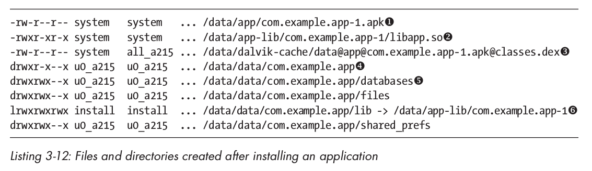

8. Add the newly installed package to package.xml
9. Package attributes

 can be passed Obtained from the `getPackageInfo(String packageName, int flags)` method of the `android.content.pm.PackageManager` SDK class. This method returns a An instance of PackageInfo that encapsulates information about each entry in `packages.xml`. 

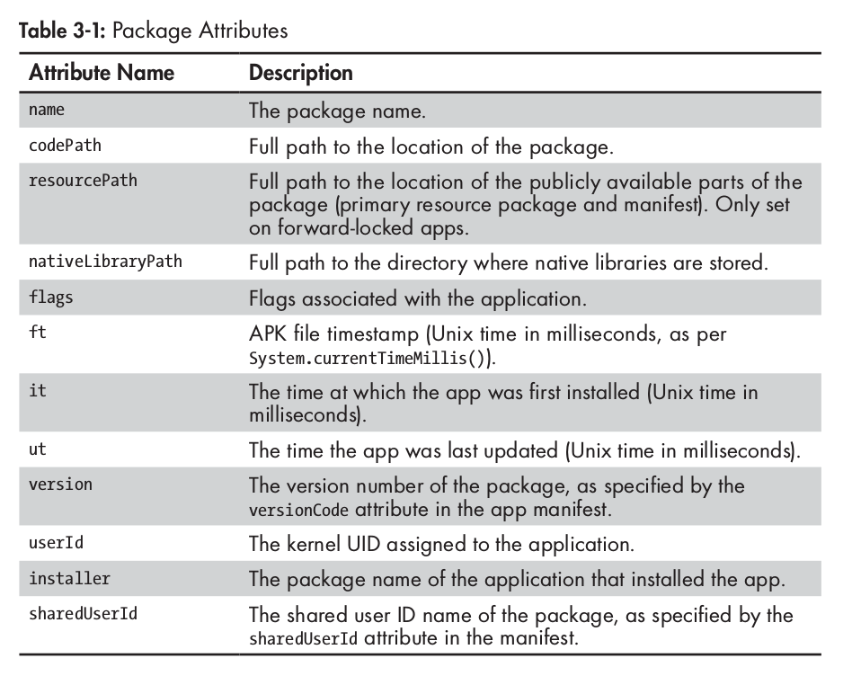

10. Update components and permissions

After creating the `packages.xml` entry, the PackageManagerService scans all new application manifests for Android components defined in the manifest , and adds it to the component registry that it loads internally in memory. Next, any permission groups and permissions declared by the app are scanned and added to the permissions registry. Finally, the package database saved on disk is modified, and the PackageManagerService sends `ACTION_PACKAGE_ADDED` to notify other components that a new application has been added. 

#### Update package 

1. Signature verification 

 checks whether the update package and the target were signed by the same issuer. Executed by the `compareSignatures()` method of PackageManagerService. 

2. The essence of updating non-system applications is to retain its data directory and reinstall the application. First, kill the processes related to the updated package, and remove the package and all components registered by the application from the internal structure and package database. Then, PackageManagerService triggers the package scanning action through the `scanPackageLI()` method and updates the package's code, resource path, version number, and timestamp. The package's manifest is also scanned and all defined components are registered into the system. The package's permissions are then reauthorized, the updated package database is written back to disk, and a `PACKAGE_REPLACED` system broadcast is sent. 

3. Update system applications

 Since the system application installation directory `/system/app/` is read-only, the update package is installed in the `/data/app/` directory, but the original application is still In addition to handling a `<package>` directory, the updated application has an `<updated-package>` entry. 

#### Installing an encrypted APK

1. Creating and installing an encrypted APK

 An APK file can be encrypted using the `enc` OpenSSL command, for example: 

```sh 
$openssl enc -aes-128-cbc -K The command encapsulates `adb push` and `pm install` command, copies the APK file to a temporary file on the device and starts the installation process. 

```sh
adb install [-l] [-r] [-s] [--algo <algoritm name> -- key <hex-encoded key> --iv <hex-encoded iv>] <file>
```

`--algo`, `--key`, `--iv` specify the encryption algorithm, key and initialization vector respectively. 

2. Implementation and encryption parameters

When the `pm` command is started with the `install` parameter, the `installPackageWithVerificationAndEncryption()` method is called. 

```java
public void installPackageWithVerificationAndEncryption(Uri packageURI,
 IPackageInstallObserver observer,
 int flags,
 String installerPackageNAme,
 VerificationParams verificationParams,
 ContainerEncryptionParams encryptionParams) The {
--snip--
}
```

VerificationParams class encapsulates a parameter used for package verification. The ContainerEncryptionParams class holds encryption parameters, including values ​​passed through the `adb install` command. 

3. Encrypted APK installation with integrity check

```sh
$ pm install -r --algo 'AES/CBC/PKCS5Padding' \
--key 000102030405060708090A0B0C0D0E0F \
- -iv 000102030405060708090A0B0C0D0E0F \
--macalgo HmacSHA1 --mackey 686d61635f6b65795f31 \
--tag 962ecdb4e99551f6c2cf72f641362d657164f55a /sdcard/my-app-enc.apk
 pkg: /sdcard/kr-enc.apk
Success
```

app Compares the specified MAC `tag` with the value calculated based on the real file content Complete to complete the integrity check. The final file is copied to the `/data/app` directory in decrypted form, so except for file decryption and integrity checking, the installation process is the same as the unencrypted APK. 

#### Forward Lock 

 Forward Lock is used for ringtones, wallpapers, and other digital goods sold for feature phones. It divides the app package into two parts: a globally readable part, including resources and manifests (in the /data/app directory), and another part that can only be read by system users, including executable code (in /data/app-private directory). 

#### Android 4.1 Forward lock implementation

 uses an encrypted container to implement the forward lock mechanism. A typical forward-locked application mount point list: 

```sh
# ls -l /mnt/asec/com.example.app-1
drwxr-xr-x system system lib
drwx-- ---- root root lost+found
-rw-r----- system u0_a96 1319057 pkg.apk
-r2-r--r-- system system 526091 res.zip
```

`res.zip` saves the app’s resources and manifest files and is globally readable;` The pkg.apk` file saves the entire APK file and can only be read by the system and the app specified application (u0_a96). The actual app container is placed in the `/data/app-asec/` directory, with the suffix `.asec`. 

1. Encrypted application containers

The Android Secure External Caches (ASEC) container manager is implemented in the system volume daemon (vold), and the MountService service provides an interface that provides its functionality to the framework layer service. You can also use the `vdc` command to interact with the vold process: 

```text
# vdc asec list // List the namespace ID of the mounted container
# vdc asec path com.example.app-1 // Display the mount point of the specified container 
# vdc asec unmount org.example.app-1 // Uninstall 
# vdc asec mount com.example.app-1 000102030405060708090A0B0C0D0E0F 1000 // Mount 
```

ASEC The encryption key of the container is stored in the `/data/misc/systemkeys/` directory. 

2. Installing a forward-locked APK

The installation process is designed with two additional steps: creating and mounting the secure container, and extracting public resources from the APK file. These steps are encapsulated by the MediaContainerService. When the APK is copied to the application directory, the appropriate MountService method is called, and the container management is delegated to the vold daemon. 

### Package Verification

The most widely used package verifier is the implementation in the Google Play Store client, supported by Google's app analytics infrastructure, which performs validator scanning before APK installation. 

#### Android's support for package verification

 Package verification is performed by one or more verification agents, and there is one `required verifier`, and zero to more `sufficient verifier`. When the required verifier and at least one sufficient verifier return a positive result, the verification action is completed. 

### Summary

Android application package is an extension of the JAR file format, which contains resources, code and a manifest file. APK files are signed using the code signing format for JAR files, but all files need to be signed using the same set of certificates. Android uses signing certificates to ensure that applications and their update packages have the same origin and establish trust relationships between applications. Installation of APK files is done by copying them to the `/data/app` directory and creating specific data directories under `/data/data/` for each application. 

Android supports encrypted APKs and secure application containers. Encrypted applications are automatically decrypted before being copied to the application directory. Forward-locked applications separate resources and manifests into one part, which are publicly accessible, and code and private assets into another part, stored in designated containers, which can only be accessed by the OS. 

Android has the option to verify applications through one or more verification agents before installation. Currently, the most widely used verification agent is built inside the Google Play Store client and uses Google's online verification service to check for harmful apps. 

## Chapter 4 User Management

### Overview of Multi-user Support

Users are identified by different user IDs, and only the system can switch between users. The default is single user. You can set the `config_multiuserMaximumUsers` system resource to a value greater than 1 to enable multi-user mode. 

### User type 

#### Master user (holder) 

 The master user is the first user created on the device, the user ID is 0, has all permissions, and can Create and delete other users, and change system settings that affect all users. 

#### Secondary Users

 Each secondary user has a designated user directory, their own installed applications, and a private data directory for each application. 

#### Restricted User 

 A restricted user is based on the master user and shares its applications, data, and accounts with certain restrictions. 

1. User restrictions

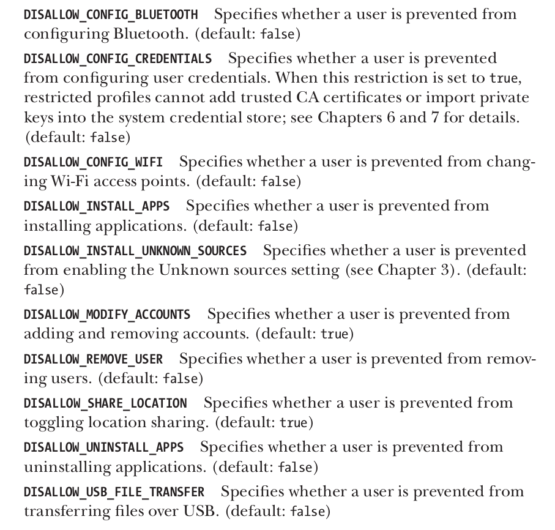

2. Application restrictions
 When the application is running, you can use the `UserManager.getUserRestrictions()` method to obtain a Bundle (a general container class, which uses strings to map different type values), including constraints imposed on the user. Restrictions are defined in key-value pairs, where the key is the name of the restriction and the value is a Boolean variable indicating whether it is valid. In addition to the built-in constraints defined by the OS, applications can customize constraints by creating a BroadcastReceiver that receives the `ACTION_GET_RESTRICTION_ENTRIES` intent. 

3. Access the online account

 First, the user can also access the main user's online account through the AccountManager interface. 

### User management

UserManagerService service is used to manage users, is responsible for reading and maintaining user information, and maintaining a list of active users. 

#### Command line tool

```sh
$ pm list users // List all users
$ pm create-user // Create a new user
$ pm remove-user // Delete user
$ pm get-max-users // Maximum number of users supported by the operating system
```

#### User status and related broadcast

```sh
USER_ADDED // Create new user
USER_REMOVE // Delete user
USER_INFO_CHANGED // When the user or its configuration information changes
USER_BACKGROUND, 
USER_FOREGROUND, 
USER_SWITCH // Switch user
 ```

### User metadata

User data is stored under `/data/system/users/`. Each user has a specific directory called user system directory, whose name matches the user ID. The `userlist.xml` file is stored Information about all users of the system. 

### Per-user application management

#### Application data directory

When an application is installed, if other users are present on the system, the PackageManagerService service User creates application data directory. The user data directory is stored under the `/data/user/` directory and is named after the user ID, where the device owner directory (0/) is a symbolic link to the `/data/data/` directory because the master user's data Still placed in the `/data/data/` directory. 

```sh
uid = userId * 100000 + (appId % 100000)
```

#### Application sharing

Although each user has a dedicated data directory , but the APK file is shared among all users, you can also create a `package_restrictions.xml` in the system directory of each user Files allow each user to have a different application. 

### External storage

 External storage is a case-insensitive file system with immutable POSIX permission classes and modes. 

#### External Storage Implementation

 Applications can manage their own directories in external storage without requesting the `WRITE_EXTERNAL_STORAGE` permission, which is used to authorize access to all external storage data. This special effect is called synthetic permissions. Its AOSP implementation is based on a FUSE daemon, which encapsulates the original storage device and manages file access and permissions based on a specific permission simulation method. Applications can access multiple external storage devices, but are only allowed to write arbitrary files to external storage (with the WRITE_EXTERNAL_STORAGE permission), and their access to other external storage is very limited, also called secondary external storage. 

#### Multi-user external storage

Each user on an Android device must have its own, isolated external storage directory. However, external storage has always used the FAT format file system, which is globally readable and does not support permission mechanisms. Google's multi-user memory implementation trades off three Linux kernel features: mount namespaces, bind mounts, and shared subtrees. 

1. Linux advanced mounting features

Linux All files on all storage devices are managed as part of a directory, and each file system is linked to a specified subtree by being mounted to the specified directory. The directory tree is shared by all processes, and each process sees the same directory structure. 

Mount namespace: Each running process has its own mount point, so it can use a different directory structure from other processes. At this time, the namespace of the parent process is called the parent namespace. 

Bind mount: allows a directory or file to be mounted to other paths in the directory tree, so that the same directory or file can be seen in multiple different locations. 

Shared subtree feature: Provides a way to control how file system mount points are propagated in the mount namespace. This allows the process to have its own namespace, but can still access the file system mounted after the process is started. Android uses two types of shared subtrees: shared mounts and slave mounts. Shared mounts created in the parent namespace will be propagated to all child namespaces. A slave mount has a master mount point that shares the mount, and new mounts are also propagated, but only from the master mount point to its slave mount points. 

2. Implementation on Android

 On a device where the main memory relies on internal storage, the sdcard FUSE daemon uses the `/data/media/` directory as the source, and in `/mnt/shell/emulated ` Creates a simulated file system. Like the application data directory, each user has a dedicated external storage data directory named after his or her user ID. The external storage setting is divided into two steps: the first step is to set all shared mount points in the zygote process, and the second step is to set the dedicated mount points visible to the respective processes as part of each application process. After that, the newly created application process can only see the external memory allocated to its starting user. 

#### External storage permissions 

sdcard The FUSE daemon assigns fixed users, groups, and access permissions to each file or directory on external storage. Additionally, permissions are immutable, and neither symbolic nor hard links are supported. The assigned owner and permissions are determined by the permission derivation mode used by the sdcard daemon. 

### Summary

Android allows multiple users to share a device by providing each user with their own memory and external storage. Multi-user support follows an established security model, and each user's application is assigned a different UID and runs in a designated process, without access to other users' data. User isolation is achieved through a combination of UID assignment schemes and storage mount rules. 

## Chapter 5 Cryptographic Services

### JCA Provider Structure

JCA provides an extensible cryptographic service provider framework and a set of APIs that cover the major ciphers in use today. Learn primitives. 

#### Encryption Service Provider

JCA divides the cryptographic function into several abstract encryption services, also called engines, and defines APIs for each service in the form of engine classes. 

In a JCA environment, a cryptographic service provider (CSP, or Provider) provides a package that implements certain cryptographic services. Each Provider advertises the services and algorithms it implements, allowing the JCA framework to maintain a Provider registry of supported algorithms and related implementations. The registry maintains a provider priority sequence, so if an algorithm is supported by multiple providers, the one with higher priority will be returned to the requesting application. 

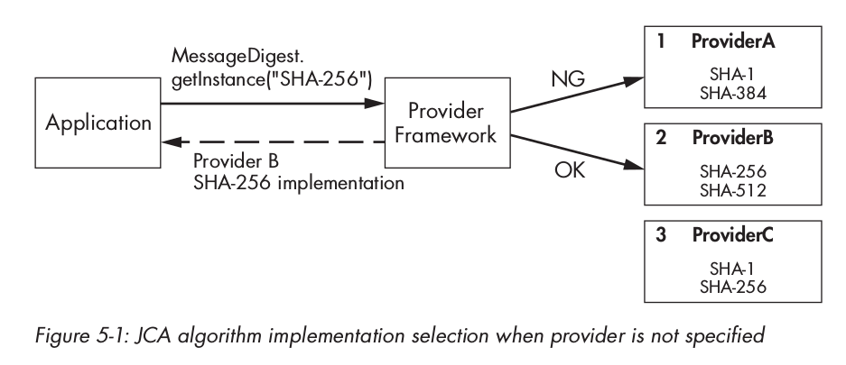

1. Provider implements

JCA architecture by following a common interface to request all implementations of a specific cryptographic service or algorithm, thus ensuring implementation of independence. For each engine lei that represents a specific cryptographic service, the framework defines a corresponding abstract Service Provider Interface (SPI) class. Provider for the respective cryptographic service, implements and advertises the corresponding SPI class. 

Each Provider also has a subclass of the `java.security.Provider` abstract class, which defines the name and version of the Provider, as well as a list of supported algorithms and matches the SPI implementation class. . 

2. Static registration of Provider

 Static registration requires editing the system security properties file and adding an entry for the Provider. 

```java
security.provider.n=ProviderClassName
```

`n` is the priority sequence number, starting from 1. 

3. Dynamically register Provider

 using the `addProvider()` and `insertProviderAt()` methods of the `java.security.Security` class to dynamically register it at runtime, and call the `removeProvider()` method to dynamically delete it. 

```java
static {
 Security.insertProviderAt(new MyProvider(), 1);
}
```

### JCA engine class

An engine class Provides an interface to a specified type of cryptographic service: 

- Cryptographical operations
- Generating or converting cryptographic materials
- Manage and store password objects

#### Obtain engine class instance

 In addition to providing an undefined interface for password operations, the engine class also decouples the client code from the background implementation, which is why they The reason why it cannot be instantiated directly; and `getInstance()` is provided A static factory method that allows indirect requests for an implementation. 

```java
static EngineClassName getInstance(String algorithm)
 throws NoSuchAlgorithmException
static EngineClassName getInstance(String algorithm, String provider)
 throws NoSuchAlgorithmException, NoSuchProviderException
static EngineClassName getInstance(String algorithm, Provider provider)
 throws NoSuchAlgorithmException
```

#### Algorithm name

The algorithm parameter of all factory methods that map to a specific cryptographic algorithm or specify an implementation strategy for a high-level object that manages a certificate/key collection. 

#### SecureRandom

The SecureRandom class represents a cryptographic random number generator (RNG). A typical software implementation is a cryptographically secure pseudo-random number generator (CSPRNG), which generates a set of approximately truly random sequence numbers based on an initial value called a seed. SecureRandom has a public constructor that can be used to create an instance. On Android, the recommended way to obtain a suitable seed instance is to use the default constructor. 

```java
SecureRandom sr = new SecureRandom();
byte() output = new byte[16];
sr.nextBytes(output);
```

#### The MessageDigest

MessageDigest class represents a cryptographic message digest function, also called a hash function. A cryptographic message digest takes an arbitrary-length sequence of bytes as input and produces a fixed-length sequence of bytes, called a digest or hash. 

```java
MessageDigest md = MessageDigest.getInstance("SHA-256");
byte[] data = getMessage();
byte[] digest = md.digest(data);
`` `

#### The Signature

Signature class provides a general interface for digital signature algorithms based on asymmetric encryption. A digital signature algorithm takes an arbitrary message and a private key as input and generates a fixed-byte length string called a signature. Digital signatures typically use a hash digest algorithm on the input message, encode the hash value, and then use a private key operation to generate the signature. The signature can be verified by performing the opposite operation using the corresponding public key. Calculate the hash value of the signed message and compare it with the hash value encoded in the signature. Successful verification will ensure the integrity of the signed message and ensure its credibility while keeping the private key private. 

```java
PrivateKey privKey = getPrivateKey();
PublicKey pubKey = getPublicKey();
byte[] data = "sign me".getBytes("ASCII");

Signature sig = Signature.getInstance("SHA256withRSA");
sig.initSign("privKey");
sig.update(data);
byte[] signature = sig.sign();

sig.initVerify(pubKey);% 0Asig.update(data);
boolean valid = sig.verify(signature);
```

#### Cipher

Cipher class provides a common interface for encryption and decryption. Ciphers are divided into block ciphers and stream ciphers, and encryption methods are divided into symmetric encryption and asymmetric encryption. 

```java
SecureRandom sr = new SecureRandom();
SecretKey key = getSecretKey();
Cipher cipher = Cipher.getInstance("AES/CBC/PKCS5Padding");

byte[] iv = new byte[cipher.getBlockSize()];
sr.nextBytes(iv);
IvParameterSpec ivParams = new IvParameterSpec(iv);
cipher.init(Cipher.ENCRYPT_MODE, key, ivParams);
byte[] plaintext = "encrypt me".getBytes("UTF-8");
ByteArrayOutputStream baos = new ByteArrayOutputStream();
byte[] output = cipher.update(plaintext);
if (output != null) {
 baos.write(output);
}
output = cipher.doFinal();
baos. write(output);
byte[] ciphertext = baos.toByteArray();
cipher.init(Cipher.DECRYPT_MODE, key, ivParams);
baos = new ByteArrayOutStream();
output = cipher.update(ciphertext);
if (output != null) {
 baos .write(output);
}
output = cipher.doFinal();
baos.write(output);
byte[] decryptedPlaintext = baos.toByteArray();
```

#### Mac

Mac class provides message authentication code (MAC) algorithm. MAC algorithms are often used to check the integrity of messages after they have been transmitted over unreliable channels. The MAC algorithm uses a secret key to calculate a MAC value, which can be used to authenticate the message and check its integrity. Authentication uses the same key, so the participants in the communication need to share the key directly. 

```java
KeyGenerator keygen = KeyGenerator.getInstance("HmacSha256");
SecretKey key = keygen.generateKey();
Mac mac = Mac.getInstance("HmacSha256");
mac.init(key );
byte[] message = "MAC me".getBytes("UTF-8");
byte[] tag = mac.doFinal(message);
```

#### The Key

Key interface indicates that it cannot be transparent in the JCA framework Access key. Opaque keys can be used for cryptographic operations but do not provide direct access to the underlying key material. There are three definition methods of 

Key interface: `String getAlgorithm()`, `byte[] getEncoded()`, `String getFormat()`. 

 Obtain a Key instance: use KeyGenerator or KeyPairGenerator to generate a key; use KeyFactory to convert from a certain encoding format; obtain the stored key from KeyStore. The 

#### SecretKey and PBEKey

SecretKey interfaces represent keys used for symmetric encryption. There is only one implementation that can be initialized directly, called SecretKeySpec. The 

PBEKey subinterface represents the use of password-based encryption (PBE) derived keys. Based on two ideas: one is to use the salting method to resist table-assisted dictionary attacks; the other is to use a large iteration technology, making the key derivation calculation very expensive. 

#### PublicKey, PrivateKey and KeyPair

 Public keys and private keys are used for asymmetric encryption algorithms. The KeyPair interface is simply a container for public keys and private keys. 

#### KeySpec

KeySpec can hold an encoded key. 

#### KeyFactory

KeyFactory encapsulates a conversion program that converts a transparent public or private key representation into a non-transparent object, and vice versa. 

#### SecretKeyFactory

 is similar to KeyFactory, but only operates on symmetric keys. It can convert a specified symmetric key into a Key object, and vice versa. 

#### KeyPairGenerator

KeyPairGenerator is used to generate public and private key pairs. Initialize the KeyPairGenerator by passing the asymmetric algorithm name as a parameter to the `getInstance()` factory method. 

#### KeyGenerator

 is similar to KeyPairGenerator, but used to generate symmetric keys. 

#### The KeyAgreement

KeyAgreement class represents a key agreement protocol that allows two or more participants to share keys without exchanging secret information. 

#### KeyStore

keystore represents a database of keys and certificates. The KeyStore class provides a well-defined interface to the keystore, defining the following three entries: PrivateKeyEntry, a private key associated with the certificate chain; SecretKeyEntry, a key; and TrustedCertificateEntry, another participating public key certificate. 

#### CertificateFactory and CertPath 

CertificateFactory as a certificate and CRL A parser that can build a certificate chain from a series of certificates. 

#### The CertPathValidator and CertPathBuilder

CertPathValidator classes encapsulate the verification algorithm of a certificate chain. 

### Summary

Android implements the Java Cryptocurrency Service Architecture (JCA) and packages several cryptography service providers. JCA defines interfaces to common cryptographic algorithms in the form of engine classes. The Cryptographic Provider supports these engine class implementations and allows clients to request an algorithm implementation by its name without knowing the actual internal implementation. The two main JCA Providers in Android are Bouncy Castle Provider and AndroidOpenSSL Provider. Bouncy Castle is implemented in pure Java, while AndroidOpenSSL is supported by native code and is the first JCA Provider. 

## Chapter 10 Equipment Security

### Control System Startup and Installation

#### Bootloader

 The bootloader (bootloader) is a dedicated, Hardware-related programs, this program will be started when the device is started for the first time. Its function is to initialize the device hardware, find and start the operating system. Most bootloaders support the fastboot protocol or download mode, and support writing to the device's persistent storage partition or booting a temporary system without flashing the device. 

#### Recovery system 

recovery operating system is a small Linux-based operating system that contains a RAM disk with various low-level tools, and a small UI operated through device hardware buttons. The recovery system is saved in a specific partition. A third-party recovery can be flashed when the bootloader is in download mode, and then the public key can be replaced or signature verification can be turned off. This recovery allows the main system to be completely replaced by a third-party operating system image. 

### Verified boot

Android verified boot (verified boot) implements the integrity detection target (target) based on the dm-verity device block (device-mapper). device-mapper is a Linux kernel framework that provides a general method to implement virtual block devices. It is the basis of Linux's Logical Volume Manager (LVM) and can also be used to implement full disk decryption, RAID arrays, and distributed redundant storage. The function of 

device-mapper is essentially to map a virtual block device to one or more physical block devices, and can selectively modify the transmission data during transmission. 

#### Introduction to dm-verity

 Because dm-verity is a block integrity detection target, the integrity of each block device is transparently verified when it is read. In detail, dm-verity uses a precomputed hash tree that contains the hashes of all device blocks. 

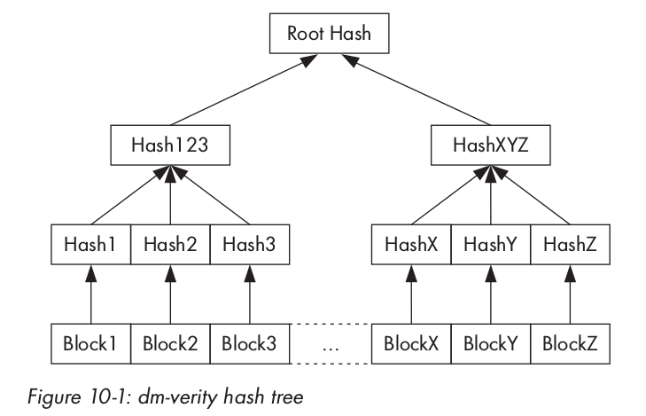

#### Android implementation

Android also uses the dm-verity target. The RSA public key is stored in the verity_key file of the boot partition. Use To verify the dm-verity mapping table. The mapping table contains the target device path and its corresponding hash table offset, root hash and salt. The 

 mapping table and its signature are part of the verity metadata block, which is written after the last file system block of the target device has been written to disk. A verify tag in the Android-specific fs_mgr_flags field before adding the partition to the device's fstab file marks the partition as verifiable. When the signature verification is successful, the file system manager will process the dm-verity mapping table and pass it to device-mapper, which then uses the information to create a virtual dm-verity block device. This virtual block device will be mounted to the mount point of the corresponding physical block in the fstab table, which replaces the original mount point. This way all reads to the underlying physical device are transparently hash tree verified. 

#### Turning on verification 

 Starting verification requires many steps: generating a hash tree, making a dm-verity mapping table for the hash tree, signing the mapping table, and then generating a verity metadata block and write it to the target device. 

A dm-verity

 hash tree can be generated by using the veritysetup program from the cryptsetup Volume Password Management Toolkit. Android's dm-verity requires that the hash tree and the target file system are on the same device, so when calling the veritysetup command, the offset after the metadata block must be explicitly specified. 

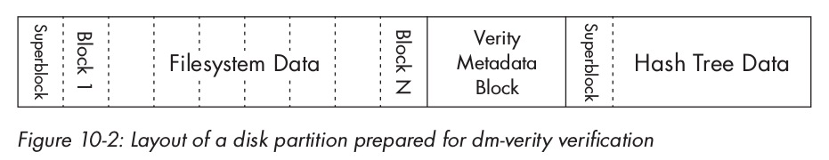

 Generating the hash tree will produce the root hash value, which is then used to build the dm-verity mapping table for the target device. 

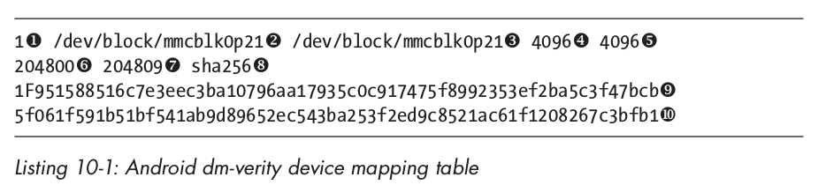 The 

 mapping table will be signed with a 2048-bit RSA key, and then combined with the generated PKCS#1 v1.5 signature to form a 32KB verity metadata block. 

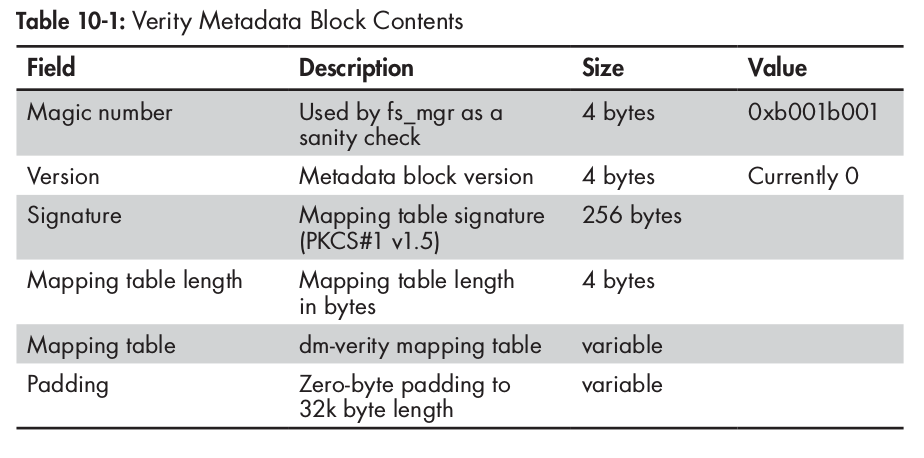

Finally modify the fstab file of the device, turn on the block integrity check of the system partition, and add the verify tag. 

### Disk encryption

 Disk encryption refers to using an encryption method to convert every bit of the file that needs to be stored on the disk into ciphertext for storage, thus ensuring that if there is no decryption key , completely unable to read data from the disk. Full Disk Encryption (FDE) ensures that all data on disk is encrypted. Android's full disk encryption implementation only encrypts the userdata partition. The boot and system partitions are not encrypted, but they can be verified using the dm-verity device-mapper target that verifies the boot. 

#### Password mode

Android's disk encryption uses dm-crypt, which is the current Linux kernel standard disk encryption subsystem. dm-crypt is also a device-mapper target that maps an encrypted physical block device to a virtual device-mapper device. All data accessed to this virtual device will be transparently decrypted or encrypted. 

The encryption mechanism deployed in Android uses a randomly generated 128-bit key and CBC mode AES for encryption. 

## Chapter 12 SELinux

### Introduction to SELinux

SELinux is a mandatory access control mechanism of the Linux kernel and exists as a Linux security module. The Linux Security Module (LSM) framework allows third-party access control mechanisms to be linked into the kernel, modifying the default DAC implementation. LSM consists of a series of security function hooks and related data structures embedded in various modules that replicate access control in the Linux kernel. The main kernel services hooked by LSM include: program execution, file and inode operations, netlink messages, and socket operations. 

#### The SELinux architecture

 has four basic components: an object manager, an access vector cache, a security server and a security policy. 

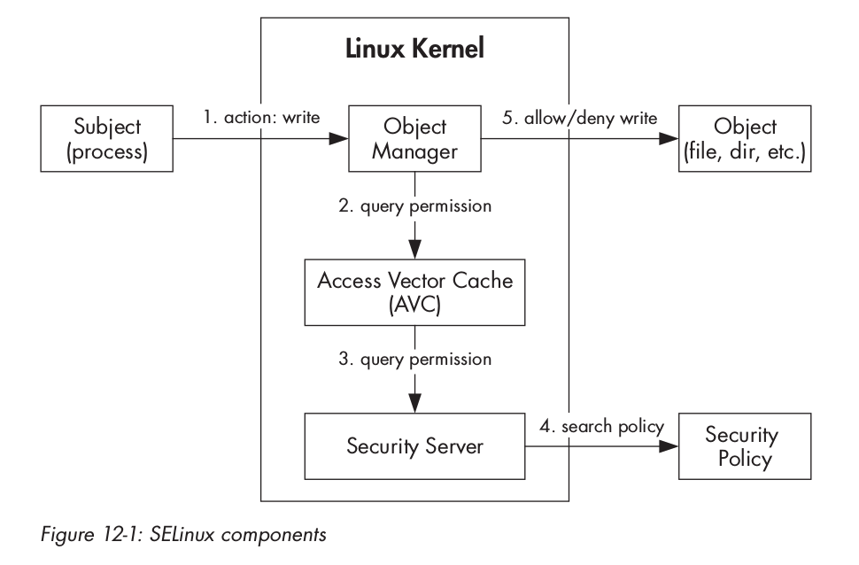

#### Mandatory Access Control

SELinux’s MAC model is based on three main concepts: principals, objects, and operations. 

#### SELinux mode

SELinux has three operating modes: disabled, permissive and enforcing. The shutdown mode only executes the default DAC; the permissive mode's denial of access will only be recorded but not actually executed; the security policy in the enforcement mode will be loaded, executed and recorded. 

#### Security Context 

 The security context is a string consisting of four fields separated by semicolons: username, role, type, and an optional MLS security scope. 
