# Android software security and reverse engineering


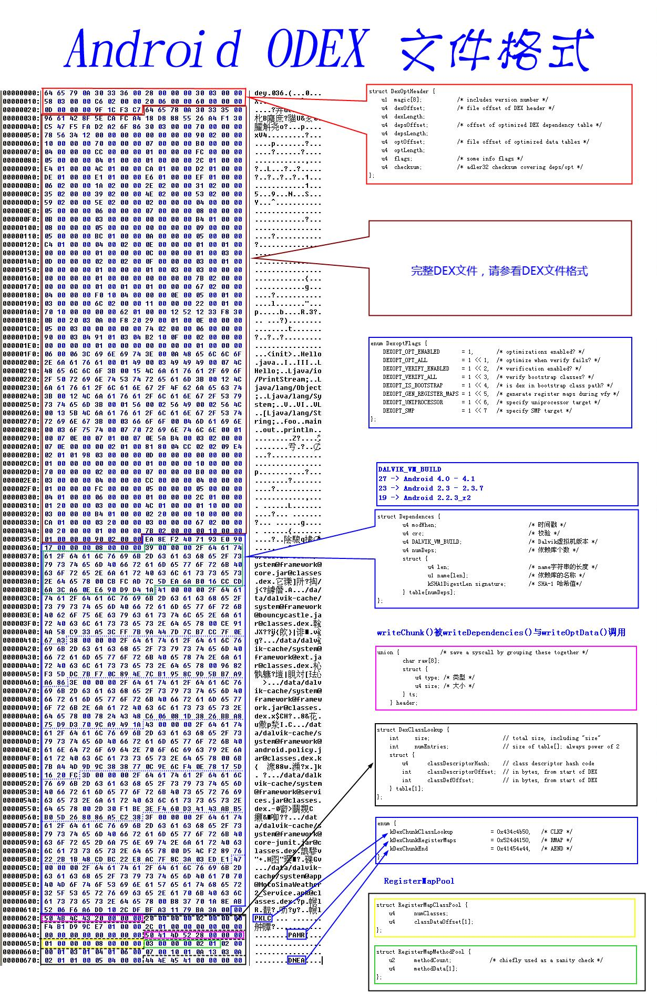


## Chapter 3 Entering the Android Dalvik Virtual Machine

### The characteristics of the Dalvik virtual machine

`dx` tool combines all Java The constant pool in the class file is decomposed, redundant information is eliminated, and reassembled to form a constant pool. All class files share the same constant pool. 

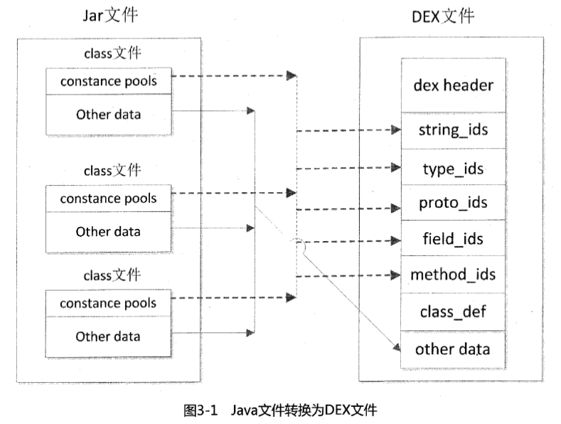

 Example: 

```java
public class Hello {
 public int foo(int a, int b) {
 return (a + b) * (a - b);
 }

 public static void main(String[] argc) {
 Hello hello = new Hello();
 System.out.println(hello.foo(5, 3));
 }
}
```

```sh
javac Hello.java // .class 
dx --dex --output=Hello.dex Hello.class // .dex
```

Java bytecode: 

```sh
javap -c -classpath . Hello
```

```sh
Compiled from "Hello.java"
public class Hello {
 public Hello();
 Code:
 0: aload_0
 1: invokespecial #1 // Method java/lang/Object."<init>":()V
 4: return

 public int foo(int, int);
 Code:
 0: iload_1
 1: iload_2
 2: iadd
 3: iload_1
 4: iload_2
 5: isub
 6: imul
 7: ireturn
% 0A public static void main(java.lang.String[]);
 Code:
 0: new #2 // class Hello
 3: dup
 4: invokespecial #3 // Method "<init>":()V
 7: astore_1
 8: getstatic #4 // Field java/lang/System.out:Ljava /io/PrintStream;
 11: aload_1
 12: iconst_5
 13: iconst_3
 14: invokevirtual #5 // Method foo:(II)I
 17: invokevirtual #6 // Method java/io/PrintStream.println:(I)V
 20: return
}
```

 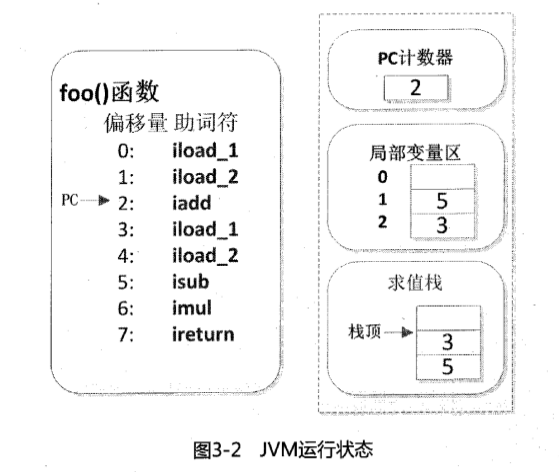

Java Bytecode instruction list: <https://en.wikipedia.org/wiki/Java_bytecode_instruction_listings>

Dalvik Bytecode: 

```sh
dexdump -d Hello.dex
```% 0A
```sh
Processing '/home/bibi/Downloads/sourcecode/chapter3/3.1/Hello.dex'...
Opened '/home/bibi/Downloads/sourcecode/chapter3/3.1/Hello.dex', DEX version '035'
Class #0 -
 Class descriptor : 'LHello;'
 Access flags : 0x0001 (PUBLIC)
 Superclass: 'Ljava/lang/Object;'
 Interfaces -
 Static fields -
 Instance fields   -
  Direct methods    -
    #0              : (in LHello;)
      name          : '<init>'
      type          : '()V'
      access        : 0x10001 (PUBLIC CONSTRUCTOR)
      code          -
      registers     : 1
      ins           : 1
      outs          : 1
      insns size    : 4 16-bit code units
00014c:                                        |[00014c] Hello.<init>:()V
00015c: 7010 0400 0000                         |0000: invoke-direct {v0}, Ljava/lang/Object;.<init>:()V // method@0004
000162: 0e00                                   |0003: return-void
      catches       : (none)
      positions     : 
        0x0000 line=1
      locals        : 
        0x0000 - 0x0004 reg=0 this LHello; 

    #1              : (in LHello;)
      name          : 'main'
      type          : '([Ljava/lang/String;)V'
      access        : 0x0009 (PUBLIC STATIC)
      code          -
      registers     : 5
      ins           : 1
      outs          : 3
      insns size    : 17 16-bit code units
000164:                                        |[000164] Hello.main:([Ljava/lang/String;)V
000174: 2200 0100                              |0000: new-instance v0, LHello; // type@0001
000178: 7010 0000 0000                         |0002: invoke-direct {v0}, LHello;.<init>:()V // method@0000
00017e: 6201 0000                              |0005: sget-object v1, Ljava/lang/System;.out:Ljava/io/PrintStream; // field@0000
000182: 1252                                   |0007: const/4 v2, #int 5 // #5
000184: 1233                                   |0008: const/4 v3, #int 3 // #3
000186: 6e30 0100 2003                         |0009: invoke-virtual {v0, v2, v3}, LHello;.foo:(II)I // method@0001
00018c: 0a00                                   |000c: move-result v0
00018e: 6e20 0300 0100                         |000d: invoke-virtual {v1, v0}, Ljava/io/PrintStream;.println:(I)V // method@0003
000194: 0e00                                   |0010: return-void
      catches       : (none)
      positions     : 
        0x0000 line=7
        0x0005 line=8
        0x0010 line=9
      locals        : 

  Virtual methods   -
    #0              : (in LHello;)
      name          : 'foo'
      type          : '(II)I'
      access        : 0x0001 (PUBLIC)
      code          -
      registers     : 5
      ins           : 3
      outs          : 0
      insns size    : 6 16-bit code units
000198:                                        |[000198] Hello.foo:(II)I
0001a8: 9000 0304                              |0000: add-int v0, v3, v4
0001ac: 9101 0304                              |0002: sub-int v1, v3, v4
0001b0: b210                                   |0004: mul-int/2addr v0, v1
0001b2: 0f00                                   |0005: return v0
      catches       : (none)
      positions     : 
        0x0000 line=3
      locals        : 
        0x0000 - 0x0006 reg=2 this LHello; 

  source_file_idx   : 1 (Hello.java)
```

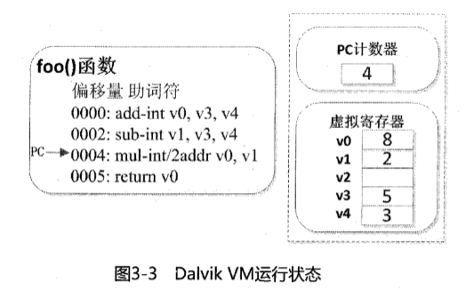

Dalvik 虚拟机属于 Android 运行时环境，它与一些核心库共同承担 Android 应用程序的运行工作。

Android 系统启动加载完内核后，第一个执行的是 `init` 进程， `init` 进程首先要做的是设备的初始化工作，然后读取 `init.rc` 文件并启动系统中的重要外部程序 `Zygote`。`Zygote` 进程是 Android 所有进程的孵化器进程，它启动后首先初始化 `Dalvik` 虚拟机，然后启动 `system_server` 并进入 `Zygote` 模式，通过 `socket` 等候命令。当执行一个 Android 应用程序时，`system_server` 进程通过 `Binder IPC` 方式发送命令给 `Zygote`，`Zygote` 收到命令后通过 `fork` 自身创建一个 Dalvik 虚拟机的实例来执行应用程序的入口函数，一个程序就启动完成了。

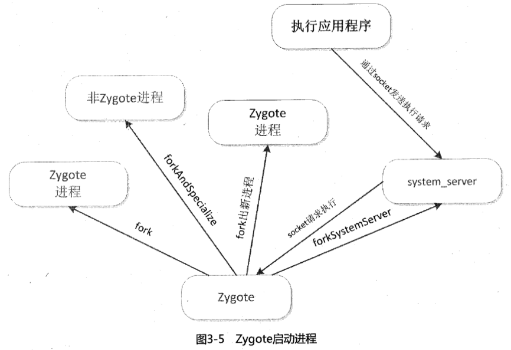

Zygote 提供了三种创建进程的方法：

- `fork()`：创建一个 Zygote 进程（这种方式实际不会被调用）；
- `forkAndSpecialize()`：创建一个非 Zygote 进程；
- `forkSystemServer()`：创建一个系统服务进程。

其中，Zygote 进程可以再 `fork()` 出其他进程，非 Zygote 进程则不能，而系统服务进程在终止后它的子进程也必须终止。

当进程 fork 成功后，执行的工作就交给 Dalvik 虚拟机。Dalvik 虚拟机首先通过 `loadClassFromDex()` 函数完成类的装载工作，每个类被成功解析后都会拥有一个 `ClassObject` 类型的数据结构存储在运行时环境中，虚拟机使用 `gDvm.loadedClass` 全局哈希表来存储与查询所有装载进来的类，随后，字节码验证器使用 `dvmVerifyCodeFlow()` 函数对装入的代码进行校验，接着虚拟机调用 `FindClass()` 函数查找并装载 `main` 方法类，随后调用 `dvmInterpret()` 函数初始化解释器并执行字节码流。

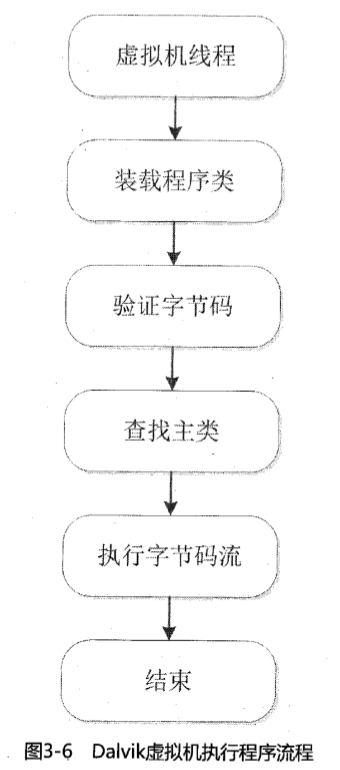

### Dalvik汇编语言基础为分析Android程序做准备

Dalvik指令语法由指令的位描述与指令格式标识来决定。位描述约定：

- Each 16-bit substring is separated by spaces. 
- Each letter represents 4 bits, and each letter is arranged in order from the high byte to the low byte. A vertical bar "|" may be used between every four digits to represent different content. 
- uses a single uppercase letter from A~Z in sequence as a 4-bit opcode, op represents an 8-bit opcode. 
- "∅" indicates that all bits in this field are 0. 
 command format convention: 
- command format identifiers mostly consist of three characters, the first two are numbers, and the last one is a letter. 
- The first number indicates how many 16-bit sub-components the instruction has. 
- The second number indicates the maximum number of registers used by the instruction. The special flag "r" identifies the use of a range of registers. 
- The third letter is the type code, indicating the type of additional data used by the instruction. There is also a special case in 
 that there may be another letter at the end. If it is the letter `s`, it means that the instruction is statically linked. If it is the letter `i`, it means that the instruction should be processed inline. 

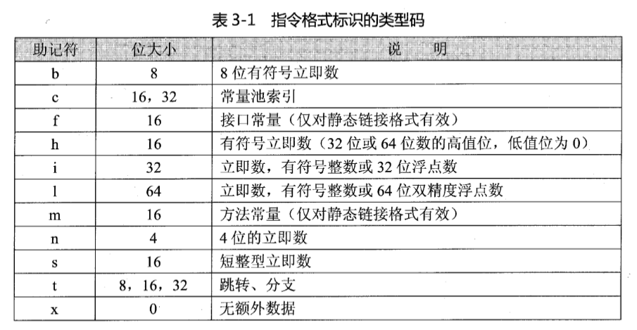

Dalvik instruction syntax convention: 

- Each instruction starts with an operation code, followed by parameters. The number of parameters is variable, and the number of parameters is variable. Separate with commas. 
- The parameters of each instruction start from the first part of the instruction. The op is located in the lower 8 bits. The upper 8 bits can be one 8-bit parameter or two 4-bit parameters. It can also be empty. If the instruction exceeds 16 bit, then the following parts are used as parameters in turn. 
- If the parameter is expressed in the form of "vX", it indicates that it is a register, such as v0, v1, etc. 
- If the parameter is expressed in the form of "#+X", it indicates that it is a constant number. 
- If the parameter is expressed in the form of "+X", it indicates that it is an address offset relative to the instruction. 
- If the parameter is expressed in the form of "kind@X", it indicates that it is a constant pool index value. kind can be string, type, field, meth. 
Dalvik maps some registers to ARM registers, and some is simulated through the call stack. The registers used in Dalvik are all 32-bit and support any type. The 64-bit type is represented by two adjacent registers. The value range is v0~v65535. We know that the Dalvik virtual machine maintains a call stack for each process, and one of the functions of this call stack is to use virtual registers. There is an interface named `dalvik.bytecode.Opcodes` in the Android SDK, which defines a complete list of Dalvik bytecodes. The function that processes these bytecodes is a macro `HANDLE_OPCODE()`, each byte The processing of the code can be found in `dalvik/vm/mterp/c`. 

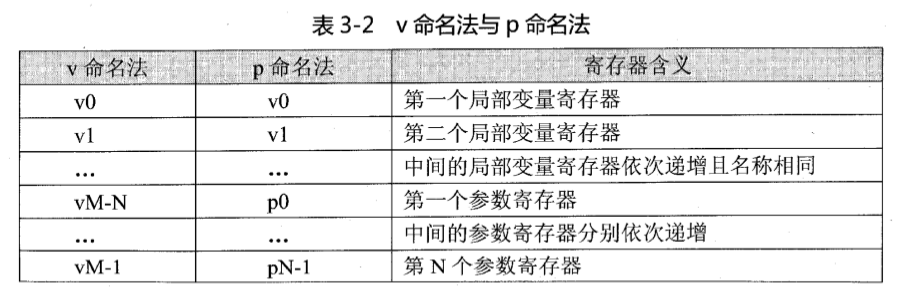

Dalvik bytecode has its own set of types, methods and field representation methods, which together with the Dalvik virtual machine instruction set form the Dalvik assembly code: 

1 . Type

Dalvik bytecode has only two types, basic types and reference types. Except for objects and arrays, which are reference types, other Java types are basic types. 

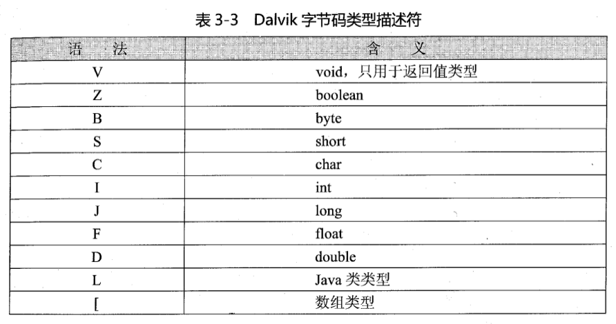

- The `L` type can represent any class in the Java type, expressed in the form of `Lpackage/name/ObjectName;`. 
- The `[` type can represent all basic arrays. `[` is followed by a basic type descriptor, and multiple `[` together represent a multi-dimensional array. 
- `L` and `[` are used together to represent an object array. 

2. Method 

Dalvik uses the method name, type parameters and return value to describe a method in detail. 

``sh
Lpackage/name/ObjectName;->MethodName(III)Z
```

`Lpackage/name/ObjectName;-` is understood as a type, `MethodName` is specific The method name of Represents the return type of the method (boolean type). The method code generated by 

BakSmali starts with the `.method` instruction and ends with the `.end method` instruction. Depending on the method type, it will be commented with a `#` sign. 

3. Field

```sh
Lpackage/name/ObjectName;->FieldName:Ljava/lang/String;
```

 field consists of type `Lpackage/name/ObjectName; `, field name `FieldName`, field type `Ljava/lang/String;`, where the field name and field type are separated by a colon `:`. The field code generated by 

BakSmali starts with the `.field` directive and is commented with a `#` symbol depending on the field type. 

### Dalvik instruction set

1. Instruction characteristics
2. No-operation instruction

The mnemonic of the no-operation instruction is `nop`, the value is 00, and is usually used to align code. 

3. Data operation instruction

The data operation instruction is `move`, and the prototype is `move destination, source`. 

```smali
move vA, vB // vB -> vA, both are 4 bits
move/from16 vAA, vBBBB // vBBBB -> vAA, the source register is 16 bits, and the destination register is 8 bits
move/16 vAAAA, vBBBB // vBBBB -> vAAAA, both are 16 bits
move- wide vA, vB // 4-bit register pair assignment, all 4-bit
move-wide/from16 vAA, vBBBB
move-wide/16 vAAAA, vBBBB // Same as move-wide
move-object vA, vB // Object assignment, both 4 bits
move-object/from16 vAA, vBBBB // Object assignment, source register 16 bit, destination register 8 bits
move-object/16 vAAAA, vBBBB // Object assignments are all 16-bit 
move-result vAA // Assign the single-word non-object result of the previous invoke type instruction operation to the vAA register 
move-result-wide vAA // Assign the double-word non-object result of the previous invoke type instruction operation The object result is assigned to the vAA register 
move-result-object vAA // Assign the object result of the previous invoke type instruction operation to vAA Register 
move-exception vAA // Save an exception that occurs during runtime to the vAA register. This instruction must be an instruction of the exception handler when the exception occurs, otherwise it will be invalid. 
```

4. The basic bytecode of the return instruction 

 is `return`. 

```smali
return-void // Return 
return vAA from a void method // Return a 32-bit non-object type value, the return value register is an 8-bit register vAA
return-wide vAA // Returns a 64-bit non-object type value. The return value register is 8-bit vAA
return-object vAA // Returns a value of object type. The return value register is 8-bit vAA
```

5. The basic bytecode of the data definition instruction 

 is `const`. 

```smali
const/4 vA, #+B // After extending the numerical sign to 32 bits, assign it to the register vA
const/16 vAA, #+BBBB // After extending the numerical sign to 32 bits Assign the value to the register vAA
const vAA, #+BBBBBBBB // Assign the value to the register vAA
const/high16 vAA, #+BBBB0000 // Zero-extend the right side of the value to 32 bits and assign it to the register vAA
const-wide/16 vAA, #+BBBB // Extend the sign of the value to 64 bits and assign it to the register vAA
const-wide/32 vAA , #+BBBBBBBB // Expand the sign of the value to 64 bits and assign it to the register vAA
const-wide vAA, #+BBBBBBBBBBBBBBBB // Assign the value to the register pair vAA
const-wide/high16 vAA, #+BBBB000000000000 // Zero-extend the right side of the value to 64 bits and assign it to the register pair vAA
const-string vAA, string@BBBB // Construct a string through the string index and assign it to the register vAA
const-string/jumbo vAA, string@BBBBBBBB // Construct a string through the string index (larger) and assign it to the register vAA
const-class vAA, type@BBBB // Get a type reference through the type index and assign it to the register vAA
const-class /jumbo vAAAA, type@BBBBBBBB // Get a class reference with the given type index and assign it to register vAAAA. This instruction occupies two bytes and has a value of 0x00ff. 
```

6. The lock instruction

 is used to operate on the same object in a multi-threaded program. 

```smali
monitor-enter vAA // Obtain the lock for the specified object
monitor-exit vAA // Release the lock of the specified object
```

7. Instance operation command

```smali
check-cast vAA, type@BBBB
check-cast/jumbo vAAAA, type@BBBBBBBB // Will The object reference in the vAA register is converted to the specified type. If it fails, a ClassCastException will be thrown. If type B specifies a basic type, the operation will always fail for non-basic type A. 
instance-of vA, vB, type@CCCC
instance-of vAAAA, vBBBB, type@CCCCCCCC // Determine whether the object reference in the vB register can be converted to the specified type. If it can, the vA register is assigned a value of 1, otherwise the vA register Assign a value of 0. 
new-instance vAA, type@BBBB
new-instance vAAAA, type@BBBBBBBB // Construct a new instance of the specified type object and assign the object reference to the vAA register. The type specified by the type symbol cannot be an array class. 
```

8. Array operation instruction

```smali
array-length vA, vB // Get the length of the array in the vB register and assign the value to the vA register. 
new-array vA, vB, type@CCCC
new-array/jumbo vAAAA, vBBBB, type@CCCCCCCC // Construct an array of the specified type (type@CCCCCCCC) and size (vBBBB), and assign the value to the vAAAA register % 0Afilled-new-array {vC, vD, vE, vF, vG}, type@BBBB // Constructs an array of specified type (type@BBBB) and size (vA) and fills the array content. The vA register is used implicitly. In addition to the size of the specified array, the number of parameters is also specified. vC~vG is the list of parameter registers used. 
filled-new-array/range {vCCCC .. vNNNN}, type@BBBB // Same as above, except that the parameter register uses the range bytecode suffix to specify the value range, vC is the first parameter register, N=A+C -1. 
fill-array-data vAA, +BBBBBBBB // Fill the array with the specified data. The vAA register is an array reference. The reference must be an array of basic types. A data table is followed by the instruction. 
arrayop vAA, vBB, vCC // Get and assign values ​​to the array elements specified by the vBB register. The vCC register specifies the array element index, and the vAA register is used to store the value of the array element that is read or needs to be set. To read elements, use the aget class instruction, and to assign elements, use the aput class instruction. 
```

9. Exception instruction

```smali
throw vAA ​​// Throw an exception of the type specified in the vAA register
```

10. Jump instruction
% 0A has three jump instructions: unconditional jump (goto), branch jump (switch) and conditional jump (if). 

```smali
goto +AA
goto/16 +AAAA
goto/32 +AAAAAAAA // Unconditionally jump to the specified offset, which cannot be 0. 
packed-switch vAA, +BBBBBBBB // Branch jump instruction. The vAA register is the value that needs to be judged in the switch branch. BBBBBBBB points to an offset table in packed-switch-payload format. The values ​​in the table increase regularly. 
sparse-switch vAA, +BBBBBBBB // Branch jump instruction. The vAA register is the value that needs to be judged in the switch branch. BBBBBBBB points to an offset table in the sparse-switch-payload format. The values ​​in the table are irregular offsets. 
if-test vA, vB, +CCCC // Conditional jump instructions. Compare the values ​​of vA register and vB register. If the comparison result is satisfied, jump to the offset specified by CCCC. CCCC cannot be 0. If-test type instructions are: 
 if-eq // if(vA==vB)
 if-ne // if(vA!=vB)
 if-lt // if(vA<vB)% 0A if-ge // if(vA>=vB)
 if-gt // if(vA>vB)
 if-le // if(vA<=vB)
if-testz vAA, +BBBB // Conditional jump instructions. Compare the vAA register with 0. If the comparison result is satisfied or the value is 0, jump to the offset specified by BBBB. BBBB cannot be 0. If-testz type instructions are: 
 if-eqz // if(!vAA)
 if-nez // if(vAA)
 if-ltz // if(vAA<0)
 if-gez / / if(vAA>=0)
 if-gtz // if(vAA>0)
 if-lez // if(vAA<=0)
```

11. The comparison instruction 

 compares the values ​​of two registers in the format of `cmpkind vAA, vBB, vCC`, where the vBB and vCC registers are the two registers or two register pairs that need to be compared, and the comparison result is placed in vAA register. There are 5 comparison instructions in the instruction set: 

```smali
cmpl-float
cmpl-double // If the vBB register is greater than the vCC register, the result is -1, the result of equality is 0, and the result is 1
cmpg- float
cmpg-double // If the vBB register is greater than the vCC register, the result is 1, if equal, the result is 0, if less than the result, the result is -1
cmp-long // If the vBB register is greater than the vCC register, the result is 1, if it is equal, the result is 0, if it is less than the result, it is -1
```

12. The field operation instruction 

 is used to read and write the fields of the object instance. There are two instruction sets for ordinary field and static field operations, namely `iinstanceop vA, vB, field@CCCC` and `sstaticop vAA, field@BBBB`. Extensions to `iinstanceop/jumbo vAAAA, vBBBB, field@CCCCCCC` and `sstaticop/jumbo vAAAA, field@BBBBBBBB`. 

The command prefix of the ordinary field command is `i`, and the command prefix of the static field command is `s`. Field operation instructions are followed by the suffix of the field type. 

13. The method invocation instruction

 is used to call the method of the class instance. The basic instruction is `invoke`, which includes `invoke-kind {vC, vD, vE, vF, vG}, meth@BBBB` and ` invoke-kind/range {vCCCC .. vNNNN}, meth@BBBB` two types. Expanded to instructions such as `invoke-kind/jumbo {vCCCC .. vNNNN}, meth@BBBBBBBB`. 

According to different method types, there are five method calling instructions as follows: 

```smali
invoke-virtual or invoke-virtual/range // Call the virtual method 
invoke-super or invoke-super of the instance /range // Call the instance's parent class method 
invoke-direct or invoke-direct/range // Call the instance's direct method 
invoke-static or invoke-static/range // Call the static method %0 of the instance. Invoke-interface or invoke-interface/range // Call the interface method 
```

 of the instance. The return value of the method call must use `move-result* ` command to obtain, such as: 

```smali
invoke-static {}, Landroid/os/Parcel;->obtain()Landroid/os/Parcel;
move-result-object v0
```

14. The format of the data conversion command 

 is `unop vA, vB`, The vB register or vB register pair stores the data that needs to be converted, and the converted result is stored in the vA register or vA register pair. 

```smali
neg-int
neg-long
neg-float
neg-double // Complement 
not-int
not-long // Negate 
int-to-long
int-to -float
int-to-double // Integer conversion
long-to-int
long-to-float
long-to-double // Long integer conversion
float-to-int
float-to-long
float-to-double // Single Precision floating point conversion
double-to-int
double-to-long
double-to-float // Double precision floating point conversion
int-to-byte
int-to-char
int-to-short
```

15. Data operation instructions 

 include arithmetic operators and logical operation instructions. There are four types of 

 data operation instructions: 

```smali
binop vAA, vBB, vCC // Operate the vBB register and the vCC register, and save the result to the vAA register. The following is similar to 
binop/2addr vA, vB
binop/lit16 vA, vB, #+CCCC
binop/lit8 vAA, vBB, #+CC
```

The first type of instructions can be classified as: 
 
```smali
add-type // vBB + vCC
sub-type // vBB - vCC
mul-type // vBB * vCC
div-type // vBB / vCC
rem-type // vBB % vCC
and-type // vBB AND vCC
or-type // vBB OR vCC
xor-type // vBB XOR vCC
shl-type // vBB << vCC
shr-type // vBB >> vCC
ushr-type // (unsigned number) vBB >> vCC
```

## Chapter 4 Android executable file

### Production steps of Android program

1. Package resources and generate R.java file. 
2. Process the aidl file and generate the corresponding Java file. 
3. Compile the project source code and generate the corresponding class file. 
4. Convert all class files and generate classes.dex file. 
5. Package and generate APK files. 
6. Sign the APK file. 
7. Align the signed APK file. 

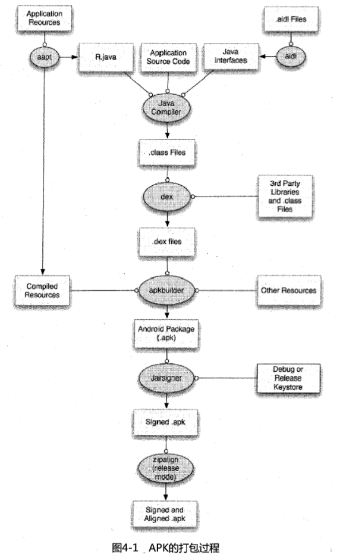

#### dex file format

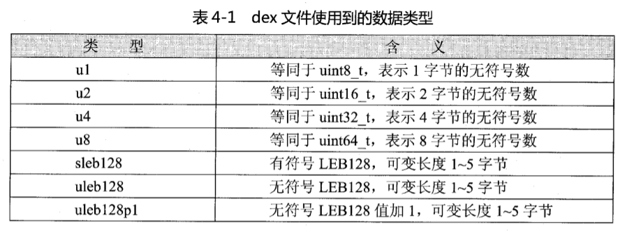

each `LEB128` It consists of 1~5 bytes. All bytes combined represent a 32-bit data. Only 7 bits of each byte are valid bits. If the highest bit of the first byte is 1, it means LEB128 The second byte needs to be used, and so on, until the highest bit of the last byte is 0. If the highest bit of the next byte is still 1 after reading 5 bytes, it means that the dex file is invalid. 

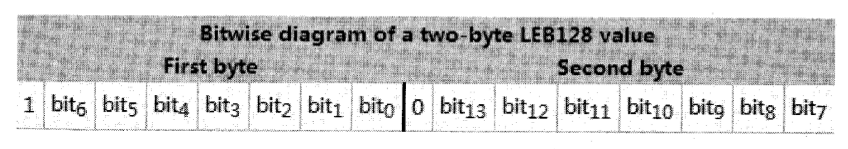

A dex file consists of 7 parts. The dex header is the dex header, which specifies some attributes of the dex file and records the physical offsets of the other six parts of the data structure in the dex file. The structures from string_ids to class_def can be understood as the index structure area, the real data is stored in the data area, and the last link_data is the static link data area. 

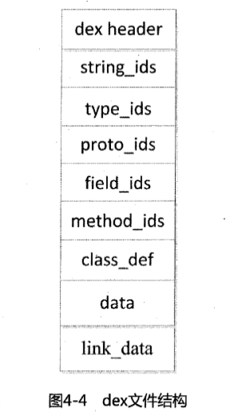

The unoptimized dex file structure is expressed as follows:

```c
struct DexFile {
 DexHeader Header;
 DexStringId StringIds [stringIdsSize];
 DexTypeId TypeIds[typeIdsSize];
 DexProtoId ProtoIds[protoIdsSize]
 DexMethodId MethodIds[methodIdsSize];
 DexClassDef ClassDefs[classDefsSize];
 DexData Data[];
 DexLink LinkData;
};
```

DexHeader structure occupies 0x70 bytes, declared as follows: 

```c
struct DexHeader {
 u1 magic[8]; // dex version identification
 u4 checksum; // adler32 check
 u1 signature[kSHA1DigestLen]; / / SHA-1 hash value 
 u4 fileSize; // Entire file size 
 u4 headerSize; // DexHeader structure size 
 u4 endianTag; // Endian tag 
 u4 linkSize; // Link segment size 
 u4 linkOff; // Link segment offset 
 u4 mapOff; // The file offset of DexMapList
 u4 stringIdsSize; //The number of DexStringId
 u4 stringIdsOff; //The file offset of DexStringId
 u4 typeIdsSize; //The number of DexTypeId
 u4 typeIdsOff; //The file offset of DexTypeId Move
 u4 protoIdsSize; // The number of DexProtoId 
 u4 protoIdsOff; // The file offset of DexProtoId 
 u4 fieldIdsSize; // The number of DexFieldId 
 u4 fieldIdsOff; // The file offset of DexFieldId 
 u4 methodIdsSize; // The number of DexMethodId 
 u4 methodIdsOff; // The file offset of DexMethodId
 u4 classDefsSize; //The number of DexClassDef
 u4 classDefsOff; //The file offset of DexClassDef
 u4 dataSize; //The size of the data segment
 u4 dataOff; // File offset of the data segment 
};
```

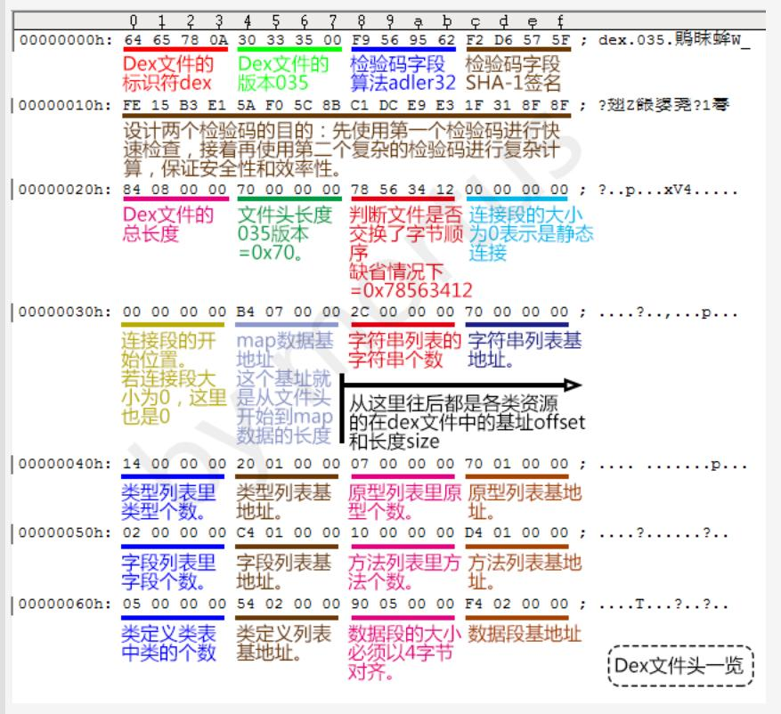

Dalvik virtual machine parses the contents of the dex file and finally maps it to `DexMapList` data structure. The `mapOff` field of the DexHeader structure specifies the offset of the DexMapList structure in the dex file, which is declared as follows
:
```c
struct DexMapList {
 u4 size; // The number of DexMapItem
 DexMapItem list[ 1]; // DexMapItem structure
};

// Among them DexMapItem Structural declaration
struct DexMapItem {
 u2 type; // Type starting with kDexType
 u2 unused; // Used for byte alignment
 u4 size; // Number of specified types
 u4 offset; // Specify File offset of type data 
};
```

`DexStringId` Structure declaration: 

```c
struct DexStringId {
 u4 stringDataOff; // String data offset
};
```

`DexTypeId` Structure declaration: 

```c
struct DexTypeId {
 u4 descriptorIdx; //Execute the index of the DexStringId list
};
```

`DexProtoId` Structure declaration: 

```c
struct DexProtoId {
 u4 shortIdx; // Execute the index of the DexStringId list 
 u4 returnTypeIdx; // Point to the index of the DexTypeId list 
 u4 parametersOff; // Point to the offset of DexTypeList Move
};

//The structure declaration of DexTypeList is
struct DexTypeList{
 u4 size; //The next number of DexTypeItem
 DexTypeItem list[1]; // DexTypeItem structure
};

//Then the structure declaration of DexTypeItem
struct DexTypeItem {
 u2 typeIdx; // Index pointing to the DexTypeId list 
};
```

`DexFieldId` Structure declaration: 

```c
struct DexMethodId {
 u2 classIdx; // Class declaration, pointing to DexTypeId Index 
 u2 of the list protoIdx; // Declaration type, pointing to the index 
 u4 of the DexProtoId list nameIdx; // Method name, pointing to the index of the DexStringId list 
};
```

`DexClassDef` Structure declaration: 

```c
struct DexClassDef {
 u4 classIdx; // Type of class , pointing to index 
 u4 accessFlags of the DexTypeId list; // Access flags 
 u4 superclassIds; // Parent class type, pointing to the index of the DexTypeId list 
 u4 interfacesOff; // Interface, pointing to the offset of DexTypeList 
 u4 sourceFileIdx; // Source file name, pointing to the index of the DexStringId list 
 u4 annotationsOff; // Annotations, pointing to DexAnnotationsDirectoryItem Structure 
 u4 classDataOff; // Offset pointing to DexClassData structure 
 u4 staticValuesOff; // Point to the offset of the DexEncodedArray structure 
};
```

`DexClassData` Structure declaration: 

```c
struct DexClassData {
 DexClassDataHeader header; // Specify Number of fields and methods
 DexField* staticFields; // Static fields, DexField structure
 DexField* instanceFields; // Instance method, DexField structure
 DexMethod* directMethods; // Direct method, DexMethod structure
 DexMethod* virtualMethods; // Virtual method, DexMethod structure
};

// DexClassDataHeader structure declaration% 0Astruct DexClassDataHeader {
 u4 staticFieldsSize; // Number of static fields
 u4 instanceFieldsSize; // Number of instance fields
 u4 directMethodsSize; // Number of direct methods
 u4 virtualMethodsSize; // Number of virtual methods
};

// Among them, DexField structure Declare 
struct DexField {
 u4 fieldIdx; // Index 
 u4 pointing to DexFieldId accessFlags; // Access flag
};

// The DexMethod structure declares 
struct DexMethod {
 u4 methodIdx; // Access the index of DexMethodId
 u4 accessFlags; // Access flag
 u4 codeOff; / / Points to the offset of the DexCode structure 
};

// and DexCode in it Structure declaration
struct DexCode {
 u2 registersSize; //Number of registers used
 u2 insSize; //Number of parameters
 u2 outsSize; //Number of registers used when calling other methods
 u2 triesSize; / / Number of Try/Catch
 u2 debugInfoOff; // Offset pointing to debugging information
 u4 insnsSize; // Number of instruction sets, in 2-byte units
 u2 insns[1]; // Instruction set
 // 2-byte space is used for structure alignment
 // try_item[triesSize] DexTry structure
 // Try /Number of handlers in Catch
 // catch_handler_item[handlersSize], DexCatchHandler structure
};
```

### odex file format
%0The structure of the Aodex file can be understood as a superset of the dex file. It adds some data to the head of the dex file, and then adds the dependent libraries of the dex file and some auxiliary data to the end of the dex file. 

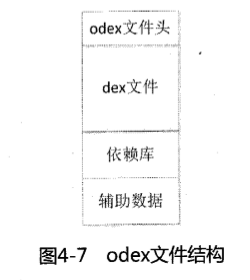

```c
struct ODEXFile {
 DexOptHeader header; // odex file header
 DEXFile dexfile; // dex file
 Dependences deps; // Dependency library list
 ChunkDexClassLookup lookup; // Class query structure
 ChunkRegisterMapPool mappool; // Mapping pool
 ChunkEnd end; // End flag
};% 0A```

`DexOptHeader` Structure declaration: 

```c
struct DexOptHeader {
 u1 magic[8]; // odex version identification 
 u4 dexOffset; // dex file header offset 
 u4 dexLength; // dex file Total length 
 u4 depsOffset; // Odex dependent library list offset 
 u4 depsLength; // Total length of dependent library list 
 u4 optOffset; // Auxiliary data offset 
 u4 optLength; // Total length of auxiliary data 
 u4 flags; // Flag 
 u4 checksum; // Checksum of dependent libraries and auxiliary data
};
`` `

`DexFile` Structure declaration: 

```c
struct DexFile {
 // directly-mapped "opt" header
 const DexOptHeader* pOptHeader;
 
 // pointers to directly-mapped structs and arrays in base DEX
 const DexHeader* pHeader;
 const DexStringId* pStringIds;
 const DexTypeId* pTypeIds;
 const DexFieldId* pFieldIds;% 0A const DexMethodId* pMethodIds;
 const DexProtoId* pProtoIds;
 const DexClassDef* pClassDefs;
 const DexLink* pLinkData;
 
 // These are mapped out of the "auxillary" section, and may not be included in the file 
 const DexClassLookup* pClassLookup;
 const void* pRegisterMapPool; // RegisterMapClassPool
 
 // points to start of DEX file data
 const u1* baseAddr;
 
 // track memory overhead for auxillary structures
 int overhead;
 
 // additional app -specific data structures associated with the DEX
 // void* auxData; 
};
```

`Dependences` Structure declaration: 

```c
struct Dependences {
 u4 modWhen; // Timestamp
 u4 crc; // Verification 
 u4 DALVIK_VM_BUILD; // Dalvik virtual machine version number 
 u4 numDeps; // Number of dependent libraries 
 struct {
 u4 len; //The length of the name string
 u1 name[len]; //The name of the dependent library
 kSHA1DigestLen signatue; //SHA-1 hash value
 } table[numDeps];
 };
```

`ChunkDexClassLookup` Declaration of structure: 

```c
struct ChunkDexClassLookup {
    Header          header;
    DexClassLookup  lookup;
};

// 其中 header 定义
union {             // save a syscall by grouping these together
    char raw[8];
    struct {
        u4 type;
        u4 size;
    } ts;
} header;

// 其中DexClassLookup结构体声明
struct DexClassLookup {
    int size;                       // total size, including "size"
    int numEntries;                 // size of table[]; always power of 2
    struct {
        u4  classDescriptorHash;    // class descriptor hash code
        int classDescriptorOffset;  // in bytes, from start of DEX
        int classDefOffset;         // in bytes, from start of DEX
    } table[1];
};
```

`ChunkRegisterMapPool` 结构体声明：

```c
struct ChunkRegisterMapPool {
    Header      header;
    struct {
        struct RegisterMapClassPool {
            u4  numClasses;
            u4  classDataOffset[1];
        } classpool;
        struct RegisterMapMethodPool {
            u2  methodCount;
            u4  methodData[1];
        };
    } lookup;
};
```

`ChunkEnd` 结构体声明：

```c
struct ChunkEnd {
    Header  header;
};
```

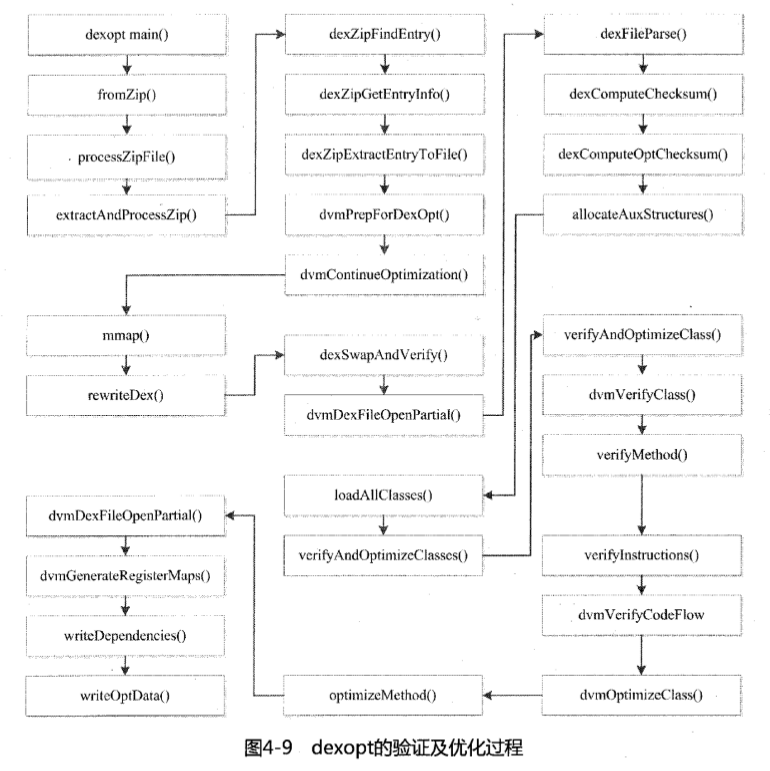

## 第五章 静态分析 Android 程序

### 快速定位Android程序的关键代码

需重点关注的Application类：

使用 `Application` 时需要在程序中添加一个类继承自 `android.app.Application`，然后重写它的 `OnCreate()` 方法，在该方法中初始化的全局变量可以在 Android 其它组件中访问，一些商业软件将授权验证的代码都转移到该类中。

定位关键代码的六种方法：

- 信息反馈法：先运行目标程序，根据反馈信息作为突破口寻找关键代码。
- 特征函数法：无论程序给出什么反馈信息，终究需要调用 Android SDK 中提供的相关 API 函数。
- 顺序查看法：从软件的启动代码开始，逐行分析，掌握执行流程。
- 代码注入法：手动修改 apk 文件的反汇编代码，加入 Log 输出，配合 LogCat 查看程序执行到特定点时的状态数据。
- 栈跟踪法：输出运行时的栈跟踪信息，然后查看栈上的函数调用序列来理解方法的执行流程。
- Method Profiling（方法剖析）：主要用于热点分析和性能优化。

### smali文件格式

smali 文件的头3行描述了当前类的信息：

```text
.class <访问权限> [修饰关键字] <类名>
.super <父类名>
.source <源文件名>
```

smali 文件中的字段的声明使用 `.field` 指令。字段有静态字段与实例字段两种。

静态字段：

```smali
# static fields
.field <访问权限> static [修饰关键字] <字段名>:<字段类型>
```

实例字段：

```smali
# instance fields
.field <访问权限> [修饰关键字] <字段名>:<字段类型>
```

如果一个类中含有方法，那么类中必然会有相关方法的反汇编代码，smali 文件中的方法的声明使用 `.method` instruction. There are two types of methods: direct methods and virtual methods. 

 direct method: 

```smali
# direct methods
.method <access rights> [modification keyword] <method prototype>
 <.locals>
 [.parameter]% 0A [.prologue]
 [.line]
<code body>
.end method
```

 virtual method: 

```smali
# virtual methods
.method <access rights> [modification keyword] <method prototype>
 <.locals>% 0A [.parameter]
 [.prologue]
 [.line]
<code body>
.end method
```

If a class implements the interface, it will be displayed in smali This is indicated in the file using the `.implements` directive. 

```smali
# interfaces
.implements <interface name>
```

 If annotations are used in a class, they will be pointed out using the `.annotation` directive. 

```smali
# annotations
.annotation [Annotation attribute] <Annotation class name>
 [Annotation field = value]
.end annotation
```

The role of annotation The scope can be a class, method, or field. If the scope of the annotation is a class, the `.annotation` directive will be defined directly in the smali file. If it is a method or field, the `.annotation` directive will be included in the definition of the method or field. 

### Classes in Android programs

1. Internal classes

 Internal classes are divided into member inner classes, static nested classes, method inner classes, and anonymous inner classes. The inner class is an independent class, a separate smali file will also be generated, with the file name in the form of `[external class]$[internal class].smali`. 

 The initialization of the inner class is divided into three steps: first, save the reference of the outer class to a synthetic field of this class so that other methods of the inner class can use it, and then call the constructor of the parent class of the inner class to initialize the parent. class, and finally initialize the inner class itself. 

2. Listener

The essence of a listener is an interface. In the actual process of writing code, it is often implemented in the form of anonymous internal classes. 

3. Annotation class

 There are two packages designed for annotations in the Android system: `dalvik.annotation` and `android.annotation`. 

4. Automatically generated classes

 Using the Android SDK, the project generated by default will automatically add some classes: R class, BuildConfig class, annotation class and android-support-v4.jar file. 

### Read the decompiled smali code

1. Loop statement

 Common loop structures include iterator loops, for loops, while loops, and do while loops. 

 (1) Iterator

```smali
 Iterator<object> <object name> = <method returns a list of objects>;
 for(<object> <object name> : <object List>) {
 [Code body for processing a single object]
 }
 Or: 
 Iterator<object> <iterator> = <method returns an iterator>;
 while(<Iterator>.hasNext()) {
 <Object> <Object name> = <Iterator>.next();
 [Code body for processing a single object]
 }
```% 0A
 Feature summary: 

- The iterator loop will call the iterator's `hasNext()` method to check whether the loop condition is met. 
- Call the iterator's `next()` method in an iterator loop to obtain a single object. 
- Use the `goto` instruction in a loop to control the flow of the code. 
- An iterator loop in the form of `for` becomes an iterator loop in the form of `while` after unrolling. 

 (2) for loop characteristics: 

- Before entering the loop, the loop counter variable needs to be initialized first, and its value needs to be changed in the loop body. 
- Loop condition judgment can be a legal instruction composed of conditional jump instructions. 
- Use goto instructions in loops to control the flow of code. 

 (3) There is not much difference between the while loop and the do-while loop, which are similar to the iterator loop code. 

2. The switch branch statement

 is divided into two types: `packed-switch` and `sparse-switch`. 

`packed-switch` command format: 

```smali
packed-switch vAA, +BBBBBBBB
```+BBBBBBBB` after the 

 command is specified as a `packed -switch-payload` format offset: 

```c
struct packed-switch-payload {
 ushort ident; //The value is fixed at 0x0100
 ushort size; //The number of cases
 int first_key; //The value of the initial case
 int[] targets; // The offset of each case relative to the switch instruction
};
```

`sparse-switch` Instruction format: 

```smali
sparse-switch vAA, + The `+BBBBBBBB` after the BBBBBBBB
```

 command is specified as a `sparse-switch-payload` Format offset: 

```c
struct sparse-switch-payload {
 ushort ident; //The value is fixed to 0x0200
 ushort size; //The number of cases
 int[] keys; // The value of each case, in order from low to high
 int[] targets; // The offset of each case relative to the switch instruction
};
```

3. try/catch statement

 The try statement in the code is marked with a label starting with `try_start_` and ends with a label starting with `try_end_`. 

 Use the `.catch` directive to specify the exception type and catch label to be processed: 

```smali
.catch <Exception type> {<try start label> .. <try end label> } <catch label>
```

 saves exception information through related data structures when processing Try/Catch statements. In `DexCode` There is a `try_item` in the structure, and the `DexTry` structure is used to save the try statement information: 

```c
struct DexTry {
 u4 startAddr; // Starting address 
 u2 insnCount; // Instruction Quantity
 u2 handlerOff; // handler offset
};
```

## Chapter 6 ARM based on Android Assembly language basics

### ARM assembly language program structure

```asm
 .arch armv5te @Processor architecture
 .fpu softvfp @Coprocessor type
 .eabi_attribute 20, 1 @ Interface attribute
 .eabi_attribute 21, 1
 .eabi_attribute 23, 3
 .eabi_attribute 24, 1
 .eabi_attribute 25, 1
 .eabi_attribute 26, 2
 .eabi_attribute 30, 6
 .eabi_attribute 18, 4
 .file "hello.c" @source file name
 .section .rodata @Declare read-only data segment 
 .align 2 @Alignment is 2^2=4 bytes
.LC0: @Label LC0
 .ascii "Hello ARM!\000" @Declaration string
 .text @Declaration code segment
 .align 2 @Alignment It is 2^2=4 bytes
 .global main @global symbol main
 .type main, %function @main type is function
main: @label main
 @ args = 0, pretend = 0, frame = 8
 @ frame_needed = 1, uses_anonymous_args = 0
 stmfd sp!, {fp, lr} @Push the fp and lr registers onto the stack
 add fp, sp, #4 @Initialization fp register, sets the stack frame, used to access local variables
 sub sp, sp, #8 @open up stack space
 str r0, [fp, #-8] @Save the first parameter
 str r1, [fp, #-12] @Save the second parameter
 ldr r3, .L3 @Get the content at label .L3, that is, "Hello GAS" Offset address 
.LPIC0: @label.LPIC0
 add r3, pc, r3 @calculated string "Hello GAS" memory address 
 mov r0, r3 @Set parameter 1
 bl puts(PLT) @Call puts function 
 mov r3, #0 @Set the value of r3 register to 0
 mov r0, r3 @Program return The result is 0
 sub sp, fp, #4 @Restore the value of sp register
 ldmfd sp!, {fp, pc} @Restore the fp register and assign the lr register to the pc register
.L4: @label.L4
 .align 2 @alignment 2^2=4 bytes
.L3: @label.L3
 .word .LC0-(.LPIC0+8) @Save the offset of the string relative to "add r3, pc, r3" 
 .size main, .-main The size of the @main function is the current line of code minus the main label 
 .ident "GCC: (GNU) 4.4.3" @Compiler identification 
 .section .note.GNU-stack,"",%progbits @Definition. note.GNU-stack section 
```

 processor architecture definition: 

- `.arch` specifies the ARM processor architecture 
- `.fpu`. Specifies the type of coprocessor. 
- `.eabi_attribute` specifies some interface attributes. 

 Section definition: The `.section` directive is used to define a section in the format of `.section name [,"flags"[ ,%type[,flag_specific_arguments]]]`. 

 Two annotation methods: `/* */` and `@`. 

 Label: `<label name>:`. 

 Assembler instructions: All instructions starting with `.` are assembler instructions, and the assembler instructions are related to the assembler. They do not belong to the ARM instruction set. 

 Subroutine and parameter transfer: 

```smali
.global function name
.type function name, %function
 Function name:
 <Function body>
```

ARM assembly stipulates: R0-R3 These four registers are used to pass the first to fourth parameters of the function call, and the remaining parameters are Passed through the stack. The R0 register is also used to store the return value of the function call. The called function cannot restore the contents of these registers before returning. 

### ARM processor addressing mode 

ARM processor supports 9 addressing modes. 

1. Immediate addressing

```asm
MOV R0, #1234
```

2. Register addressing

```asm
MOV R0, R1
 ```

3. Register shift addressing 

 is similar to register addressing, but the source register operand needs to be shifted before the operation: 

- `LSL`: logical left shift, and the vacated low bits are filled with 0. 
- `LSR`: Logical right shift, filling the vacant high bits with 0. 
- `ASR`: Arithmetic right shift, the sign bit remains unchanged, if the source operand is a positive number, the vacant high bit is filled with 0, otherwise it is filled with 1. 
- `ROR`: Rotate right, and the moved low bits are filled in the vacant high bits. 
- `RRX`: circular right shift with expansion, the operand is shifted one bit to the right, and the empty high bit is filled with the value of the C flag. 

```asm
MOV R0, R1, LSL #2 @R0=(R1<<2) That is, R0=R1*4
```

4. Register indirect addressing

 The register given by the address code is the address pointer of the operand, and the required operand is stored in the storage unit at the address specified by the register. 

```asm
LDR R0, [R1] The value in the @R1 register is used as the address, and the value in the address is taken out and assigned to R0
```

5. Base address addressing 

 will The base address register given by the address code is added to the offset to form the effective address of the operand, and the required operand is stored in the storage unit pointed to by the effective address. 

```asm
LDR R0, [R1, #-4] @The value of the R1 register is reduced by 4 as the address, and the value in the address is taken out and assigned to R0
```

6. Multi-register search One instruction at address 

 can transfer up to 16 general-purpose register values. 

```asm
LDMIA R0 {R1, R2, R3, R4} @R1=[R0], R2=[R0+#4], R3=[R0+#8], R4=[R0+#12] 
```

7. Stack addressing

The stack addressing instruction has `LDMFA/STMFA`, `LDMEA/STMEA`, `LDMFD/STMFD`, `LDMED/STMED`. 

```asm
STMFD SP!, {R1-R7, LR} @Push R1~R7, LR onto the stack
LDMFD SP!, {R1-R7, LR} @Put the data out of the stack and put it into R1~R7, LR register
```

8. Block copy addressing% 0A
 implements copying of continuous address data from one location in the memory to another. Block copy instructions include `LDMIA/STMIA`, `LDMDA/STMDA`, `LDMIB/STMIB`, `LDMDB/STMDB`. 

```asm
LDMIA R0!, {R1-R3} @Read 3 words from the storage unit pointed to by the R0 register to the R1~R3 ​​register
STMIA R0!, {R1-R3} @Storage R1 ~The contents of the R3 register to the storage unit pointed to by the R0 register 
```

9. Relative addressing 

 uses the program counter The current value of PC is the base address, and the address label in the instruction is used as the offset. After adding the two, the effective address of the operand is obtained. 

```asm
BL NEXT
 ......
NEXT:
 ......
```

### ARM and Thumb instruction set
% 0A1. Instruction format

```asm
<opcode>{<cond>}{S}{.W|.N}<Rd>,<Rn>{,<operand2>}
```
 
- `opcode` is the instruction mnemonic. 
- `cond` is the execution condition, and the value is as follows: 

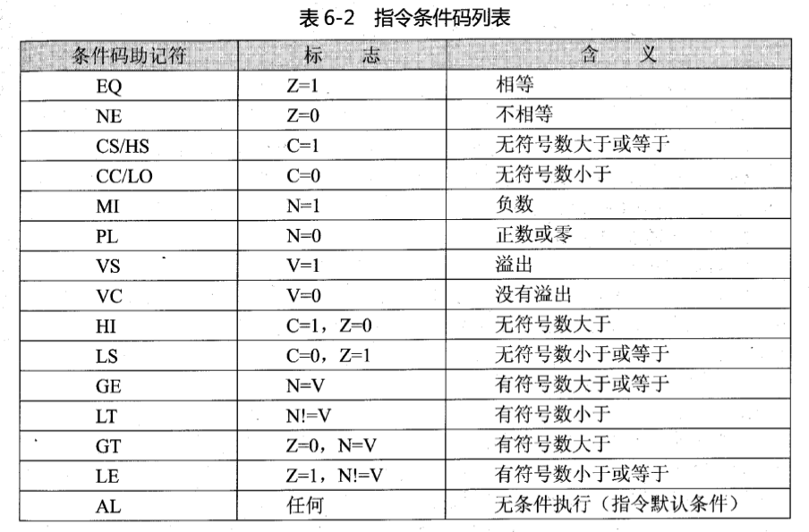

- `S` specifies whether the instruction affects the value of the CPSR register. 
- `.W` and `.N` are instruction width specifiers. 
- `Rd` is the destination register. 
- `Rn` is the first operand register. 
- `operand2` is the second operand. 

2. The jump instruction 

 has two ways: one is to use the jump instruction to jump directly; the other is to directly assign a value to the PC register to realize the jump. 

 (1) B jump instruction 

 If the condition cond is met, it will immediately jump to the address specified by label for execution. 

```asm
B {cond} label
```

 (2) BL jump instruction with link

 If the condition cond is met, first the next instruction of the current instruction Copy the address to the R14 (LR) register, and then jump to the address specified by label for execution. 

```asm
BX {cond} label
```

 (3) BX jump instruction with state switching

 If the conditions are met, the processor will determine the Rm bit [0] Is it 1? If it is 1, the flag bit T of the CPSR register is automatically set when jumping, and the code at the target address is interpreted as Thumb code for execution, that is, the processor switches to Thumb state; on the contrary, if bit [0] of Rm is 0, the flag T of the CPSR register is automatically reset when jumping, and the code at the address is interpreted as ARM code for execution, that is, it switches to the ARM state. 

 (4) BLX jump instruction with link and status switching 

 combines the functions of BL and BX. When the conditions are met, in addition to setting the link register, the processing is also switched based on bit [0] of Rm device status. 

```asm
BLX {cond} Rm
```

3. Memory access instruction

 (1) LDR: used to load data from memory into the register. 

```asm
LDR {type} {cond} Rd, label
LDRD {cond} Rd, Rd2, label
```

`type` specifies the size of the operand data: % 0A
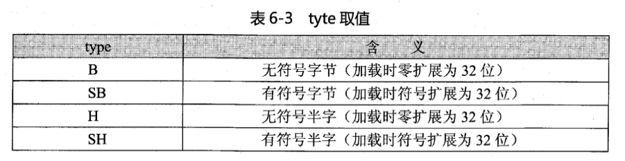

- `cond` is the execution condition. 
- `Rd` is the register to be loaded. 
- `label` is the memory address to be read: direct offset; register offset; relative PC. 
- `LDRD` loads double word data in sequence, loading the data into the Rd and Rd2 registers. 

 (2) STR: used to store data into the storage unit at the specified address. 

```asm
STR {type} {cond} Rd, label
STRD {cond} Rd, Rd2, label
```

 (3) LDM: Load multiple files from the specified storage unit data into a register list. 

```asm
LDM {addr_mode} {cond} Rn{!} reglist
```

`addr_mode` The values ​​are as follows: 


- `cond` is the execution condition. 
- `Rn` is the base address register, used to store the initial address. 
-`! ` is an optional suffix, if present, the final address will be written back to the Rn register. 
- `reglist` is a list of registers used to store data, enclosed in curly brackets. 

 (4) STM: Store the data of a register list to the specified storage unit. 

```asm
STM {addr_mode} {cond} Rn{!} reglist
```

 (5) PUSH: Push the register into the full decrementing stack. 

```asm
PUSH {cond} reglist
```

 (6) POP: Pop data from the full decrementing stack to the register. 

```asm
POP {cond} reglist
```

 (7) SWP: used for data exchange between registers and memory. 

```asm
SWP {B} {cond} Rd, Rm, [Rn]
```

- `B` is an optional byte, if any, it is an interactive byte, Otherwise swap 32-bit words. 
- `cond` is the execution condition. 
- `Rd` is the register from which data is to be loaded. 
- `Rm` is the register for writing data to memory. 
- `Rn` is the memory address where data exchange needs to be performed. 

4. Data processing instructions

Data processing instructions include four categories: data transfer instructions, arithmetic operation instructions, logical operation instructions and comparison instructions. Data processing instructions mainly process data between registers. All data processing instructions can use the S suffix to determine whether to affect the status flag. Comparison instructions do not require the S suffix, they will directly affect the status flag. 

 (1) Data transfer instruction: used for data transfer between registers. 

`MOV`: Transfer the 8-bit immediate value or the contents of the register to the target register. 

```asm
MOV {cond} {S} Rd, operand2
```

`MVN`: Data non-transfer command. Transfer the 8-bit immediate value or register to the target register after bitwise inversion. 

```asm
MVN {cond} {S} Rd, operand2
```

 (2) Arithmetic operation instructions: complete arithmetic operations such as addition, subtraction, multiplication and division. 

`ADD`: addition instruction. Add the value of the Rn register to the operand2 value and store the result in the Rd register. 

```asm
ADD {cond} {S} Rn, operand2
```

`ADC`: Add instruction with carry. Add the values ​​of the Rn register and operand2, plus the value of the C condition flag bit of the CPSR register, and save the final result to the Rd register. 

```asm
ADC {cond} {S} Rd, Rn, operand2
```

`SUB`: subtraction instruction. Subtract the value of operand2 from the Rn register and store the result in the Rd register. 

```asm
SUB {cond} {S} Rd, Rn, operand2
```

`RSB`: Reverse subtraction instruction. Subtract the Rn register with operand2 and store the result in the Rd register. 

```asm
RSB {cond} {S} Rd, Rn, operand2
```

`SBC`: subtraction instruction with carry. Subtract the value of operand2 from the Rn register, then subtract the value of the C condition flag bit of the CPSR register, and finally save the result to the Rd register. 

```asm
SBC {cond} {S} Rd, Rn, operand2
```

`RSC`: Reverse subtraction instruction with carry. Use operand2 to subtract the Rn register, then subtract the value of the C condition flag bit of the CPSR register, and save the result to the Rd register. 

```asm
RSC {cond} {S} Rd, Rn, operand2
```

`MUL`: 32-bit multiplication instruction. Multiply the values ​​of the Rm register and the Rn register, and save the lower 32 bits of the result to the Rd register. 

```asm
MUL {cond} {S} Rd, Rm, Rn
```

`MLS`: Multiply the values ​​in the Rm register and the Rn register, and then obtain the values ​​from the Ra register Subtract the product from the value, and finally store the lower 32 bits of the result in the Rd register. 

```asm
MLS {cond} {S} Rd, Rm, Rn, Ra
```

`MLA`: Multiply the values ​​in the Rm register and the Rn register, and then The product is added to the value in the Ra register, and the lower 32 bits of the result are finally stored in the Rd register. 

```asm
MLA R0, R1, R2, R3
```

`UMULL`: Multiply the values ​​of the Rm register and the Rn register as unsigned numbers, and then multiply the lower 32 bits are stored in the RdLo register. 

```asm
UMULL R0, R1, R2, R3
```

`UMLAL`: Multiply the values ​​of the Rm register and the Rn register as unsigned numbers, and then multiply the 64-bit The result is multiplied by the 64-digit number composed of RdHi and RdLo. The lower 32 bits of the result are stored in the RdLo register and the higher 32 bits are stored in RdHi. register. 

```asm
UMLAL {cond} {S} RdLo, RdHi, Rm, Rn
```

`SMULL`: Multiply the values ​​of the Rm register and the Rn register as a signed number , and then store the lower 32 bits of the result in the RdLo register and the higher 32 bits in the RdHi register. 

```asm
SMULL {cond} {S} RdLo, RdHi, Rm, Rn
```

`SMLAL`: Multiply the values ​​of the Rm register and the Rn register as signed numbers , then multiply the 64-bit result with the 64-bit number composed of RdHi and RdLo, and store the lower 32 bits of the result in RdLo Register, the high 32 bits are stored in the RdHi register. 

```asm
SMLAL R0, R1, R2, R3
```

`SMLAD`: Will Multiply the low halfword of the Rm register by the low halfword of the Rn register, then multiply the high halfword of the Rm register by the high halfword of Rn, and finally add the two products to the value of the Ra register and store them in the Rd register. . 

```asm
SMLAD {cond} {S} Rd, Rm, Rn, Ra
```

`SMLSD`: Convert the lower halfword of the Rm register to the lower halfword of the Rn register multiplied, and then the upper halfword of the Rm register and Rn The upper halfword of , then subtracts the second product from the first product, and finally adds the resulting difference to the value of the Ra register and stores it in the Rd register. 

```asm
SMLAD {cond} {S} Rd, Rm, Rn, Ra
```

`SDIV`: Signed division instruction. 

```asm
SDIV R0, R1, R2
```

`UDIV`: unsigned division instruction. 

```asm
UDIV R0, R1, R2
```

`ASR`: arithmetic right shift instruction. Arithmetically shift the Rm register right by operand2 bits, fill the empty bits with the sign bit, and save the shift result to the Rd register. 

```asm
ASR {cond} {S} Rd, Rm, operand2
```

 (3) Logic operation instructions: complete logical operations such as AND, OR, XOR, shift, etc. operate. 

`AND`: logical AND instruction. 

```asm
AND R0, R0, #1
```

`ORR`: logical OR instruction. 

```asm
ORR {cond} {S} Rd, Rn, operand2
```

`EOR`: XOR instruction. 

```asm
EOR {cond} {S} Rd, Rn, operand2
```

`BIC`: Bit clear instruction. Negate the value of operand2, AND the result with the value of the Rn register and store it in the Rd register. 

```asm
BIC {cond} {S} Rd, Rm, operand2
```

`LSL`: logical left shift instruction. Logically shift the Rm register to the left by operand2 bits, clear the empty bit to 0, and save the shift result to the Rd register. 

```asm
LSL {cond} {S} Rd, Rm, operand2
```

`LSR`: Logical right shift instruction. Logically shift the Rm register right by operand2 bits, clear the empty bit to 0, and save the shift result to the Rd register. 

```asm
LSR {cond} {S} Rd, Rm, operand2
```

`ROR`: Rotate right instruction. Logically shift the Rm register right by operand2 bits, shift the bits shifted out from the right side of the register back to the left, and save the shift result to the Rd register. 

```asm
ROR {cond} {S} Rd, Rm, operand2
```

`RRX`: Rotate right shift instruction with extension. Circularly shift the Rm register to the right by 1 bit, fill the highest bit of the register with the flag id value, and save the shift result to the Rd register. 

```asm
RRX {cond} {S} Rd, Rm
```

 (4) Comparison instruction: used to compare the values ​​between two operands. 

`CMP`: Use the Rn register to subtract the value of operand2, which has the same function as the SUBS instruction, but the CMP instruction does not save the technical result. 

```asm
CMP {cond} {S} Rn, operand2
```

`CMN`: Add the value of operand2 to the Rn register, which has the same function as the ADDS instruction, but The CMN instruction does not save calculation results. 

```asm
CMN R0, R1
```

`TST`: bit test instruction. Perform an AND operation on the value of the Rn register and the value of operand2, which has the same function as the ANDS instruction, but the TST instruction does not save the calculation result. 

```asm
TST {cond} {S} Rn, operand2
```

`TEQ`: Exclusive OR operation between the value of the Rn register and the value of operand2, which is consistent with the EORS instruction Functionality is the same, but calculation results are not saved. 

```asm
TSQ {cond} {S} Rn, operand2
```

5. Other instructions

`SWI`: soft interrupt instruction. Used to generate soft interrupts to switch from user mode to management mode. 

```asm
SWI {cond}, immed_24
```

`NOP`: No operation instruction. Used for no-op or byte alignment. 

`MRS`: read status register instruction. 

```asm
MRS Rd, psr
```

`MSR`: write status register command. 

```asm
MSR Rd, psr_fields, operand2
```

## Chapter 7 Android NDK program reverse analysis

 Three methods to compile and generate native programs: use gcc to compile Manually compile using the ndk-build tool; use Eclipse to create a project and automatically compile. 

### Analysis of the startup process of native programs

 Native programs have two types: static link and dynamic link. Dynamic link is divided into dynamic link program and dynamic link library. 

 Static linking needs to be in Specify `-Bstatic` in the command line parameters of the gcc compiler. When generating an executable program, the `crtbegin_static.o` and `crtend_android.o` object files will be linked. The `crtbegin_static.o` file defines the startup of the static linker. Function `_start`, this function is the first function executed when the program starts. 

 Dynamic linking requires specifying `-Bdynamic` in the command line parameters of the gcc compiler. When generating an executable program, the `crtbegin_dynamic.o` and `crtend_android.o` object files will be linked, and dynamic linking needs to pass The `--dynamic-linker` parameter specifies the loader of the program, and the default is `/system/bin/linker`. In the generated executable program, each program will contain an `.interp` section to be stored in the program's loader. The dynamic linker startup program `_start` is located in the `crtbegin_dynamic.o` file. 

 Dynamic link also includes dynamic link library. When generating dynamic link library, the `crtbegin_so.o` and `crtend_so.o` object files will be linked, and the `armelf_linux_eabi.xsc` link script will be passed in. 

### Native file format

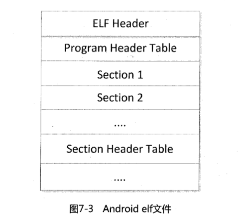

### Reverse analysis of native C program

1. Characteristics of for loop statement disassembly code 

```c
#include <stdio.h>

int nums[5] = {1, 2, 3, 4, 5};

int for1(int n){ //Ordinary for loop
 int i = 0;
 int s = 0;
 for (i = 0; i < n; i++){
 s += i * 2;
 }
 return s;
}

int for2(int n){ //Access global array 
 int i = 0;
 int s = 0;
 for (i = 0; i < n; i++){
 s += i * i + nums[n-1];
 }
 return s;
 }

int main(int argc, char* argv[]){
 printf("for1:%d\n", for1(5));
 printf("for2:%d\n", for2(5));
 return 0;
}
```


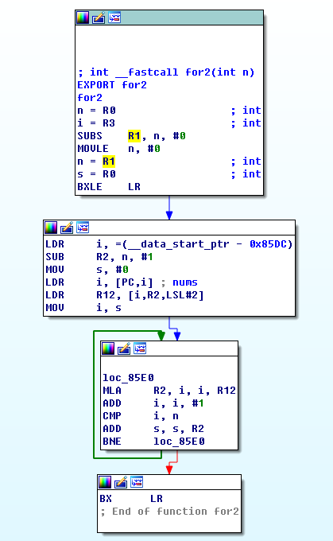

2. Characteristics of if...else branch statement disassembly code

```c
#include <stdio.h>

void if1(int n){ //if else statement
 if(n < 10){
 printf("the number less than 10\n");
 } else {
 printf("the number greater than or equal to 10\n");
 }
}

void if2(int n){ //Multiple if else statements
 if(n < 16){
 printf("he is a boy\n");
 } else if(n < 30){
 printf("he is a young man\n");
 } else if(n < 45){
 printf("he is a strong man\n");
 } else{
 printf("he is an old man\n");
 }
}

int main(int argc, char* argv[]){
 if1(5);
 if2(35);
 return 0;
}
```

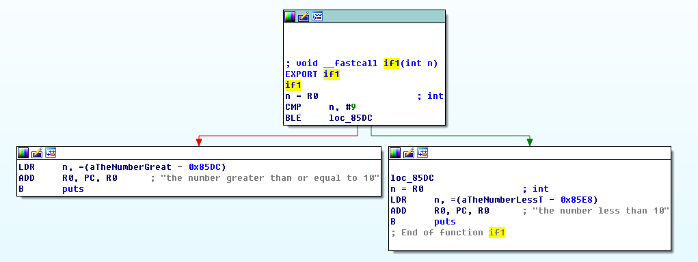

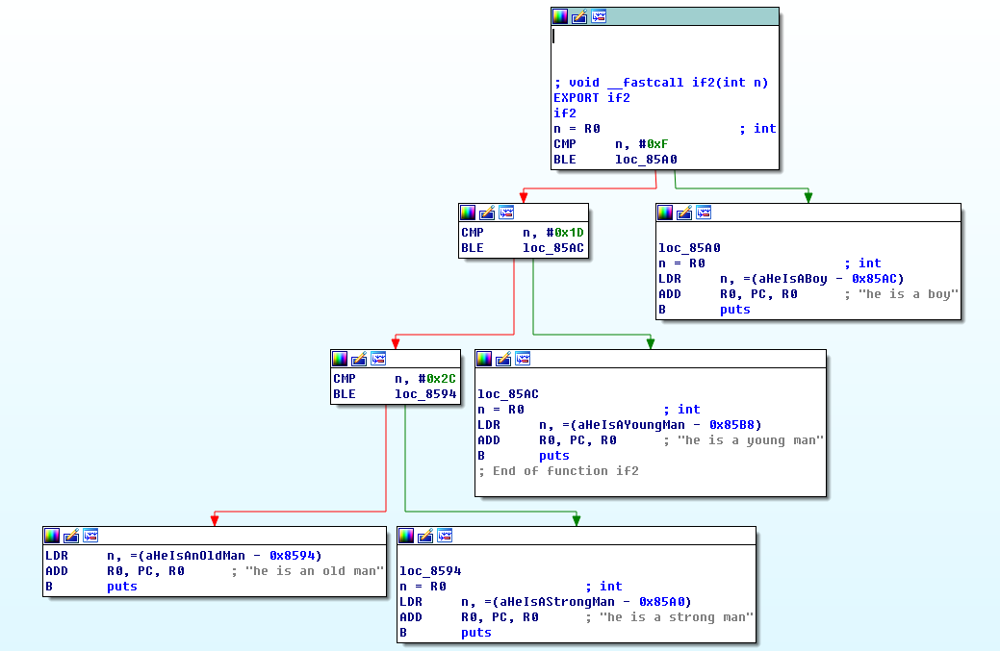

3. while loop statement disassembly Characteristics of the code

```c
#include <stdio.h>

int dowhile(int n){
 int i = 1;
 int s = 0;
 do{
 s += i;
 }while(i++ < n);
 return s;
}

int whiledo(int n){
 int i = 1 ;
 int s = 0;
 while(i <= n){
 s += i++;
 }
 return s;
}

int main(int argc, char* argv[]){
 printf("dowhile:%d\n", dowhile(100));
 printf("while:%d\ n", whiledo(100));
 return 0;
}
```

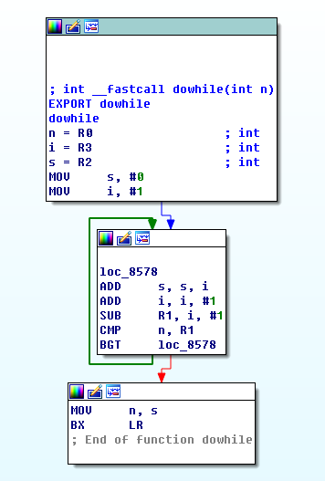

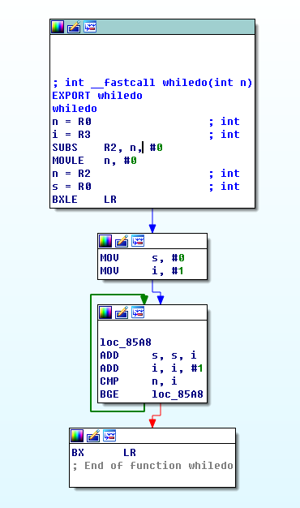

4. Switch branch statement disassembly Characteristics of the code

```c
#include <stdio.h>

int switch1(int a, int b, int i){
 switch (i){
 case 1:
 return a + b;
 break;
 case 2:% 0A return a - b;
 break;
 case 3:
 return a * b;
 break;
 case 4:
 return a / b;
 break;
 default:
 return a + b;
 break;
 }
}

int main(int argc, char* argv[]){
 printf("switch1:%d\n ", switch1(3, 5, 3));
 return 0;
}
```

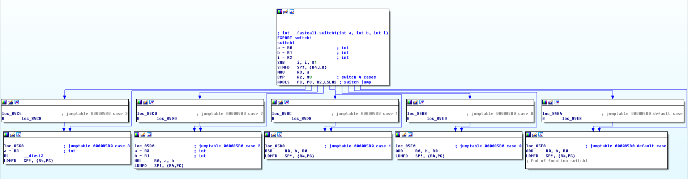

### Reverse analysis of native C++ program

1. Reverse C++ code of C++ classes is mainly reverse C++ classes. From a macro perspective, we can understand C++ classes as structures in C language. Each member variable is a structure field, and each member function The code is optimized outside the class and does not occupy storage space. 

2. Android NDK’s support for C++ features

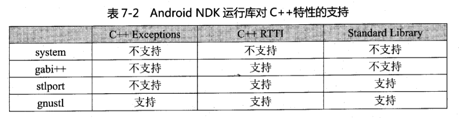

## Chapter 8 Dynamic debugging of Android programs

Software debugging can be divided into source code level debugging and assembly level debugging. 

### DDMS

DDMS full name is Dalvik virtual machine debugging and monitoring service. Provides device screenshots, viewing running thread information, file browsing, LogCat, Method Profiling, broadcast status information, simulated phone calls, receiving SMS, virtual geographical coordinates and other functions. 

`android.util.Log` provides `Log.v()`, `Log.d()`, `Log.i()`, `Log.w()` and `Log.e( )` and other 5 debugging information output methods. 

### Locate the key code

1. Code injection method

 first decompile the Android program, then add the Log call code to the disassembled smali file, and finally repackage the program and run it to view Output results. 

2. The stack trace method 

 also inputs code injection. It mainly involves manually adding stack trace information output code to the disassembled smali file. This method only needs to know the approximate code injection point, and the feedback information is more detailed. 

3. Method Profiling

DDMS provides this debugging method, which can record the name of each debugged API when executing the program. 

In the `android.os.Debug` class, two methods `startMethodTracing()` and `stopMethodTracing()` are provided to turn on and off Method Profiling. 

### AndBug

 To use AndBug to debug an Android program, you need to first execute the program being debugged, and then use AndBug to attach to the program process for debugging. 

### IDA Pro

 debugs general Android native programs in two ways: remote running and remote attachment. 

### gdb and the official gdb that comes with gdbserver

 are dynamically compiled and do not contain symbol information. When debugging, you need to set the symbol loading path of the Android system dynamic link library, so we need to compile it manually. A static gdb. 
