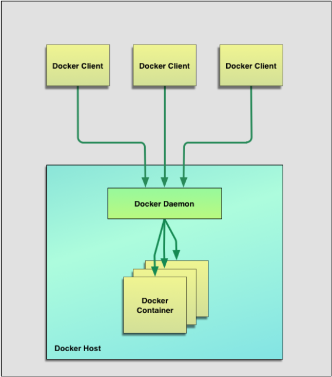
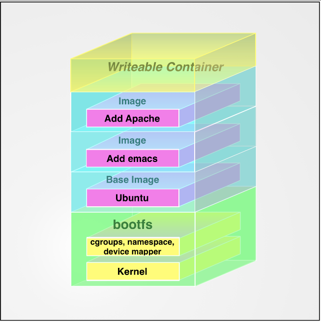

#The first Docker book

## Chapter 1 Introduction

Docker is an open source engine that can automatically deploy developed applications to containers. Docker adds an application deployment engine to the virtualized container execution environment. The goal is to provide a lightweight and fast environment that can run the developer's program and deploy the program from the developer's laptop to the test environment conveniently and efficiently. , and then deploy to the production environment. 

### Docker core components

Docker client and server: Docker is a client/server (C/S) architecture program. The client simply makes a request to the Docker server or daemon, and the server or daemon does all the work and returns the results. The Docker daemon is also called the Docker engine. 



Docker image: a hierarchical structure based on the joint file system

Registry: used to save user-built images

Docker container: execution Environment

### Docker technical component

 A native Linux container format, called libcontainer in Docker. 

Linux kernel namespace (namespace), used to isolate file systems, processes, and networks. 

 File system isolation: Each container has its own root file system. 

 Process isolation: Each container runs in its own process environment. 

Network isolation: The virtual network interfaces and IP addresses between containers are separated. 

 Resource isolation and grouping: Use cgroups (ie control group, Linux kernel feature) to independently allocate resources such as CPU and memory to each Docker container. 

Copy-on-write: File systems are created through copy-on-write. 

 Log: `STDOUT`, `STDERR` and `STDIN` generated by the container will be collected and logged. 

Interactive shell: Users can create a pseudo tty terminal and connect it to `STDIN` to provide an interactive shell to the container. 

Extended resources: 

- <http://www.docker.com/>
- <https://github.com/docker/docker>
- <https://github. com/dockerforge>
- <https://groups.google.com/forum/#!forum/docker-user>
- <https://twitter.com/docker>
- <http://stackoverflow.com/search?q=docker>

## Chapter 2 Installing Docker (Debian)

1. Check the kernel version: 

```sh
uname -a 
```

2. Check the system version: 

<http://distrowatch.com/>

3. Add Docker’s ATP Repository: 

```sh
sudo sh -c "echo deb https://apt.dockerproject.org/repo debian-stretch main > /etc/apt/sources.list.d/docker.list"% 0A```

4. Add the GPG key of the Docker repository: 

```sh
apt-key adv --keyserver hkp://p80.pool.sks-keyservers.net:80 --recv-keys 58118E89F3A912897C070ADBF76221572C52609D
```

5. Update APT source: 

```sh
sudo apt-get update
```

6. Install Docker: 

```sh
sudo apt-get install docker-engine
```

7. Open the Docker daemon: 

 ```sh
sudo service docker start
```

8. Confirm installation: 

```sh
sudo docker info
```

### Update

```sh
sudo apt-get upgrade docker-engine
```

### Uninstall

`` `sh
sudo apt-get purge docker-engine
sudo apt-get autoremove
rm -rf /var/lib/docker
```

### Docker daemon 

 daemon listens to the socket `/var/run/docker.sock` to obtain Docker requests from the client . 

### Configuring the Docker daemon 

Use the `-H` flag to specify a different network interface and port configuration: 

```sh
sudo docker daemon -H tcp://0.0. 0.0:2375
```

 You can also use the `-H` flag to specify a Unix Socket path: 

```sh
sudo docker daemon -H unix://home/docker/docker.sock
```

Specify multiple addresses at the same time: 

```sh
sudo docker daemon -H tcp://0.0.0.0 :2375 -H unix://home/docker/docker.sock
```

Start Docker Debug mode of the daemon process: 

```sh
sudo docker daemon -D
```

 If you want to make permanent changes, you need to modify the `DOCKER_OPTS` of the `/etc/default/docker` file variable. 

### Check whether the Docker daemon is running

```sh
// Check the status 
sudo service docker status
// Start 
sudo service docker start
// Stop 
sudo service docker stop
```

## Chapter 3 Getting Started with Docker

### Run the first container

```sh
sudo docker run -i -t ubuntu /bin/bash
```

`-i` flag to ensure that `STDIN` in the container is turned on , the `-t` flag allocates a pseudo `tty` terminal to the container to be created. 

 First, Docker will check the local image, and if it does not exist, it will download it locally. 

### Use container 

 to check the container host name: 

```sh
root@d0cef31f8120:/# hostname
d0cef31f8120
```

 Check the container's /etc /hosts file: 

```sh
root@d0cef31f8120:/# cat /etc/hosts 
127.0.0.1 localhost
::1 localhost ip6-localhost ip6-loopback
fe00::0 ip6-localnet
ff00::0 ip6-mcastprefix
ff02::1 ip6-allnodes
ff02: :2 ip6-allrouters
172.17.0.2 d0cef31f8120
```

 Check container process: 

```sh
root@d0cef31f8120:/# ps -aux
USER PID %CPU %MEM VSZ RSS TTY STAT START TIME COMMAND
root 1 0.0 0.0 18240 3128 ? Ss 14:44 0:00 /bin/bash
root 18 0.0 0.0 34424 2772 ? R+ 14:49 0:00 ps -aux
```

Install package in container: 

`` `sh
root@d0cef31f8120:/# apt-get update && apt-get install vim
```

When you use `exit` to exit the container, the container stops running, but it still exists. You can use the `docker ps -a` command to view the list of containers in the current system: 
% 0A```sh
bibi@bibi-pc:~$ sudo docker ps -a
[sudo] bibi's password: 
CONTAINER ID IMAGE COMMAND CREATED STATUS PORTS NAMES
d0cef31f8120 ubuntu "/bin/bash" 51 minutes ago Exited (1) 17 seconds ago nauseous_engelbart
26d00ca60271 ubuntu "/bin/echo 'hello wor" About an hour ago Exited (0) About an hour ago gloomy_brown
` ``

### Container name

```sh
sudo docker run --name bob_the_container -i -t ubuntu /bin/bash
```

### Restart the stopped container

` ``sh
sudo docker start bob_the_container
```

 or by ID To start: 

```sh
sudo docker start d0cef31f8120
```

 You can also use the `docker restart` command to restart a container. 

### Attach to the container

```sh
sudo docker attach bob_the_container
// You can also use ID
```

### to create a guarded container
 
 creates a daemon container without interactive sessions for serving long-running applications. 

```sh
sudo docker run --name daemon_dave -d ubuntu /bin/sh -c "while true; do echo hello world; sleep 1;done"
```

 used `-d` parameter puts the container in the background for execution. 

### What is happening inside the container

Use the `docker logs` command to get the container's logs. 

```sh
bibi@bibi-pc:~$ sudo docker logs daemon_dave
hello world
hello world
hello world
hello world
. . .
```

 can be used` -f` parameter to monitor logs in real time. 

```sh
sudo docker logs -f daemon_dave
````

 Get the last 10 lines of content: 

```sh
sudo docker logs --tail 10 daemon_dave
` ``

Trace the latest log without reading the entire log file: 

```sh
sudo docker --tail 0 -f daemon_dave
```

 Use `-t` to add a timestamp to each log entry: 

```sh
sudo docker logs -ft daemon_dave
```

# ## Docker log driver

 uses the `--log-driver` option to control the log driver when starting the Docker daemon or executing the `docker run` command. 

```sh
sudo docker run --log-driver="syslog" --name daemon_dwayne -d ubuntu /bin/sh -c "while true; do echo hello world; sleep 1; done"
 ```

The above command will output the container's logs to `Syslog`. 

### View the process in the container

```sh
bibi@bibi-pc:~$ sudo docker top daemon_dave
UID PID PPID C STIME TTY TIME CMD
root 6743 6728 0 10:05 ? 00:00:00 /bin/sh -c while true; do echo hello world; sleep 1;done
root 7824 6743 0 10:19 ? 00:00:00 sleep 1
```

 You can see all the processes in the container, the user running the process and the process ID. 

### Docker statistics

```sh
bibi@bibi-pc:~$ sudo docker stats daemon_dave nauseous_engelbart
CONTAINER CPU % MEM USAGE / LIMIT MEM % NET I/O BLOCK I/O PIDS
daemon_dave 0.07% 0 B / 0 B 0.00% 12.25 kB / 648 B 2.234 MB / 0 B 2
nauseous_engelbart 0.00% 0 B / 0 B 0.00% 20.73 kB / 648 B 4.687 MB / 0 B 1
```

### Running process inside the container

 can use the `docker exec` command to start additional new processes inside the container. There are two background tasks and interactive tasks. type. 

Run background tasks in the container: 

```sh
sudo docker exec -d daemon_dave touch /etc/new_config_file
```

`-d` After the flag, what is specified is The name of the container within which this command is to be executed and the command to be executed. 

 Run the interactive command: 

```sh
sudo docker exec -t -i daemon_dave /bin/bash
```

 Stop the daemon container: 

``` sh
sudo docker stop daemon_dave
```

 Automatically restart the container: 

 If the container stops running due to some error, you can pass The `--restart` flag allows Docker to automatically restart the container. 

```sh
sudo docker run --restart=always --name daemon_dave -d ubuntu /bin/sh -c "while true; do echo hello world; sleep 1; done"
```% 0A
 The `--restart` flag is set to `always`, which automatically restarts the container regardless of its exit code. If set to `on-failure`, an automatic restart will only occur if the exit code is non-zero. 

### Go deep into the container

 to get more container information:

```sh
sudo docker inspect daemon_dave
```

You can use `-f` or` --format` flag to select the viewing results: 

```sh
// Return the running status of the container
sudo docker inspect --format '{{ .State.Running }}' daemon_dave
// View the IP address of the container
sudo docker inspect --format '{{ .NetworkSettings.IPAddress }}' daemon_dave
```

### Delete container% 0A
```sh
sudo docker rm -f daemon_dave
```

Delete all containers: 

```sh
sudo docker rm 'sudo docker ps -a -q'
```

## Chapter 4 Use Docker image and warehouse

Docker image is superimposed by the file system. An image can be placed on top of another image. 

 When creating a new container, Docker builds an image stack and adds a read-write layer at the top of the stack. 



### Listed images 

Local images are saved in the local `/var/lib/docker` directory. 

```sh
bibi@bibi-pc:~$ sudo docker images
REPOSITORY TAG IMAGE ID CREATED SIZE
ubuntu latest f753707788c5 4 weeks ago 127.1 MB
```

The image is saved in the warehouse , and the warehouse exists in `Registry`, which defaults to public `Registry` service, namely `Docker Hub`. Each mirror warehouse can store multiple mirrors. 

```sh
// Pull Ubuntu image
sudo docker pull ubuntu:12.04
// List Docker image
REPOSITORY TAG IMAGE ID CREATED SIZE
ubuntu latest f753707788c5 4 weeks ago 127.1 MB
ubuntu 12.04 0b310e6bf058 3 months ago 225.4 MB
ubuntu precise 0b310e6bf058 3 months ago 225.4 MB
```

This shows that the ubuntu image is actually a series of images gathered under a warehouse. 

 Distinguish images by labels (the same image can have multiple labels): 

```sh
sudo docker run -t -i --name new_container ubuntu:12.04 /bin/bash
```

### Search image

```sh
bibi@bibi-pc:~$ sudo docker search ubuntu
NAME DESCRIPTION STARS OFFICIAL AUTOMATED% 0Aubuntu Ubuntu is a Debian-based Linux operating s... 5056 [OK] 
ubuntu-upstart Upstart is an event-based replacement for... 68 [OK] 
rastasheep/ubuntu-sshd Dockerized SSH service, built on top of... 49 [OK]
consol/ubuntu-xfce-vnc Ubuntu container with "headless" VNC sessi... 29 [OK]
```

The returned information includes warehouse name, image description, user evaluation, whether it is official, and automatic construction. 

### Build the image

 and log in to Docker Hub. You can use `docker logout` to exit from a Registry server. 
